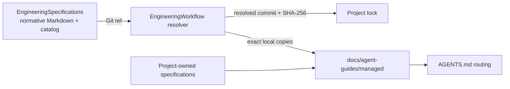

# EngineeringSpecifications

[English](README.md) | [简体中文](README.zh-CN.md)

EngineeringSpecifications is the versioned source of truth for reusable
engineering rules consumed by
[EngineeringWorkflow](https://github.com/XiaoWeiKIN/EngineeringWorkflow).
It keeps specification governance separate from the tool that discovers,
fetches, locks, and materializes those specifications in a project.

## Repository model



The separation has two practical effects:

- specification changes have their own review and release history;
- a consuming project records the exact Git commit and content digest it used.

## Specification scope

The catalog is designed for reusable rules across several engineering layers:

- `core/` for rules that every implementation repository must carry;
- `languages/` for Go, Java, Python, TypeScript, and other language contracts;
- `frameworks/` for ecosystems such as Gin, GORM, Spring, and Netty;
- `databases/` for shared schema design and systems such as MySQL or
  ClickHouse;
- `testing/` for cross-language and technology-specific test contracts;
- `protocols/` for shared HTTP, gRPC, messaging, and compatibility rules.

These are independent composition dimensions. A database schema rule can be
cross-language without being required in a repository that has no database.
Framework and database specifications can depend on language, protocol, or
shared data specifications without copying their rules.

The current release contains only Core, Go, Python, and TypeScript
specifications. The remaining categories describe where future reusable
specifications belong; they are not published until they appear in
`catalog.json`.

Read the [Specification Model](docs/specification-model.md) for the taxonomy,
dependency model, selection modes, task-time routing, and project ownership
boundary.

## Governance

The repository adapts six mechanisms from mature specification projects:

- BCP 14 keywords give normative requirements explicit strength;
- Engineering Specification Proposals separate significant design intent from
  integrated requirements;
- document maturity communicates compatibility promises independently from
  versions;
- Catalog and per-Spec SemVer, Git revisions, and digests identify released
  contracts;
- stable requirement IDs will connect specifications to implementation
  evidence;
- one canonical check protects structure, dependencies, links, digests, and
  tests.

The [Governance Model](governance/README.md) records what is already enforced
and which mechanisms remain staged. The
[Specification Principles](governance/specification-principles.md),
[Lifecycle](governance/lifecycle.md),
[Proposal Process](proposals/README.md), and
[Compliance Model](compliance/README.md) provide the detailed contracts.

## Layout

```text
.
├── catalog.json
├── compliance/
│   └── README.md
├── docs/
│   └── specification-model.md
├── governance/
│   ├── README.md
│   ├── lifecycle.md
│   └── specification-principles.md
├── proposals/
│   ├── README.md
│   └── 0000-template.md
├── schemas/
│   └── catalog.schema.json
├── specification/
│   ├── 0000-template.md
│   ├── core/
│   └── languages/
├── scripts/
│   └── check.py
└── tests/
```

The initial catalog contains:

- `core/semantic-naming`, required for every implementation repository;
- `languages/go`;
- `languages/python`;
- `languages/typescript`.

## Catalog contract

`catalog.json` is the machine-readable entrypoint. Each entry declares a stable
ID, semantic version, Markdown source, SHA-256 digest, dependencies, applicable
file scopes, and optional deterministic detection.

EngineeringWorkflow first selects required, detected, and explicitly configured
specifications, then resolves their dependency closure. It locks and
materializes that set once; Codex reads only the local specifications whose
scopes match the current task.

Consumers must treat catalog and specification content as untrusted external
data: parse exact shapes, reject traversal and symbolic links, verify digests,
and pin the resolved Git revision before materializing files.

## Contributing

Read [CONTRIBUTING.md](CONTRIBUTING.md) for the normative change and
compatibility process. In summary:

1. Classify the change as editorial, scoped normative, or significant.
2. Use an ESP before significant cross-cutting or public-contract changes.
3. Start a new normative document from the
   [Formal Specification Template](specification/0000-template.md).
4. Add or update its `catalog.json` entry.
5. Bump the specification version when normative behavior changes.
6. Refresh the entry's SHA-256.
7. Run:

```bash
python3 -B scripts/check.py
```

Project-only constraints should normally stay in that project's repository and
be referenced by its EngineeringWorkflow manifest. Add a rule here only when
it is intentionally reusable and can be governed as a stable specification.

## Versioning

Catalog and specification versions follow Semantic Versioning. Git tags may
identify released catalog revisions; consumers may follow a branch or tag, but
their lock file always records the immutable resolved commit.

See [CHANGELOG.md](CHANGELOG.md) for released changes.

## License

EngineeringSpecifications is licensed under the
[Apache License 2.0](LICENSE), the same license used by the OpenTelemetry
Specification repository.
