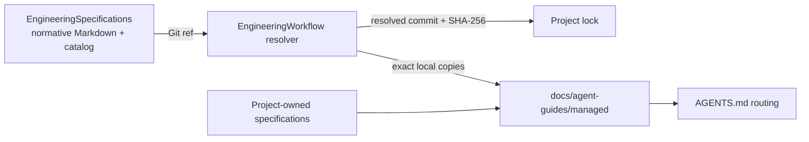

# EngineeringSpecifications

[English](README.md) | [简体中文](README.zh-CN.md)

EngineeringSpecifications is the versioned source of truth for reusable
engineering rules consumed by
[EngineeringWorkflow](https://github.com/XiaoWeiKIN/EngineeringWorkflow).
It keeps specification governance separate from the tool that discovers,
fetches, locks, and materializes those specifications in a project.

## Repository model



The separation has two practical effects:

- specification changes have their own review and release history;
- a consuming project records the exact Git commit and content digest it used.

## Layout

```text
.
├── catalog.json
├── schemas/
│   └── catalog.schema.json
├── specification/
│   ├── core/
│   └── languages/
├── scripts/
│   └── check.py
└── tests/
```

The initial catalog contains:

- `core/semantic-naming`, required for every implementation repository;
- `languages/go`;
- `languages/python`;
- `languages/typescript`.

## Catalog contract

`catalog.json` is the machine-readable entrypoint. Each entry declares a stable
ID, semantic version, Markdown source, SHA-256 digest, dependencies, applicable
file scopes, and optional deterministic language detection.

Consumers must treat catalog and specification content as untrusted external
data: parse exact shapes, reject traversal and symbolic links, verify digests,
and pin the resolved Git revision before materializing files.

## Contributing

Read [CONTRIBUTING.md](CONTRIBUTING.md) for the normative change and
compatibility process. In summary:

1. Edit or add a Markdown source under `specification/`.
2. Add or update its `catalog.json` entry.
3. Bump the specification version when normative behavior changes.
4. Refresh the entry's SHA-256.
5. Run:

```bash
python3 -B scripts/check.py
```

Project-only constraints should normally stay in that project's repository and
be referenced by its EngineeringWorkflow manifest. Add a rule here only when
it is intentionally reusable and can be governed as a stable specification.

## Versioning

Catalog and specification versions follow Semantic Versioning. Git tags may
identify released catalog revisions; consumers may follow a branch or tag, but
their lock file always records the immutable resolved commit.

See [CHANGELOG.md](CHANGELOG.md) for released changes.
