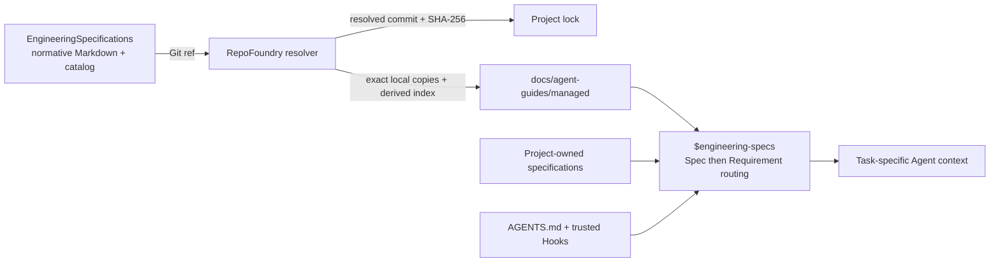

# EngineeringSpecifications

[English](README.md) | [简体中文](README.zh-CN.md)

EngineeringSpecifications is the versioned source of truth for reusable
engineering rules consumed by
[RepoFoundry AI](https://github.com/XiaoWeiKIN/RepoFoundryAI).
It keeps specification governance separate from the tool that discovers,
fetches, locks, and materializes those specifications in a project.

## Repository model



The separation has two practical effects:

- specification changes have their own review and release history;
- a consuming project records the exact Git commit and content digest it used.

## Specification scope

The catalog is designed for reusable rules across several engineering layers:

- `core/` for rules that every implementation repository must carry;
- `languages/` for Go, Java, Python, TypeScript, and other language contracts;
- `frameworks/` for ecosystems such as Gin, GORM, Spring, and Netty;
- `databases/` for shared schema design and systems such as MySQL or
  ClickHouse;
- `testing/` for cross-language and technology-specific test contracts;
- `protocols/` for shared HTTP, gRPC, messaging, and compatibility rules.

These are independent composition dimensions. A database schema rule can be
cross-language without being required in a repository that has no database.
Framework and database specifications can depend on language, protocol, or
shared data specifications without copying their rules.

The current release contains only Core and Go specifications. The remaining
categories describe where future reusable specifications belong; they are not
published until they appear in `catalog.json`.

Read the [Specification Model](docs/specification-model.md) for the taxonomy,
dependency model, selection modes, task-time routing, and project ownership
boundary.

## Governance

The repository adapts six mechanisms from mature specification projects:

- BCP 14 keywords give normative requirements explicit strength;
- Engineering Specification Proposals separate significant design intent from
  integrated requirements;
- document maturity communicates compatibility promises independently from
  versions;
- Catalog and per-Spec SemVer, Git revisions, and digests identify released
  contracts;
- stable Requirement IDs and Agent handoffs connect formalized specifications
  to implementation evidence;
- one canonical check protects structure, dependencies, Requirement metadata,
  Verification coverage, links, digests, and tests.

The [Governance Model](governance/README.md) records what is already enforced
and which mechanisms remain staged. The
[Specification Principles](governance/specification-principles.md),
[Lifecycle](governance/lifecycle.md),
[Proposal Process](proposals/README.md), and
[Compliance Model](compliance/README.md) provide the detailed contracts.

## Layout

```text
.
├── catalog.json
├── compliance/
│   └── README.md
├── docs/
│   └── specification-model.md
├── governance/
│   ├── README.md
│   ├── lifecycle.md
│   └── specification-principles.md
├── proposals/
│   ├── README.md
│   └── 0000-template.md
├── RELEASING.md
├── schemas/
│   └── catalog.schema.json
├── specification/
│   ├── 0000-template.md
│   ├── core/
│   └── languages/
├── scripts/
│   ├── check.py
│   └── check_release.py
└── tests/
```

The current catalog contains:

- `core/semantic-naming`, installed everywhere and activated for shared names,
  mappings, units, states, and naming compatibility;
- `core/data-boundaries`, installed everywhere and activated for external data,
  trust transitions, parsing, and effect gating;
- `languages/go`;
- `languages/go/functional-options`, explicitly selected and activated for Go
  functional-option API design, validation, composition, and migration;
- `languages/go/factory-delegation`, explicitly selected and activated for
  optional capability factories built from named function delegates.

## Catalog contract

`catalog.json` is the machine-readable entrypoint. Each entry declares a stable
ID, semantic version, Markdown source, SHA-256 digest, dependencies, applicable
file scopes, an Agent-readable activation summary, and optional deterministic
detection.

RepoFoundry always selects required Specifications, reports deterministic
detection as optional recommendations, and lets the consuming project
explicitly choose its optional Specification IDs. It then resolves the
dependency closure, locks the exact set, and materializes it locally. Required
means locally available; detection does not authorize installation. At task
time, file scopes produce Spec candidates and the Catalog description plus
Applicability contract decide which Specs apply. The Router then exposes
bounded Requirement activation cards, resolves exact Requirement dependencies,
and compiles a digest-verified context capsule from selected blocks, their
interpretation frames, and matching Verification rows. It never summarizes or
truncates normative text; legacy documents use an explicit whole-Spec
fallback. For a Codex Harness, RepoFoundry generates one project-local
`$engineering-specs` Router Skill rather than one Skill per Specification or
Requirement. The root AGENTS route makes the workflow mandatory; trusted
project Hooks record the turn decision, gate writes, inject the exact capsule,
and audit the handoff. The trust and runtime adapter remain consumer concerns,
so normative Specifications stay Agent-neutral. See
[ESP-0010](proposals/0010_task-activation-router.md) and the approved
[Requirement-level context proposal](proposals/0000_requirement-level-context-activation.md).

Consumers must treat catalog and specification content as untrusted external
data: parse exact shapes, reject traversal and symbolic links, verify digests,
and pin the resolved Git revision before materializing files.

## Contributing

Read [CONTRIBUTING.md](CONTRIBUTING.md) for the normative change and
compatibility process. In summary:

1. Classify the change as editorial, scoped normative, or significant.
2. Use an ESP before significant cross-cutting or public-contract changes.
3. Start a new normative document from the
   [Formal Specification Template](specification/0000-template.md).
4. Add or update its `catalog.json` entry.
5. Bump the specification version when normative behavior changes.
6. Refresh the entry's SHA-256.
7. Run:

```bash
python3 -B scripts/check.py
```

Catalog releases additionally follow [RELEASING.md](RELEASING.md), including
the release check and immutable tag publication.

Project-only constraints should normally stay in that project's repository and
be referenced by its RepoFoundry manifest. Add a rule here only when
it is intentionally reusable and can be governed as a stable specification.

## Versioning

Catalog and specification versions follow Semantic Versioning. Every
production Catalog release is published as immutable tag `vMAJOR.MINOR.PATCH`,
and the tag version must equal `catalog_version`. RepoFoundry selects a fixed
release, then records both its resolved full commit and content digests in the
project lock. Branches such as `main` are explicit development channels, not
production release identities.

Read the [Release Process](RELEASING.md) for the version boundary, preparation,
tagging, validation, consumer upgrade, and recovery contracts.

See [CHANGELOG.md](CHANGELOG.md) for released changes.

## License

EngineeringSpecifications is licensed under the
[Apache License 2.0](LICENSE), the same license used by the OpenTelemetry
Specification repository.
