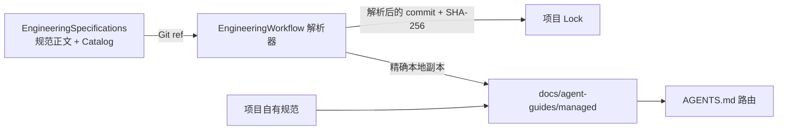

# EngineeringSpecifications

[English](README.md) | [简体中文](README.zh-CN.md)

EngineeringSpecifications 是可复用工程规范的版本化事实源，由
[EngineeringWorkflow](https://github.com/XiaoWeiKIN/EngineeringWorkflow)
按需发现、拉取、锁定并安装到项目本地。规范治理与消费工具分属两个仓库。

## 仓库模型



这个边界带来两个直接结果：

- 规范变更拥有独立的评审与发布历史；
- 消费项目记录实际使用的 Git commit 与内容摘要，可复现且可审计。

## 目录

```text
.
├── catalog.json
├── schemas/
│   └── catalog.schema.json
├── specification/
│   ├── core/
│   └── languages/
├── scripts/
│   └── check.py
└── tests/
```

首个 Catalog 包含：

- `core/semantic-naming`，所有实现型仓库必选；
- `languages/go`；
- `languages/python`；
- `languages/typescript`。

## Catalog 契约

`catalog.json` 是机器入口。每个条目声明稳定 ID、语义版本、Markdown
源文件、SHA-256、依赖、适用文件范围，以及可选的确定性语言检测规则。

消费方必须把 Catalog 和规范正文视为外部不可信数据：严格解析字段、拒绝路径穿越
与符号链接、验证内容摘要，并在安装前锁定解析后的 Git revision。

## 贡献

1. 修改或新增 `specification/` 下的 Markdown。
2. 新增或更新 `catalog.json` 条目。
3. 规范行为变化时提升规范版本。
4. 刷新条目的 SHA-256。
5. 运行：

```bash
python3 -B scripts/check.py
```

只服务单个项目的约束通常应保留在项目仓库，并由 EngineeringWorkflow manifest
引用。只有规则确实可复用、且适合按稳定规范治理时，才放入本仓库。

## 版本

Catalog 与单项规范遵循语义化版本。Git tag 可以标识发布版本；消费方既可以跟随
分支，也可以指定 tag，但其 lock 始终记录不可变的实际 commit。

