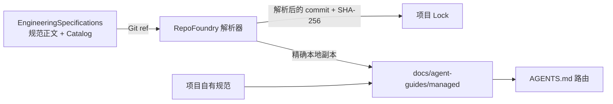

# EngineeringSpecifications

[English](README.md) | [简体中文](README.zh-CN.md)

EngineeringSpecifications 是可复用工程规范的版本化事实源，由
[RepoFoundry AI](https://github.com/XiaoWeiKIN/RepoFoundryAI)
按需发现、拉取、锁定并安装到项目本地。规范治理与消费工具分属两个仓库。

## 仓库模型



这个边界带来两个直接结果：

- 规范变更拥有独立的评审与发布历史；
- 消费项目记录实际使用的 Git commit 与内容摘要，可复现且可审计。

## 规范范围

Catalog 面向多个工程层级的可复用规则：

- `core/` 存放所有实现型仓库都应携带的规则；
- `languages/` 存放 Go、Java、Python、TypeScript 等语言契约；
- `frameworks/` 存放 Gin、GORM、Spring、Netty 等技术生态规范；
- `databases/` 存放共享 Schema 设计，以及 MySQL、ClickHouse 等数据库规范；
- `testing/` 存放跨语言和特定技术的测试契约；
- `protocols/` 存放 HTTP、gRPC、消息和兼容性规则。

这些是独立的组合维度。数据库 Schema 规则可以跨语言复用，但没有数据库的仓库
不需要安装。框架和数据库规范可以依赖语言、协议或共享数据规范，无需复制上游规则。

当前版本只发布 Core 和 Go 规范。其余分类用于约束未来可复用规范的归属；只有进入
`catalog.json` 的规范才视为已经发布。

分类、依赖、选择方式、任务时路由和项目规则边界见
[规范模型](docs/specification-model.zh-CN.md)。

## 规范治理

仓库参考成熟规范项目，引入六项相互独立的机制：

- 用 BCP 14 关键词明确规范要求强度；
- 用 Engineering Specification Proposal 分离重大设计意图与正式要求；
- 用文档成熟度表达兼容承诺，成熟度与版本独立演进；
- 用 Catalog 与单项 Spec SemVer、Git revision 和摘要标识发布契约；
- 用稳定 Requirement ID 和 Agent handoff 连接正式规范与实现证据；
- 用唯一 canonical check 验证结构、依赖、Requirement 元数据、Verification
  覆盖、链接、摘要和测试。

[治理模型](governance/README.md)记录已经执行的约束和分阶段机制。详细契约见
[规范原则](governance/specification-principles.md)、
[生命周期](governance/lifecycle.md)、
[Proposal 流程](proposals/README.md)和
[合规模型](compliance/README.md)。

## 目录

```text
.
├── catalog.json
├── compliance/
│   └── README.md
├── docs/
│   └── specification-model.md
├── governance/
│   ├── README.md
│   ├── lifecycle.md
│   └── specification-principles.md
├── proposals/
│   ├── README.md
│   └── 0000-template.md
├── schemas/
│   └── catalog.schema.json
├── specification/
│   ├── 0000-template.md
│   ├── core/
│   └── languages/
├── scripts/
│   └── check.py
└── tests/
```

当前 Catalog 包含：

- `core/semantic-naming`，所有项目安装，在共享命名、映射、单位、状态或命名兼容
  任务中激活；
- `core/data-boundaries`，所有项目安装，在外部数据、信任转换、解析或副作用门禁
  任务中激活；
- `languages/go`。

## Catalog 契约

`catalog.json` 是机器入口。每个条目声明稳定 ID、语义版本、Markdown
源文件、SHA-256、依赖、适用文件范围、供 Agent 使用的激活摘要，以及可选的
确定性检测规则。

RepoFoundry 先组合必选、检测到和项目显式配置的规范，再解析依赖闭包。
这组规范只锁定和物化一次。必选表示规范始终在本地可用；执行任务时，文件作用域
先产生候选集，再由 Catalog description 和 Applicability 决定 Codex 阅读哪些全文。

消费方必须把 Catalog 和规范正文视为外部不可信数据：严格解析字段、拒绝路径穿越
与符号链接、验证内容摘要，并在安装前锁定解析后的 Git revision。

## 贡献

规范变更与兼容流程见 [CONTRIBUTING.md](CONTRIBUTING.md)。摘要如下：

1. 把变更分为编辑性、局部规范性或重大变更。
2. 跨领域或公共契约的重大变化先提交 ESP。
3. 新规范从
   [正式 Spec 模板](specification/0000-template.md)开始。
4. 新增或更新 `catalog.json` 条目。
5. 规范行为变化时提升规范版本。
6. 刷新条目的 SHA-256。
7. 运行：

```bash
python3 -B scripts/check.py
```

Catalog 发布还必须遵循 [RELEASING.md](RELEASING.md)，包括发布检查与不可变 tag
发布。

只服务单个项目的约束通常应保留在项目仓库，并由 RepoFoundry manifest
引用。只有规则确实可复用、且适合按稳定规范治理时，才放入本仓库。

## 版本

Catalog 与单项规范遵循语义化版本。每个生产 Catalog 版本都以不可变的
`vMAJOR.MINOR.PATCH` tag 发布，且 tag 版本必须与 `catalog_version` 完全一致。
RepoFoundry 选择固定版本，再把解析后的完整 commit 与内容摘要写入项目 lock。
`main` 等分支只作为显式开发通道，不是生产发布身份。

版本边界、准备、打 tag、验证、消费方升级与恢复契约见
[发布流程](RELEASING.md)。

已发布变更见 [CHANGELOG.md](CHANGELOG.md)。

## 许可证

EngineeringSpecifications 使用
[Apache License 2.0](LICENSE)，与 OpenTelemetry Specification 仓库一致。
