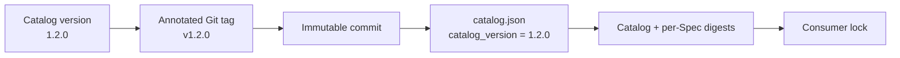

# Releasing EngineeringSpecifications

EngineeringSpecifications publishes the Catalog as one immutable semantic
versioned release. Individual Specifications retain their own independent
versions inside that Catalog release.

The process adapts the useful release identity from the
[OpenTelemetry Specification release process](https://github.com/open-telemetry/opentelemetry-specification/blob/main/RELEASING.md)
to this repository's smaller Harness Engineering model.

## Release identity



A production release has all of these identities:

- Catalog SemVer `MAJOR.MINOR.PATCH` in `catalog.json`;
- annotated Git tag `vMAJOR.MINOR.PATCH`;
- the full commit resolved from that tag;
- the Catalog digest and every selected Specification digest recorded by the
  consumer.

The tag and `catalog_version` MUST match exactly. Published release tags are
immutable: do not delete, move, or force-push one. Correct a released problem
with a new patch, minor, or major version.

Branches are development channels. They MAY be used explicitly for proposal,
integration, or compatibility testing, but they are not production release
identities.

## Version boundaries

Catalog and per-Spec versions answer different questions:

- `catalog_version` identifies one atomic package of Catalog metadata and
  referenced normative documents.
- a Specification entry's `version` identifies the evolution of that one
  normative contract.
- document maturity describes compatibility expectations and does not replace
  either version.

A Catalog release can include several changed Specification versions. An
unchanged Specification version and digest can appear in several consecutive
Catalog releases.

Use Semantic Versioning for the Catalog:

- patch: release-process or metadata correction that preserves the consumer
  contract and selected normative behavior;
- minor: backward-compatible Catalog capability or Specification addition;
- major: incompatible Catalog or normative-package change requiring consumer
  migration.

The independently versioned Specification entries follow the compatibility
rules in [CONTRIBUTING.md](CONTRIBUTING.md).

## Prepare a release pull request

1. Start from the latest `main` and confirm the worktree is clean.
2. Choose a Catalog version that has never been published.
3. Set `catalog_version` in `catalog.json`.
4. Ensure every changed normative document has an appropriate per-Spec version
   and refreshed SHA-256.
5. Move externally observable entries from `Unreleased` into
   `## [MAJOR.MINOR.PATCH] - YYYY-MM-DD` in `CHANGELOG.md`.
6. Run the canonical repository check and the release check:

```bash
python3 -B scripts/check.py
python3 -B scripts/check_release.py MAJOR.MINOR.PATCH
```

7. Open and merge the release pull request. Do not tag an unmerged review
   branch for a normal release.

`check_release.py` verifies the requested SemVer, current
`catalog_version`, Changelog entry, and—when a matching tag already exists—the
tagged Catalog version. It never writes repository state.

## Publish the immutable tag

After the release pull request is merged:

```bash
git switch main
git pull --ff-only
python3 -B scripts/check.py
python3 -B scripts/check_release.py MAJOR.MINOR.PATCH
git tag -a vMAJOR.MINOR.PATCH -m "EngineeringSpecifications vMAJOR.MINOR.PATCH"
git push origin refs/tags/vMAJOR.MINOR.PATCH
python3 -B scripts/check_release.py MAJOR.MINOR.PATCH --require-tag
```

The final command verifies that the published tag resolves to a Catalog whose
declared version matches the tag. Record the tag and full commit in the pull
request or release notes.

The historical `v1.2.0` tag establishes the first fixed-version source for the
current RepoFoundry default. Future releases follow the merge-then-tag sequence
above.

## Consumer upgrade

Publishing does not mutate any consuming repository. A maintainer upgrades
through a previewed RepoFoundry operation:

```bash
python3 -B scripts/foundryctl.py --repo /absolute/project \
  spec update --spec-version MAJOR.MINOR.PATCH

python3 -B scripts/foundryctl.py --repo /absolute/project \
  spec update --spec-version MAJOR.MINOR.PATCH --apply
```

The project manifest records `refs/tags/vMAJOR.MINOR.PATCH`. Its lock records
the full commit and content digests. Later `spec sync` repairs from the locked
commit; it does not re-resolve the tag or silently upgrade.

## Recovery

- Before tag publication, fix the release pull request and rerun both checks.
- If tag push fails, retry the same push after confirming the local tag target.
- If a local tag is wrong and has never been published, delete and recreate it.
- If a published release is wrong, leave its tag intact and publish a new
  version with migration guidance.
- If a remote is unavailable, existing consumers can still run offline
  validation against their manifest, lock, and local managed copies.
