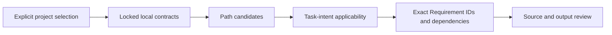

# Documentation contracts

English | [简体中文](documentation-contracts.zh-CN.md)

`documentation/` is an optional composition layer for engineering-information
integrity, alongside the layers in the [Specification Model](specification-model.md).
It implements the direction recorded in [ESP-0014](../proposals/0014_documentation-integrity-contracts.md).
It is not a style-guide package or a new Agent workflow.

## Choose the contract, not a renderer

| Spec | Responsibility | Selection and dependency |
| --- | --- | --- |
| [Technical Documentation](../specification/documentation/technical-documentation.md) | State, evidence, procedure effects, technical vocabulary and freshness | Explicit; requires `core/semantic-naming` |
| [Derived Explanations](../specification/documentation/derived-explanations.md) | Derived authority, source provenance and access to material information | Explicit; requires Technical Documentation |

A project can adopt ordinary document correctness without adopting media-review
requirements. Selecting Derived Explanations brings its declared dependencies;
directory nesting does not confer inheritance. Both Specs start at `0.1.0`,
Development, with Advisory automated enforcement. No other Spec is promoted or
changed. The [Catalog](../catalog.json) remains the metadata owner.

Google-informed organization and STE-inspired prose advice stay in the consumer's
writing guidance. Project-specific layouts, required headings, language, terms
and publication authority remain project-owned. An editorial preference cannot
waive an adopted normative requirement or change an owning source's meaning.
No Google, ASD or W3C endorsement or full-standard conformance is asserted.

## Route by task intent

Technical-documentation scopes cover Markdown, MDX, reStructuredText, AsciiDoc
and direct HTML documents. Derived-explanations uses `**/*` conservatively to
include generator sources and media companions. This creates candidates only;
unrelated program logic or decoration does not become applicable.

Binary media are not parsed as normative text. Out-of-repository exports do not
magically acquire planned-path coverage; explicitly review their producer/output
using the consumer's task mechanism. No Router protocol or Explore-mode change
is introduced. Matching a filename neither installs a Spec nor proves compliance.

## Verify meaning without inventing a new process

Every Requirement declares its activation, exact context dependencies,
enforcement class, evidence and one Verification entry. Reuse existing PRs,
reviews and test evidence. Do not add a separate approval step, uniform provenance
schema, sentence-length lint gate or automatic rewrite of accepted history.

A digest binds bytes, not truth or authorization. A review scenario is not a
completed LLM evaluation. An exported video source package is not a rendered,
captioned, accessibility-tested video. Report unavailable tools and missing
checks rather than synthesizing a pass.

The [review scenarios](../tests/fixtures/documentation-contract/review-cases.json)
are assessment rubrics for eight positive and eight negative conditions. The
repository tests validate structure and negative metadata cases. The separate
consumer CI uses a pinned RF checkout for real selection and capsule checks;
neither suite certifies the accessibility or truth of arbitrary documents.

## Release and adoption

This integration is recorded under Unreleased. The Catalog schema remains 1;
`catalog_version` is assigned in a separate release PR under the
[release process](../RELEASING.md). No immutable tag is created or moved here.
Do not assume the previous released tag includes these new entries merely
because the working tree still carries the previous Catalog version.

After a new release exists, maintainers explicitly select the intended optional
IDs through their consumer's preview/apply flow. RF's default remains unchanged
until a separate consumer update. Existing locks, installed projects, historical
decisions, and published views are not automatically migrated or rewritten.

## Contribute documentation rules

Use [CONTRIBUTING](../CONTRIBUTING.md) and the formal template. Put shared meaning
in the existing upstream rule rather than copying it. Keep tone, English word
choice, file layout and renderer details out of this layer. Cross-language does
not imply Core; optional documentation adoption stays separate from runtime
contracts. Schema changes, enforcement promotion or additional categories need
their own review and evidence.
