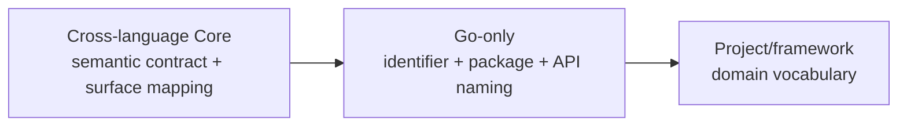

# Reusable Go engineering practices — Synthesis

This Synthesis is the bounded, living decision interface between the R-001
corpus and a later normative change to `languages/go`. Research readiness will
not conclude or archive the parent Research without explicit Owner
authorization.

## Executive Conclusion

Current evidence supports two new language-level requirements for reproducible
module state and reproducible committed generated artifacts. It also supports
narrow amendments to `GO-NAME-002`, lifecycle, and test requirements:
single-method interface/canonical method naming, risk-based race coverage, and
a support matrix. The evidence is decision-ready for Owner review, but it does
not authorize a formal Spec edit or Research conclusion.

Naming remains deliberately layered:

Go casing, receiver, accessor, constructor, and interface conventions belong
only to `languages/go`. Java, Python, database, configuration, wire, storage,
and telemetry surfaces must follow their own applicable specifications.

## Supported Findings

| Finding | Confidence | Evidence |
|---|---|---|
| Checked-in module state should be canonical and verified across the declared module inventory. | high | `notes/cross-project-go-requirements.md` |
| Committed generated artifacts need authoritative inputs, a reproducible command, and a no-diff check. | high | `notes/cross-project-go-requirements.md` |
| Race and platform/toolchain/build-tag coverage should be risk-based amendments, not duplicated requirement IDs. | medium | `notes/cross-project-go-requirements.md` |
| Existing naming rules cover the shared baseline; only single-method interface and canonical method naming materially extend `GO-NAME-002`. | high | `notes/cross-project-go-naming.md` |
| Go-specific naming must not enter cross-language Core or overwrite external/project naming surfaces. | high | `notes/cross-project-go-naming.md` |
| Exact lint lists, package layouts, logger choices, and build target names remain project or Harness policy. | high | `notes/opentelemetry-collector-practices.md`; `notes/grafana-observability-practices.md` |

## Rejected Hypotheses

- A practice does not become a language-level requirement merely because a
  well-known repository uses it.
- A universal linter list, Make target vocabulary, package layout, logger
  implementation, or vendor policy is not supported by the sample.
- Collector-specific `NewDefault`, `Config/Settings`, signal, enum, and
  component vocabulary is not a universal Go or cross-language naming system.
- Go MixedCaps, initialism, receiver, getter, and interface naming cannot be
  applied to Java, Python, database, configuration, wire, or telemetry names.
- Every test job need not run with the race detector; coverage depends on
  supported platforms, exercised paths, and resource cost.

## Remaining Unknowns

- The Research Owner must decide whether the candidate module and generator
  requirements and three amendments are appropriate for the next minor version.
- Canonical local command and architecture-policy lint rules require a separate
  cross-language Harness or testing Research.
- The observability-heavy sample lowers confidence in prescribing an exact
  matrix, but it does not block tool-semantic module/generator requirements or
  official Go naming guidance.

## Options Comparison

| Option | Benefits | Costs and risks | Current rank |
|---|---|---|---|
| Keep `languages/go` unchanged | No migration cost | Leaves module and generator drift outside the normative contract | 3 |
| Add only cross-project gaps and amend existing rules | Closes mechanical gaps while preserving layer boundaries | Requires a minor version bump and consumer review | 1 |
| Copy the sampled project guides broadly | Produces a large checklist quickly | Imports project architecture and vendor history as false universals | 4 |
| Defer all findings to project Specs | Avoids language-level policy | Duplicates stable Go-tool semantics across projects | 2 |

## Recommendation and Preconditions

Prepare a scoped `languages/go` minor revision containing the two strongly
corroborated new requirements and narrow amendments to existing naming,
lifecycle, and test rules. Final wording must remain independent of Make,
repository layout, specific linter implementations, and observability
frameworks. The naming amendment must remain Go-only; `core/semantic-naming`
continues to own only language-neutral semantics, explicit cross-surface
mappings, and compatibility.

## Handoff to ADR and ExecPlan

No ADR or implementation plan is authorized by review readiness alone. An
explicit Owner decision may authorize conclusion; only then should a downstream
plan change the formal Go specification, update its version and digest, and run
the catalog checks. The scoped normative delta is:

1. add `GO-MODULE-001`;
2. add `GO-GENERATE-001`;
3. amend `GO-NAME-002` with conditional single-method interface and canonical
   Go method naming;
4. amend `GO-LIFECYCLE-001` with risk-based race coverage and scoped
   exceptions;
5. amend `GO-TEST-001` with toolchain/platform/build-tag coverage.

Revision-pinned project observations remain audit evidence, not direct
normative text. Collector/Grafana/Prometheus local vocabulary remains
project-owned.

## Revision Notes

- 2026-07-30T16:30:25Z — Draft Synthesis created with R-001.
- 2026-07-31 — Restored the draft decision interface and recorded RQ-005 as a
  prerequisite for review readiness.
- 2026-07-31 — Integrated RQ-005, made the Core/Go/project naming boundary
  explicit, and prepared the five-part Go Spec delta for Owner review.
