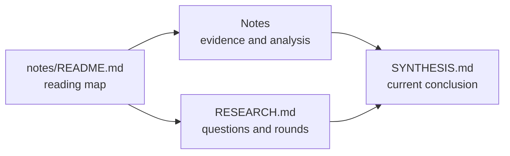

# R-001 Notes

This page is the reading entrypoint for the Research note corpus. Start with
[RESEARCH.md](../RESEARCH.md) for scope and rounds, then read [SYNTHESIS.md](../SYNTHESIS.md) for the current
conclusion and downstream handoff.

## Note inventory

<!-- RCTL:NOTES:START -->
- [RT-004 · Cross-project Go naming conventions](./cross-project-go-naming.md)
- [RT-003 · Cross-project candidate Go requirements](./cross-project-go-requirements.md)
- [RT-005 · Go performance optimization workflow and specification boundary](./go-performance-optimization.md)
- [RT-002 · Grafana Loki and Mimir Go engineering practices](./grafana-observability-practices.md)
- [RT-001 · OpenTelemetry Collector Go engineering practices](./opentelemetry-collector-practices.md)
<!-- RCTL:NOTES:END -->

The inventory between the `RCTL:NOTES` markers is maintained by `researchctl.py`.
Content outside those markers may be edited. Remove both markers to take full manual
ownership of this page; synchronization will then preserve it and validation will
report any note documents that are not linked here.
