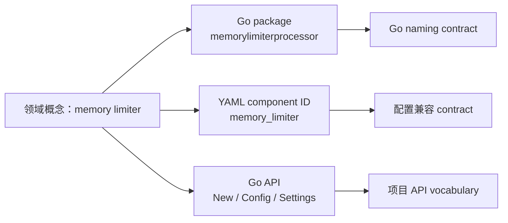

# RT-004 · Cross-project Go naming conventions

## 结论速览

<!-- topic-role: decision-brief -->

> **答案：** 当前 `GO-NAME-001` 与 `GO-NAME-002` 已覆盖成熟项目最一致的
> MixedCaps、initialism、receiver、package、accessor 与 constructor 约定。
> 唯一有明确增量价值的命名修订，是补充单方法接口的语法化 `-er` 命名，以及
> 复用 `Read`、`Write`、`Close`、`String` 等 canonical method name 时保持既有
> 含义与 signature。
>
> **置信度：** High。该修订由 Go 官方文档直接定义，Loki 明文采用，
> Prometheus 通过官方指南与命名 lint 间接采用；现有 Spec 的缺口也可直接定位。
>
> **决策影响：** 在下一版 `languages/go` 中窄幅修订 `GO-NAME-002`，不新增
> Requirement ID。保留现有 naming SHOULD 与 compatibility exceptions，不把
> Collector 的 `NewDefault`、`Config/Settings`、signal/enum 前缀或外部 component
> snake_case 复制成通用 Go 规则。
>
> **适用边界：** 结论适用于手写 Go identifier 与公开 API。generated code、
> 固定 wire/config/storage/telemetry spelling、已发布兼容面和项目领域词汇仍由其
> owning contract 决定。

关联研究问题：

- `RQ-001`
- `RQ-002`
- `RQ-003`
- `RQ-005`

命名规范已经存在于正式 Go Spec，因此这项研究的价值不是再整理一份 style
checklist，而是证明哪些条款足够稳定、哪些存在真实缺口、哪些只能作为项目规则。
若不做 gap analysis，成熟项目中的局部命名体系会与 Go 通用惯例混在一起。

**按阅读目标选择路径：**

- 快速决策：结论速览 → 候选修订；
- 理解推导：命名分层模型 → 已覆盖基线 → 接口缺口 → 例外；
- 完整评审：继续阅读 alternatives、falsifiers、证据索引与固定来源。

## 同一个概念在不同 surface 上可以合法地拥有不同拼写

<!-- topic-role: mental-model -->

命名至少有三层所有权：

1. Go identifier 的大小写、package 与 call-site 可读性由语言惯例决定；
2. wire、configuration、storage 与 telemetry spelling 由外部兼容契约决定；
3. `NewDefault`、`Config/Settings`、signal 名称等领域词汇由项目 API 决定。

| 层级 | 本研究允许进入的规则 | 明确不得上浮的规则 |
|---|---|---|
| `core/semantic-naming`（跨语言） | 名称描述可观察契约；semantic verb 保持稳定；跨 surface mapping 与 rename migration 显式化 | MixedCaps、initialism casing、receiver、getter、`-er` interface |
| `languages/go`（仅 Go） | MixedCaps、package/call-site、receiver、accessor、constructor、单方法 interface 与 canonical Go method | Java Bean、Python snake_case、数据库 identifier 或 YAML field 风格 |
| project/framework | 领域 vocabulary、framework lifecycle、configuration type 与 component identifier | 未经跨生态验证的局部命名体系 |

OTel Collector 同时使用 component `lower_snake_case` 与无下划线 Go package，
正是该模型的直接实例。[E-003](#e-003) 因此分析必须分别判断 Go 层是否已被
当前 Spec 覆盖，以及项目层观察是否真的跨生态稳定。

## 跨项目比较只发现一个尚未覆盖的 Go 命名义务

<!-- topic-role: analysis -->

先用 Go 官方文档建立语言基线，再用 OTel、Loki、Mimir 与 Prometheus 检查实际
采用和例外，最后与当前 `languages/go`、`core/semantic-naming` 做逐项差异。
只有官方语义明确、成熟项目实际采用且当前 Spec 未覆盖的内容才进入候选修订。

### 当前 Spec 已覆盖绝大多数成熟项目共享的命名基线（A-001）

Go 官方要求 package 使用简短、小写、单词式名称，并利用 package context 避免
`chubby.ChubbyFile` 一类重复；accessor 通常使用 `Owner` 而不是 `GetOwner`；
identifier 使用 MixedCaps，initialism 保持一致大小写，receiver 短小且保持一致。
[E-001](#e-001) [E-002](#e-002)

Loki 的 `CODING_STANDARDS.md` 明确采用 MixedCaps、`HTTPServer` / `userID`；
OTel 的 lint 启用 receiver 与 variable naming；Prometheus 直接要求遵循 Go Code
Review Comments，并用 `revive` 检查 receiver/variable naming。
[E-004](#e-004) [E-005](#e-005) [E-006](#e-006)

当前 `GO-NAME-001` 已规定 MixedCaps、initialism、scope-sensitive variable
length、receiver identity/consistency；`GO-NAME-002` 已规定 package
call-site、accessor、constructor、`MustX` 和 Boolean predicate。
[E-009](#e-009) 因此重复创建 `GO-INITIALISM-*`、`GO-RECEIVER-*` 或
`GO-CONSTRUCTOR-*` 只会制造重叠 Requirement。

### 单方法接口命名是当前规则中唯一清晰的增量缺口（A-002）

Effective Go 将单方法 interface 命名为 method 加 `-er` 或其他可读的 agent
noun，例如 `Reader`、`Writer`、`Formatter`、`CloseNotifier`。它同时指出
`Read`、`Write`、`Close`、`Flush`、`String` 等方法已经有 canonical signature
与 meaning，复用名称时应遵守该契约。[E-002](#e-002)

Loki 独立写明单方法 interface 通常使用 `Reader`、`Writer`、`Flusher`；
Prometheus 通过官方指南采用同一基线。[E-004](#e-004)
[E-006](#e-006) 当前 Spec 只规定 interface 的规模、consumer ownership 与
引入时机，没有定义 interface 名称或 canonical method vocabulary。
[E-009](#e-009)

这不是要求机械地给所有 interface 加 `er`。`CloseNotifier` 已说明可以做语法化
调整；当 method 无法形成自然 agent noun 时，应使用准确的领域名，而不是生成
`Doer`、`Manager` 之类低信息词。建议只把这段内容加进既有
`GO-NAME-002`。

### OTel 的具体名词体现良好项目设计，但不能升级成语言公理（A-003）

OTel 区分：

- zero/provided-value construction 使用 `New`；
- 带 policy-bearing defaults 的 construction 使用 `NewDefault`；
- 用户配置 struct 使用 `Config`，开发者配置使用 `Settings`；
- signal operation 与 enum constant 使用项目统一前后缀。

这些规则在 Collector API 内提供了稳定 vocabulary，也印证“名称必须反映真实
行为”以及“package context 不应重复”的上层原则。[E-003](#e-003)
[E-007](#e-007) 但 Grafana 与 Prometheus 没有展示同一套完整词汇，Go 官方也
没有要求所有项目区分 `New` / `NewDefault` 或 `Config` / `Settings`。把它们写进
`languages/go` 会让项目领域模型反向控制语言层。

合理处理是：通用 Spec 保留 `New`、`Open`、`Compile` 或准确 domain operation
等语义选择；需要 Collector 式严格 vocabulary 的项目，在自己的 project/framework
Spec 中定义并用 lint 或 API review 执行。

### 命名格式不能越权改写外部兼容面（A-004）

Collector 要求 configuration/component ID 使用 `lower_snake_case`，同时明确
Go package 仍使用小写、无下划线，并为已有 component name 规定 deprecated
alias 与迁移路径。[E-003](#e-003) 这不是 Go naming rule 的例外，而是两个
naming surface 各自遵循 owning contract。

当前 `SEM-SURFACE-001` 已要求显式声明跨 surface spelling、测试 mapping，并禁止
从 implementation identifier 机械派生外部名称；`SEM-COMPAT-001` 也禁止纯风格
rename。[E-010](#e-010) `languages/go` 的 Applicability 同样排除固定 wire、
storage 与 telemetry name。[E-009](#e-009) 因此这里不需要新增规则，只需在
后续 Go Spec 修订中保留对 Core 的依赖和例外。

### 成熟仓库的 lint 例外证明执行策略必须支持渐进采用（A-005）

Mimir 的 Staticcheck 配置排除 initialism 相关 `ST1003`，Prometheus 启用
`var-naming` 却对 package-name 检查设置例外，并暂时禁用 package-comments。
[E-005](#e-005) [E-008](#e-008) 这些配置不能推翻 Go 官方命名惯例，却证明真实
大型代码库存在 generated/legacy/compatibility debt，不能把每条 style preference
无条件升级为 whole-repository MUST。

现有 `GO-NAME-*` 使用 SHOULD，并显式排除 generated、vendored、cgo、
protocol-owned 与稳定 compatibility surface，这一强度应保持不变。
[E-009](#e-009) Harness 可以对 new/modified hand-written code 启用
AST-aware check，对已有例外使用精确 scope 与理由；不应通过一次性 bulk
rename 获得表面一致性。

## 更大的命名规则集会复制现有条款或侵入项目所有权

<!-- topic-role: alternatives -->

| 解释或方案 | 为什么看似合理 | 反证 | 当前判断 |
|---|---|---|---|
| 新增完整 Go naming Spec | 四个项目都有命名政策或 lint | 当前 `GO-NAME-*` 已覆盖主体，另建 Spec 会重复 | 拒绝 |
| 将 OTel vocabulary 全部通用化 | `NewDefault`、`Config/Settings` 很清晰 | 只在 Collector 领域形成完整契约，其他样本不一致 | 项目/framework Spec |
| initialism 全仓库强制 MUST | Go 官方规则明确且 lint 可检查 | Mimir/Prometheus 存在 legacy/compatibility 例外 | 保持 SHOULD，增量执行 |
| 所有单方法 interface 强制 `-er` | Effective Go 与 Loki 均支持 | 有些 method 无自然 agent noun，机械命名会退化成 `Doer` | 条件式 SHOULD |
| 把外部 snake_case 改成 Go casing | 形式看起来统一 | 会破坏配置/wire compatibility，并违反 surface ownership | 明确拒绝 |

## 候选修订只增加接口命名，不改变命名架构

<!-- topic-role: implications -->

建议在 `GO-NAME-002` 的 accessor 与 constructor 段附近增加：

> Single-method interfaces **SHOULD** use a grammatical agent noun derived
> from the method when one is clear, such as `Reader`, `Writer`, `Formatter`,
> or `CloseNotifier`. A method that reuses a canonical Go operation name such
> as `Read`, `Write`, `Close`, `Flush`, or `String` **SHOULD** preserve its
> established meaning and signature; otherwise it **SHOULD** use a
> domain-specific name.

| 目标 | 处理 | Enforcement | Evidence |
|---|---|---|---|
| `GO-NAME-001` | 不改 normative text | AST-aware casing 与 receiver checks | focused lint + reviewed exceptions |
| `GO-NAME-002` | 增加上面的单方法 interface/canonical method 段落 | exported API 与 call-site review；可选 interface naming lint | API examples、type checking |
| `core/semantic-naming` | 不改 | 保持 cross-surface mapping tests | schema/adapter compatibility tests |
| Collector/Grafana/Prometheus 局部词汇 | 不上浮 | 各项目自己的 lint/review | project Spec |

这项修订与 RT-003 的 module/generator/lifecycle/test 候选可以进入同一个 Go minor
version change；它不需要独立 Requirement ID，也不授权 rename 已发布 API。
尤其不能将它登记到 `core/semantic-naming`，否则 Java、Python、数据库与配置
surface 会被错误要求采用 Go identifier 习惯。

## 哪些新证据会改变当前判断

<!-- topic-role: falsifiers -->

| 影响的分析 | 会削弱或推翻当前判断的证据 | 为什么重要 | 如何验证 |
|---|---|---|---|
| A-001 | 当前 `GO-NAME-*` 实际未被 consumers 加载或存在互相冲突的文本 | “已覆盖”判断失效 | 对 Catalog dependency、managed copies 与 consumer routes 做审计 |
| A-002 | Go 官方撤销 canonical interface/method naming，或跨领域项目广泛采用相反惯例 | 候选修订不再稳定 | 新轮次复核官方文档与至少两个非观测生态 |
| A-003 | `NewDefault` / `Config` / `Settings` 在官方 Go API guidance 中成为通用契约 | 项目规则可能应上浮 | 查证 Go 官方指南与标准库/API corpus |
| A-004 | 外部 spelling 可以从 Go identifier 无损且兼容地重新推导 | surface separation 前提变化 | 检查 published schema、round-trip 与 migration tests |
| A-005 | AST lint 能在无例外情况下安全修复全部 legacy/generated API | 渐进采用可能过于保守 | 在固定 revision 上 dry-run 并做 API compatibility diff |

## 下游交接

<!-- topic-role: handoff -->

| 去向 | 状态 | 具体变化或约束 |
|---|---|---|
| Synthesis | integrated | 增加 `GO-NAME-002` 窄幅修订；其余 naming 条款保持 |
| `languages/go` | not-ready | 等待 Research Owner 明确定稿与结论授权 |
| Project/framework Specs | required | OTel vocabulary 与各仓库 lint policy 留在局部 |
| Harness validation | unchanged | 继续使用 AST-aware check、精确 exception 与 API review |

## 证据索引

<!-- topic-role: evidence-index -->

| ID | 观察 | 精确来源 | 支持的分析 | 置信度 |
|---|---|---|---|---|
| E-001 | Go 官方定义 initialism、package、receiver 与 accessor naming | S-001, S-002 | A-001 | High |
| E-002 | Effective Go 定义单方法 interface 的 agent noun 与 canonical method contract | S-002 | A-001, A-002 | High |
| E-003 | OTel 显式分离 external component spelling 与 Go package，并定义项目 API vocabulary | S-003 | A-003, A-004 | High |
| E-004 | Loki 采用 MixedCaps、initialism 与单方法 interface `-er` | S-004 | A-001, A-002 | High |
| E-005 | Mimir 排除 ST1003，Prometheus 对 naming check 设置局部例外 | S-005, S-007 | A-001, A-005 | High |
| E-006 | Prometheus 要求遵循 Go Code Review Comments 并运行 naming lint | S-006, S-007 | A-001, A-002 | High |
| E-007 | OTel 的 Config/Settings、NewDefault 与 enum 命名属于完整项目 vocabulary | S-003 | A-003 | High |
| E-008 | Prometheus 暂时禁用 package-comments，显示大型仓库的渐进采用边界 | S-007 | A-005 | High |
| E-009 | 当前 Go Spec 已覆盖除单方法 interface 外的主要共享命名规则 | S-008 | A-001, A-002, A-004, A-005 | High |
| E-010 | Core Spec 已规定 surface ownership、explicit mapping 与 rename compatibility | S-009 | A-004 | High |

## 来源

<!-- topic-role: sources -->

- S-001 — [Go Code Review Comments: Initialisms, Package Names, Receiver Names](https://go.dev/wiki/CodeReviewComments#initialisms)，Go 官方 review guidance。
- S-002 — [Effective Go: Names](https://go.dev/doc/effective_go#names)，package、getter、interface 与 MixedCaps 的官方语言指导。
- S-003 — [OTel Collector coding guidelines at `e864743`, lines 10–71 and 161–172](https://github.com/open-telemetry/opentelemetry-collector/blob/e8647437141c7c2cf76dfaa4d5e4bdc41d28dc9c/docs/coding-guidelines.md#L10-L71)，external/component 与 Go API vocabulary；同文档的 [enum rules](https://github.com/open-telemetry/opentelemetry-collector/blob/e8647437141c7c2cf76dfaa4d5e4bdc41d28dc9c/docs/coding-guidelines.md#L161-L172)。
- S-004 — [Loki coding standards at `6962b12`, lines 43–50](https://github.com/grafana/loki/blob/6962b120c4ecb46b38325eaa39721d553b978f16/CODING_STANDARDS.md#L43-L50)，明确的 Go naming baseline。
- S-005 — [Mimir lint configuration at `9f8400e`, lines 79–91](https://github.com/grafana/mimir/blob/9f8400e81c8c2f8ebfe723797cd5bd7d21bfa3eb/.golangci.yml#L79-L91)，Staticcheck naming exclusions。
- S-006 — [Prometheus AGENTS guidance at `bf5a981`, lines 100–113](https://github.com/prometheus/prometheus/blob/bf5a9810e60d5f4cdbb4035119fd61668790b1b7/AGENTS.md#L100-L113)，官方指南、doc comment 与 lint policy。
- S-007 — [Prometheus lint configuration at `bf5a981`, lines 201–230](https://github.com/prometheus/prometheus/blob/bf5a9810e60d5f4cdbb4035119fd61668790b1b7/.golangci.yml#L201-L230)，receiver/variable naming 与 scoped exceptions。
- S-008 — Repository-local [`specification/languages/go.md`](../../../../../specification/languages/go.md)，当前 `GO-NAME-*` gap baseline。
- S-009 — Repository-local [`specification/core/semantic-naming.md`](../../../../../specification/core/semantic-naming.md)，surface 与 compatibility ownership baseline。

## 修订记录

<!-- topic-role: revision-notes -->

- 2026-07-30T16:43:20Z — RT-004 created for RR-001.
- 2026-07-31 — Added official Go and four-project naming comparison,
  candidate `GO-NAME-002` amendment, exclusions, enforcement boundary, and
  falsifiers.
