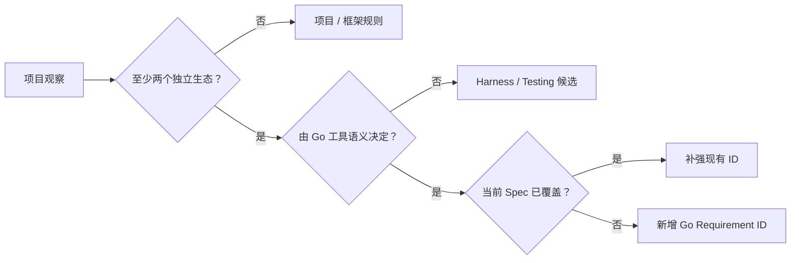

# RT-003 · Cross-project candidate Go requirements

## 结论速览

<!-- topic-role: decision-brief -->

> **答案：** 跨 OpenTelemetry、Grafana 与 Prometheus 的证据支持新增两个候选：
> `GO-MODULE-001`（依赖状态可规范化）与 `GO-GENERATE-001`（已提交生成物可重建）。
> race 与支持矩阵应补强现有 lifecycle/test 条款，不应重复建新规则。
>
> **置信度：** High。两个候选均有三个生态的可执行 CI 证据，并与 Go 官方工具
> 语义一致；测试矩阵的具体强度因项目风险而异，置信度为 Medium。
>
> **决策影响：** 下一步可以起草 `languages/go` 0.3.0，但只能引入下面列出的
> 两个新增 ID、两个 validation 修订，以及 RT-004 识别出的一个 Go-only
> naming 修订；项目 import、日志、package 布局和 Makefile 名称必须排除。
>
> **适用边界：** 结论覆盖使用 Go modules、可能提交生成输出、并以 CI 交付的
> Go 仓库。小型无生成物仓库对 `GO-GENERATE-001` 自动不适用。

关联研究问题：

- `RQ-001`
- `RQ-002`
- `RQ-003`
- `RQ-004`

RT-001 与 RT-002 提供项目内机制，本专题再用 Prometheus 与 Go 官方文档校正层级，
并把观察转换成可评审的候选规范文本。

**按阅读目标选择路径：**

- 快速决策：结论速览 → 候选变更表；
- 理解推导：分层门槛 → module → generator → 测试矩阵；
- 完整评审：继续阅读反例、falsifier、证据索引与固定来源。

## 规范提取需要同时满足复现性、普适性与正确层级

<!-- topic-role: mental-model -->

“知名项目这样做”只能证明实践存在。只有当实践跨生态出现、由 Go 的 module、
generator 或 runtime 语义支撑，并且当前规范确有缺口时，才有资格成为新的
language-level Requirement。

## 两个状态闭环通过了新增规则门槛

<!-- topic-role: analysis -->

先用现有 Spec 做 gap analysis，再对候选文字施加反例，避免把 CI 实现细节写成
规范。

### Module 文件必须表示 canonical dependency state（A-001）

OTel、Loki 与 Mimir 都在 CI 中执行 tidy 或更完整的 download/verify/tidy/vendor
链，并对工作树差异失败；Prometheus 贡献契约也要求 tidy 后提交 `go.mod` 与
`go.sum`。[E-001](#e-001) [E-002](#e-002) [E-003](#e-003)
[E-004](#e-004) Go 官方说明 `go mod tidy` 会根据代码与测试补齐缺失 module、
移除无用 module，并同步 `go.sum`；它还按所有 build tags 考虑依赖。
[E-005](#e-005)

当前 `languages/go` 只要求 canonical validation 通过，没有规定依赖图必须保持
可复现和无漂移。[E-008](#e-008) 因此这是实质缺口，而不是对 `GO-TEST-001`
换一种说法。

候选规范文字：

> **GO-MODULE-001 — Module dependency state is reproducible**
>
> Every checked-in Go module **MUST** have `go.mod` and `go.sum` state that is
> canonical for the repository's declared Go toolchain. Dependency changes
> **MUST** run `go mod tidy` or an equivalent no-diff check. A committed vendor
> tree **MUST** be regenerated from the same module state. Multi-module
> repositories **MUST** apply the check to every declared module, and CI
> **MUST** fail when normalization produces an uncommitted difference.

`go mod verify` 可作为使用下载 module 的强默认，但不应成为无条件 MUST；它验证
下载内容而不是 module 选择本身。临时 workspace 也不应被误写成通用禁令，规则
只要求它不能无意改变共享 dependency state。

### 已提交生成物必须证明自己仍是源的投影（A-002）

四个样本都至少有一类生成物通过“重建后 clean diff”检查：Collector 的
`go generate`/proto/pdata，Loki 的 yacc/ragel/proto，Mimir 的 proto/node/docs，
Prometheus 的 parser/proto/PromQL 函数。[E-001](#e-001)
[E-002](#e-002) [E-003](#e-003) [E-006](#e-006)

Go 官方明确指出 `go generate` 不会被 `go build` 或 `go test` 自动执行。
[E-007](#e-007) 所以仅运行普通测试不能证明生成物与源一致；必须单独建立
generator 闭环。

候选规范文字：

> **GO-GENERATE-001 — Versioned generated artifacts are reproducible**
>
> When generated Go artifacts are committed, the repository **MUST** identify
> their authoritative inputs and a reproducible generation command. CI
> **MUST** regenerate the artifacts with the declared toolchain and fail when
> the resulting tracked files differ. Generated output **MUST NOT** be edited
> as the authoritative source. Scoped debugging edits **MAY** be used locally
> but **MUST NOT** replace regeneration before review.

这条规则不要求项目提交生成物。若项目选择 build-time generation，它应由构建系统
保证输入和工具固定；本候选只约束已 versioned 的投影。

### Race 与 build matrix 是现有要求的证据增强而非新概念（A-003）

OTel 默认测试在支持平台启用 race，并测试 stable/oldstable；Mimir 提供 race 与
不同 build tags；Prometheus 测试 race、旧 Go、Windows、386 与多种 tags；
Loki 分离 integration、fuzz 和带 tags 的 lint/test。[E-009](#e-009)

这证明 concurrency 与条件编译必须进入验证面，但当前 `GO-LIFECYCLE-001` 已要求
race/leak 证据，`GO-TEST-001` 已要求 canonical CI。[E-008](#e-008) 新建
`GO-MATRIX-001` 会引入重叠。更小的修订是：

- 在 `GO-LIFECYCLE-001` 的 Enforcement 中要求 concurrency-bearing packages
  在受支持平台运行 `-race`，不能运行的路径记录精确例外；
- 在 `GO-TEST-001` 中要求对改变行为的 build tags、支持 Go 版本与目标平台建立
  risk-based compile/test matrix，并明确未覆盖边界。

Go 官方也提醒 race detector 只有在代码路径实际执行时才可能发现问题，而且资源
成本高，因此“每个 job 都开 race”不是合理的通用 MUST。[E-010](#e-010)

### Canonical 命令与架构 lint 应进入 Harness 或项目 Spec（A-004）

所有样本都提供本地 Make target 并在 CI 复用，还会用 `depguard`、`faillint` 或
自定义检查表达架构政策。[E-011](#e-011) 这是 Harness Engineering 的核心机制：
给 Agent 一个短反馈回路，并把重复评审意见机械化。

但 Make 不是 Go 语言契约，禁止某个 logger、metrics registerer 或 package 方向也
不是普适规则。可复用结果应成为未来 testing/harness 规范：“CI 必须调用仓库声明
的 canonical command；项目政策门禁必须给出作用域与替代路径”，而不是塞进
`languages/go`。

## 更宽的候选因为重复或层级错误被拒绝

<!-- topic-role: alternatives -->

| 候选 | 支持它的观察 | 失去资格的原因 | 当前处理 |
|---|---|---|---|
| 固定 `golangci-lint` linter 列表 | 四个项目均使用 lint | 各自启用项和例外不同 | 项目 Spec |
| 所有 test 无条件 `-race` | 三个样本广泛使用 | 平台、成本与路径触发限制 | 补强现有 lifecycle |
| 强制 table-driven test | 多个指南推荐 | 并非每个单例契约都更清晰 | 保留现有 SHOULD |
| 统一 package/module 布局 | OTel 有成熟模型 | 发布边界由产品架构决定 | 项目架构 |
| 强制提交 vendor | Grafana 两项目使用 | OTel 与 Prometheus 不采用同一策略 | `GO-MODULE-001` 条件分支 |
| 强制特定日志/错误库 | lint 可机械执行 | 属于迁移史和框架选择 | 项目/框架 Spec |

## 候选变更表给出可直接评审的下游输入

<!-- topic-role: implications -->

| 目标 | 建议 | Enforcement | Evidence |
|---|---|---|---|
| 新增 `GO-MODULE-001` | 接受候选文字 | tidy/no-diff；覆盖 module inventory；可选 verify/vendor | clean revision 的 module check |
| 新增 `GO-GENERATE-001` | 接受候选文字 | 固定输入与工具再生后 no-diff | clean generator check |
| 修订 `GO-NAME-002` | 按 RT-004 增加单方法 interface 与 canonical method naming，仅适用于 Go | API/call-site review；可选 naming lint | focused lint、type checking 与 reviewed exceptions |
| 修订 `GO-LIFECYCLE-001` | 增加支持平台 race 与例外作用域 | risk-based `go test -race` | package-bound race result |
| 修订 `GO-TEST-001` | 增加 toolchain/platform/tag matrix | compile/test matrix | revision-bound CI matrix |
| 新建 Harness/Testing Spec | 后续单独研究 | canonical command 与 policy lint | CI-to-local command mapping |

如果 Owner 接受该 Synthesis，下游应把前五项做成一个 scoped normative change，
提升 `languages/go` minor version并刷新 digest；第六项需要独立 Research，因为它
跨语言且会改变 Catalog 分类内容。`GO-NAME-002` 修订不得移入
`core/semantic-naming` 或应用到 Java、Python、数据库与配置 identifier。

## 哪些新证据会改变当前判断

<!-- topic-role: falsifiers -->

| 影响的分析 | 会削弱或推翻当前判断的证据 | 为什么重要 | 如何验证 |
|---|---|---|---|
| A-001 | `go mod tidy` 在声明工具链下仍不可重复或破坏受支持依赖图 | canonical state 假设失效 | 固定 Go patch version 连续运行并比较 |
| A-002 | 项目生成器依赖不可锁定的环境且官方不支持重放 | 规则可能阻止合法生成模型 | 记录 hermetic boundary 与替代证据 |
| A-003 | 当前 Spec validator 将两个修订解释为新的独立义务 | 可能需要单独 ID | 对正式文本做 Requirement review |
| A-004 | 某项架构 lint 在多个非观测生态中语义完全一致 | 可能值得提升为 language rule | 新一轮跨领域样本研究 |

## 下游交接

<!-- topic-role: handoff -->

| 去向 | 状态 | 具体变化或约束 |
|---|---|---|
| Synthesis | integrated | 采用两个新增候选、两个 validation 修订，并从 RT-004 纳入一个 Go-only naming 修订 |
| `languages/go` | not-ready | 等待 Research Owner 明确定稿并封存 |
| Harness/Testing Research | deferred | canonical command 与 policy lint 另立跨语言研究 |
| Project Specs | required | 精确 imports、logger、module layout 不上浮 |

## 证据索引

<!-- topic-role: evidence-index -->

| ID | 观察 | 精确来源 | 支持的分析 | 置信度 |
|---|---|---|---|---|
| E-001 | OTel 以 CI clean diff 检查 tidy 与多类 generator | S-001 | A-001, A-002 | High |
| E-002 | Loki CI/Make 检查 module 与 generated 状态 | S-002 | A-001, A-002 | High |
| E-003 | Mimir CI/Make 检查 module、proto、node 与文档生成 | S-003 | A-001, A-002 | High |
| E-004 | Prometheus 要求 tidy 并提交 module 文件 | S-004 | A-001 | Medium |
| E-005 | Go 官方定义 tidy 对 code/test/tag dependency state 的同步语义 | S-005 | A-001 | High |
| E-006 | Prometheus CI 重建 parser/proto/PromQL 输出并拒绝 diff | S-006 | A-002 | High |
| E-007 | `go generate` 不会由 build/test 自动运行 | S-007 | A-002 | High |
| E-008 | 当前 Go Spec 已覆盖 race、canonical CI，但未覆盖 module/generator | S-008 | A-001, A-003 | High |
| E-009 | 四个样本均显式拆分风险相关测试或构建维度 | S-009 | A-003 | High |
| E-010 | Go 官方说明 race 仅检测实际路径且成本显著 | S-010 | A-003 | High |
| E-011 | 项目复用 local target 并以 lint 编码架构政策 | S-011 | A-004 | High |

## 来源

<!-- topic-role: sources -->

- S-001 — [OTel Collector CI at `e864743`](https://github.com/open-telemetry/opentelemetry-collector/blob/e8647437141c7c2cf76dfaa4d5e4bdc41d28dc9c/.github/workflows/build-and-test.yml#L96-L175)。
- S-002 — [Loki Makefile at `6962b12`](https://github.com/grafana/loki/blob/6962b120c4ecb46b38325eaa39721d553b978f16/Makefile#L195-L211)与[dependency check](https://github.com/grafana/loki/blob/6962b120c4ecb46b38325eaa39721d553b978f16/Makefile#L657-L668)。
- S-003 — [Mimir CI at `9f8400e`](https://github.com/grafana/mimir/blob/9f8400e81c8c2f8ebfe723797cd5bd7d21bfa3eb/.github/workflows/test-build-deploy.yml#L72-L115)。
- S-004 — [Prometheus CONTRIBUTING at `bf5a981`, dependency lines 64–84](https://github.com/prometheus/prometheus/blob/bf5a9810e60d5f4cdbb4035119fd61668790b1b7/CONTRIBUTING.md#L64-L84)。
- S-005 — [Go Modules Reference: `go mod tidy`](https://go.dev/ref/mod#go-mod-tidy)。
- S-006 — [Prometheus CI at `bf5a981`, generated checks](https://github.com/prometheus/prometheus/blob/bf5a9810e60d5f4cdbb4035119fd61668790b1b7/.github/workflows/ci.yml#L294-L310)。
- S-007 — [Go command documentation: generate](https://pkg.go.dev/cmd/go#hdr-Generate_Go_files_by_processing_source)。
- S-008 — Repository-local [`specification/languages/go.md`](../../../../../specification/languages/go.md)，当前 Requirement 与 gap 基线。
- S-009 — [Prometheus CI support matrix at `bf5a981`](https://github.com/prometheus/prometheus/blob/bf5a9810e60d5f4cdbb4035119fd61668790b1b7/.github/workflows/ci.yml#L13-L121)，并结合 S-001、S-002、S-003。
- S-010 — [Go race detector documentation](https://go.dev/doc/articles/race_detector)。
- S-011 — RT-001 与 RT-002 中固定 revision 的 target/lint 证据。

## 修订记录

<!-- topic-role: revision-notes -->

- 2026-07-30T16:31:20Z — RT-003 created for RR-001.
- 2026-07-31 — Added cross-project matrix, candidate normative text, and
  rejected project-level rules.
