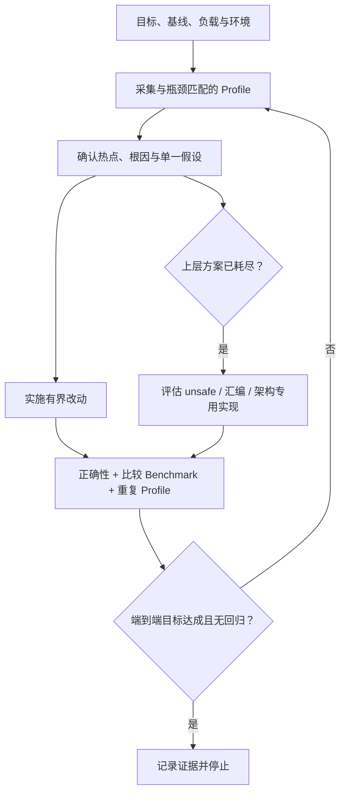

# RT-005 · Go performance optimization workflow and specification boundary

## 这套流程可以提炼为 Go 专项规范，但固定四步只能保留为默认路径

<!-- topic-role: decision-brief -->

> **答案：** 将可复用部分发布为显式选择的
> `languages/go/performance`。规范约束目标、代表性证据、热点改动、比较验证和
> 低层优化准入；“先内存、再 CPU、最后汇编”保留为可跳过的默认路径。
>
> **置信度：** High。引用任务与 Go 官方 diagnostics、pprof、benchmark、PGO
> 和 assembler 文档共同支持证据闭环；跨语言抽象仍缺少第二种语言的验证。
>
> **决策影响：** 新增一个依赖 `languages/go` 的 Development Specification，
> 不修改 `languages/go` 的通用实现要求，也不提前发布 `testing/` 共享契约。
>
> **适用边界：** 结论覆盖 Go 程序的性能诊断、优化、评审和回归验证。它不规定
> 固定阈值、产品架构、热点代码比例，也不证明 VictoriaMetrics 的实现细节适用于
> 其他仓库。

关联研究问题：

- `RQ-006`
- `RQ-007`
- `RQ-008`

这个专题决定新规则的规范层级和强度。它把来源中的工程经验转换为可验证不变量，
同时阻止项目结论、经验数字和工具示例获得超出证据的规范地位。

**按阅读目标选择路径：**

- 快速决策：结论速览 → 规范边界；
- 理解机制：证据闭环 → 诊断分支 → 验证层级 → 低层准入；
- 完整评审：继续阅读替代方案、可证伪条件、证据索引和来源。

## 性能优化是带停止条件的证据闭环

<!-- topic-role: mental-model -->

闭环包含四类边界：目标决定何时停止，负载决定数据是否代表真实问题，Profile
决定改动位置，比较验证决定收益是否成立。下面依次从来源流程中提取这四类不变量，
再判断 Go 专项规范的最小 Requirement 集合。

## 来源中的经验顺序需要转换为可分支的规范不变量

<!-- topic-role: analysis -->

先判断四步流程中稳定不变的部分，再处理不同瓶颈的分支，最后收敛证据和规范层级。

### 四步经验的稳定内核是“测量—假设—改动—复测”（A-001）

引用任务给出的顺序是生产负载采样、减少热路径分配、重构 CPU 热点、必要时进入
汇编。后续讨论又补充了 benchmark、正确性验证、端到端指标和重新采样，说明一次
线性执行不能完成验收。[E-001](#e-001) Go 官方 pprof 示例同样先以 Profile
定位成本，再修改具体瓶颈并重新测量结果。[E-002](#e-002)

因此规范应固定闭环和停止条件，不应固定每个项目都会进入的四个阶段。一个 CPU
热点没有显著分配时，先做内存改动只会制造无关复杂度；一个已经满足目标的服务也
无需继续追求局部极值。

### 代表性负载和匹配的诊断类型共同决定证据效度（A-002）

Go diagnostics 将 CPU、heap、allocs、block、mutex 和 trace 对应到不同成本，
并提醒某些采集方式会互相干扰。[E-003](#e-003) Go PGO 文档要求 Profile 代表
应用实际行为，并明确指出只覆盖局部路径的 microbenchmark 通常不能代表整个
程序。[E-004](#e-004)

由此可得两个规范条件：采样必须绑定 workload、revision、配置、工具链和环境；
诊断类型必须匹配待验证的瓶颈。Profile 只能显示成本归属，评审还要沿调用链验证
热点是否为根因。

### 内存、CPU、锁与 I/O 应按证据分支，不宜机械串行（A-003）

`runtime/pprof` 对 allocs、heap、block 与 mutex 给出不同观测语义：累计分配、
存活对象、同步阻塞和锁竞争不能互相替代。[E-005](#e-005) 引用任务的修订也明确
允许在分配成本低时跳过内存阶段，并在锁、I/O 或调度主导时切换诊断手段。
[E-006](#e-006)

规范可以把算法、数据流、分配和并发作为低风险优先方向，但具体顺序由当前证据
决定。固定“内存一定先于 CPU”会把一条常用启发式误写成普遍义务。

### 性能收益必须由同条件基线与实验比较建立（A-004）

Go 项目的性能监控原则要求性能数字始终相对于基线报告，并解释跨时间测量会引入
机器状态噪声。[E-007](#e-007) Go PGO 示例在同一 workload 下重复运行基线和
实验版本，再用 `benchstat` 比较多轮结果。[E-008](#e-008) `testing.B` 提供标准
benchmark 入口，但单个 `ns/op` 数字不等于端到端收益。[E-009](#e-009)

最小证据应包含基线与实验 revision、workload、环境、命令、重复结果、比较方法和
正确性测试。面向服务的改动还要复核吞吐、资源消耗、尾延迟和错误率，防止局部
改进转移成本。

### unsafe、汇编和架构专用实现需要额外的可移植性预算（A-005）

Go assembler 使用半抽象指令集，同时包含大量架构专用细节和运行时指针约束；
官方指南要求 Go prototype、正确的指针信息，并区分不同架构行为。
[E-010](#e-010) 现有 `GO-TEST-001` 与 `GO-COMPAT-001` 已要求受影响的架构、
build tag 和兼容表面获得验证。[E-011](#e-011)

低层实现只有在 Profile 持续指向同一热点、上层方案无法达到已批准目标、预期收益
覆盖维护成本时才具备准入依据。实现应缩小边界，保留可读参考或纯 Go fallback，
并对受支持架构执行等价性与性能比较。

### 当前证据支持 Go 子规范，尚不支持跨语言 testing 契约（A-006）

仓库模型允许 `languages/` 持有语言特定测试实践，同时要求共享规则只有在更宽层级
仍然成立时才上浮。[E-012](#e-012) 本轮证据全部来自 Go 工具链和 Go 项目经验，
没有验证 Java、Rust 或其他运行时的采样、基准和低层优化边界。

因此最小且可发布的边界是 `languages/go/performance`，依赖
`languages/go` 并保持显式选择。未来若第二种语言证明目标、基线和比较验证具有
相同契约，可以再通过 Proposal 抽取 `testing/performance`，Go 子规范只保留
pprof、GC、逃逸分析和 assembler 约束。

## 三种看似合理的放置方式只有 Go 子规范满足当前证据

<!-- topic-role: alternatives -->

| 解释或方案 | 为什么看似合理 | 反证 | 当前判断 |
|---|---|---|---|
| 直接扩充 `languages/go` | 所有 Go 项目都可能关心性能 | 大多数 Go 任务无需加载完整性能流程，Requirement context 会膨胀 | 拒绝，保持窄 Spec |
| 新增 `testing/performance` | 目标与基线看起来跨语言 | 当前没有第二语言或不同运行时证据，且会引入新顶层 testing 抽象 | 延后到跨语言 Research 与 ESP |
| 新增 `languages/go/performance` | Go Profile、benchmark 和汇编具有明确工具边界 | 仍需避免写入产品阈值和经验数字 | 采用，显式选择 |
| 把四步原文逐条改成 MUST | 路径简单、易检查 | 锁、I/O、无分配热点和已达标场景会被错误约束 | 拒绝，改写为分支闭环 |

## 五个 Requirement 足以封闭目标、诊断、改动、验证和低层准入

<!-- topic-role: implications -->

新 Spec 应声明 `GO-PERF-TARGET-001`、`GO-PERF-DIAGNOSE-001`、
`GO-PERF-CHANGE-001`、`GO-PERF-VERIFY-001` 和
`GO-PERF-LOWLEVEL-001`。前四项构成主闭环，最后一项仅在 unsafe、汇编或
架构专用实现进入范围时激活。

每项 Requirement 从 Advisory 开始。Catalog 使用 `**/*.go` 与 `**/*.s` 产生
保守候选，description 与 Applicability 再判断任务是否真的在处理性能。该新增
Spec 位于已有语言类别，只依赖一个已发布父 Spec，属于边界清楚的 Development
增量；当前不需要新 ESP。

## 哪些新证据会改变当前判断

<!-- topic-role: falsifiers -->

| 影响的分析 | 会削弱或推翻当前判断的证据 | 为什么重要 | 如何验证 |
|---|---|---|---|
| A-001 | 多个成功优化无需基线、复测或停止条件仍能稳定复现 | 证据闭环可能过度约束 | 用固定 revision 独立复现收益 |
| A-002, A-003 | 单一 Profile 能可靠区分 CPU、分配、锁和 I/O 根因 | 诊断分支可被简化 | 对已知多瓶颈 workload 做盲测 |
| A-004 | 单次或跨环境绝对数字能稳定预测生产收益 | 比较证据要求可能过强 | 跨机器、跨时段重复同一实验 |
| A-005 | 架构专用实现可由默认架构测试证明全部受支持行为 | 多架构矩阵可能没有增量价值 | 在不同 GOARCH 运行等价性测试 |
| A-006 | 第二种语言验证相同不变量且只需少量适配 | 共享 testing 层获得证据 | 新建跨语言 Research 与 Proposal |

## 下游交接

<!-- topic-role: handoff -->

| 去向 | 状态 | 具体变化或约束 |
|---|---|---|
| Synthesis | required | 纳入 `languages/go/performance` 推荐、五个 Requirement 和跨语言延后条件 |
| Specification | required | 从正式模板创建 Development Spec，依赖 `languages/go`，所有新 Requirement 为 Advisory |
| ADR / ExecPlan | not-ready | 本次规范内容不改变单一实现仓库架构，无需 ADR；发布执行仍按仓库治理流程 |
| Prototype / monitoring | not-ready | Warning/Blocking 需独立观察证据；本轮不提升自动执行等级 |

## 证据索引

<!-- topic-role: evidence-index -->

| ID | 观察 | 精确来源 | 支持的分析 | 置信度 |
|---|---|---|---|---|
| E-001 | 引用任务提出四阶段路径，后续文档补充复测、正确性与停止条件 | S-001 | A-001 | High |
| E-002 | Go 官方 pprof 案例根据 CPU 与内存 Profile 逐轮定位并降低成本 | S-002 | A-001 | High |
| E-003 | Go diagnostics 区分多类 Profile，并说明采集可能相互干扰 | S-003 | A-002 | High |
| E-004 | Go PGO 要求代表性 Profile，并提示 microbenchmark 覆盖范围过窄 | S-004 | A-002 | High |
| E-005 | `runtime/pprof` 分别定义 allocs、heap、block 与 mutex 的观测语义 | S-005 | A-003 | High |
| E-006 | 引用任务修订允许跳过内存阶段，并按锁、I/O 或调度瓶颈分支 | S-001 | A-003 | High |
| E-007 | Go 性能监控原则要求结果始终与基线比较 | S-006 | A-004 | High |
| E-008 | Go PGO 示例重复采集基线与实验并使用 `benchstat` 比较 | S-007 | A-004 | High |
| E-009 | `testing.B` 定义标准 benchmark、并行与自定义指标机制 | S-008 | A-004 | High |
| E-010 | Go assembler 包含架构和运行时指针约束，需要专门 prototype 与检查 | S-009 | A-005 | High |
| E-011 | 当前 Go Spec 要求架构/build-tag 测试矩阵和兼容验证 | S-010 | A-005 | High |
| E-012 | 本仓库允许语言特定测试规则，并要求证据支持最宽有效层级 | S-011, S-012 | A-006 | High |

## 来源

<!-- topic-role: sources -->

- S-001 — Codex task `019fdaa3-0043-7122-b932-bdc98162aa9b`, “分析 Go
  性能优化流程”, including the source workflow and generated
  `go-performance-optimization-best-practices.md`; direct provenance for the
  requested extraction.
- S-002 — [Go Blog: Profiling Go Programs](https://go.dev/blog/pprof), official
  CPU and memory Profile-guided optimization walkthrough.
- S-003 — [Go Diagnostics](https://go.dev/doc/diagnostics), official profile,
  trace, runtime-statistics, overhead, and interference guidance.
- S-004 — [Go Profile-guided optimization](https://go.dev/doc/pgo), official
  representative-profile and whole-program coverage guidance.
- S-005 — [`runtime/pprof` package](https://pkg.go.dev/runtime/pprof), exact
  semantics of allocs, heap, block, mutex, goroutine, and CPU profiles.
- S-006 — [Go Performance Monitoring](https://go.dev/wiki/PerformanceMonitoring),
  official baseline-versus-experiment principles.
- S-007 — [Go Blog: Profile-guided optimization in Go 1.21](https://go.dev/blog/pgo),
  repeated benchmark and `benchstat` comparison example.
- S-008 — [`testing` package](https://pkg.go.dev/testing), standard Go benchmark
  contract and parallel measurement support.
- S-009 — [A Quick Guide to Go's Assembler](https://go.dev/doc/asm), official
  architecture, ABI, pointer-map, prototype, and vet constraints.
- S-010 — [Go Implementation Specification](../../../../../specification/languages/go.md),
  current `GO-COMPAT-001` and `GO-TEST-001` contracts.
- S-011 — [Specification Model](../../../../../docs/specification-model.md),
  composition and language-specific testing boundaries.
- S-012 — [Specification Principles](../../../../../governance/specification-principles.md),
  broadest evidence-supported layer and verifiability rubric.

## 修订记录

<!-- topic-role: revision-notes -->

- 2026-08-10T08:46:33Z — RT-005 created for RR-002.
- 2026-08-10 — Separated the reusable evidence loop from the fixed four-stage
  heuristic and recommended `languages/go/performance` with five Requirements.
