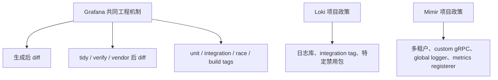

# RT-002 · Grafana Loki and Mimir Go engineering practices

## 结论速览

<!-- topic-role: decision-brief -->

> **答案：** Loki 与 Mimir 共同强化了两条可复用机制：依赖与生成物必须能够从
> 声明命令恢复到 clean tree，测试必须按风险拆成 unit、integration、race 或
> build-tag 维度。它们的大量禁用包和架构 lint 则是项目政策。
>
> **置信度：** High。两个仓库的贡献文档、Makefile 与阻塞 CI target 互相对应。
>
> **决策影响：** 将生成物与 module 一致性提升为通用候选；将 lint 的具体 import
> 规则、日志库、部署模式和文档生成流程保留在项目或框架 Spec。
>
> **适用边界：** Loki revision
> `6962b120c4ecb46b38325eaa39721d553b978f16` 与 Mimir revision
> `9f8400e81c8c2f8ebfe723797cd5bd7d21bfa3eb`。两个样本同属 Grafana
> 生态，不能视作完全独立的两票。

关联研究问题：

- `RQ-001`
- `RQ-002`
- `RQ-004`

Grafana 证据的价值在于同一组织内两个不同系统如何共享机制又保留局部政策。它能
验证“机制可迁移”，但 RT-003 仍需要 Prometheus 作为独立控制样本。

**按阅读目标选择路径：**

- 快速决策：结论速览 → 分层结论；
- 理解机制：生成闭环 → module 闭环 → 风险测试；
- 完整评审：继续阅读项目 lint 反例、证据索引与固定 revision 来源。

## 共同平台机制与局部架构政策必须分层

<!-- topic-role: mental-model -->

如果把右侧项目政策和左侧共同机制混为一谈，通用 Spec 会把 Loki/Mimir 的历史与
架构选择强加给所有 Go 仓库。本分析先证明共同机制，再说明为什么具体规则必须
留在较窄作用域。

## 两个 Grafana 项目以相同闭环治理不同代码库

<!-- topic-role: analysis -->

Loki 与 Mimir 的命令名称和目录不同，但它们都把派生状态转化为“运行工具后是否
产生 Git 差异”的可观测结果。

### 已提交生成物必须能够再生为零差异（A-001）

Loki 的 `check-generated-files` 重建 yacc、ragel 与 protobuf 产物后检查 diff，
其复用 CI 明确把该 target 作为 check job。Mimir CI 同样运行 protobuf、node
methods、文档和 reference help 的重建检查。[E-001](#e-001)
[E-002](#e-002)

两者生成技术完全不同，却共享同一个不变量：提交树不能包含与源和生成器不一致的
投影。由此提取的规则不应写“必须使用 protobuf”或“必须提交 generated code”，
而应覆盖“只要提交生成物，就必须有可重放且无漂移的来源链”。

### Module、checksum 与 vendor 是一个原子依赖状态（A-002）

Loki 文档要求依赖变更同时提交 `go.mod`、`go.sum` 与 `vendor/`，`check-mod`
执行 download、verify、tidy、vendor 后拒绝差异。Mimir 的 `mod-check` 使用同一
闭环，并由 CI 直接调用。[E-003](#e-003) [E-004](#e-004)

这里可复用的是“仓库选择的依赖表示必须原子且可规范化”。没有 vendor 的项目
无需创建 vendor；多 module 项目则必须遍历已声明的 module。临时本地替换应使用
未提交的 workspace 或等价隔离，避免把开发环境泄漏进共享 module 状态。

### 测试层次应对应风险，而不是复制固定命令（A-003）

Loki 分离 unit、integration 与 fuzz target；Mimir 分离 unit、race 与 integration，
并让 build tags 参与真实 test/lint 路径。[E-005](#e-005)
[E-006](#e-006) 差异证明不存在唯一“成熟项目测试命令”，共同点是会改变行为的
模式必须拥有明确入口和 CI 证据。

因此通用 Go 规则可以要求并发代码接受 race 覆盖、条件编译路径接受构建或测试，
但不能规定每个库都创建 integration 目录或 fuzz job。

### 架构 lint 证明项目约束应机械化，但其内容不能上浮（A-004）

Loki 用 `depguard` 和 `faillint` 禁止淘汰日志与 tracing 依赖；Mimir 进一步限制
package 方向、错误类型、默认 metrics registerer、global logger 和 context API。
[E-007](#e-007) [E-008](#e-008) 这些规则通常附带替代路径，使 Agent 在失败位置
就能获得下一步动作。

它们是优秀的 Harness 实践，却依赖项目架构。通用 Spec 应要求项目把重复 review
意见变成有作用域、有替代建议的门禁；具体 import 与 package 边界应登记为
project-owned Spec。

## 不能从同一组织的相似自动化推断统一技术选型

<!-- topic-role: alternatives -->

| 解释或方案 | 为什么看似合理 | 反证 | 当前判断 |
|---|---|---|---|
| 所有项目都提交 vendor | Loki/Mimir 都这样做 | Go modules 不要求 vendor；OTel 与 Prometheus 策略不同 | 依仓库策略 |
| 所有 Go 测试都建 integration 目录 | Loki/Mimir 都有 | 库项目可能没有外部集成边界 | 条件适用 |
| 直接复用 Grafana 禁用包清单 | 替代路径具体 | 清单反映迁移史与项目 API | 项目级 |
| 强制同一日志库与 key 顺序 | Loki 文档清楚 | Mimir 与 OTel 的 logging abstraction 不同 | 框架/项目级 |

## 分层结论决定规范放置位置

<!-- topic-role: implications -->

生成一致性和 module 一致性可进入 `languages/go`，因为其语义由 Go 的生成与 module
系统决定。race、build tags 与 integration 覆盖适合补强现有 lifecycle/test
要求。禁止 import、日志键、metrics 注册器、部署结构和文档生成细节必须留在项目
Spec；若多个项目未来共享某一框架规则，再提升到 `frameworks/`。

## 哪些新证据会改变当前判断

<!-- topic-role: falsifiers -->

| 影响的分析 | 会削弱或推翻当前判断的证据 | 为什么重要 | 如何验证 |
|---|---|---|---|
| A-001 | CI 允许生成后 diff 非空仍成功 | 生成闭环不是门禁 | 检查复用 workflow 的 required job |
| A-002 | module target 在 clean revision 上因非确定源持续漂移 | 不能作为可靠验证 | 在固定工具镜像连续运行两次 |
| A-003 | build-tag 路径没有任何对应 CI job | 风险覆盖判断过高 | 展开 workflow 与 test scripts |
| A-004 | 某条禁用 import 已被多个独立生态采用且语义一致 | 可能具备更宽适用性 | 增加非 Grafana 样本 |

## 下游交接

<!-- topic-role: handoff -->

| 去向 | 状态 | 具体变化或约束 |
|---|---|---|
| Synthesis | integrated | 纳入生成、module、风险测试三类共同机制 |
| ADR / ExecPlan | not-ready | 等待跨生态候选排序与 Owner 评审 |
| Project Specs | required | Grafana-specific lint、日志与部署约束不上浮 |

## 证据索引

<!-- topic-role: evidence-index -->

| ID | 观察 | 精确来源 | 支持的分析 | 置信度 |
|---|---|---|---|---|
| E-001 | Loki 重建多类生成文件并在 diff 非空时失败 | S-001, S-002 | A-001 | High |
| E-002 | Mimir CI 重建 protobuf、node、docs 与 reference help | S-003, S-004 | A-001 | High |
| E-003 | Loki 将 tidy、verify、vendor 与三类文件 diff 组成 check | S-005 | A-002 | High |
| E-004 | Mimir 的同类 `mod-check` 是直接 CI step | S-003, S-006 | A-002 | High |
| E-005 | Loki 分离 unit、integration 和 fuzz 入口 | S-007 | A-003 | High |
| E-006 | Mimir 提供 race/integration/build-tag 测试路径 | S-006 | A-003 | High |
| E-007 | Loki 以 lint 禁止过时日志与 tracing 依赖 | S-008 | A-004 | High |
| E-008 | Mimir 以 lint 维护 package、error、context 和 metrics 架构 | S-006 | A-004 | High |

## 来源

<!-- topic-role: sources -->

- S-001 — [Loki Makefile at `6962b12`, generated-file check lines 203–211](https://github.com/grafana/loki/blob/6962b120c4ecb46b38325eaa39721d553b978f16/Makefile#L203-L211)。
- S-002 — [Loki release workflow source at `6962b12`, check targets lines 116–126](https://github.com/grafana/loki/blob/6962b120c4ecb46b38325eaa39721d553b978f16/.github/vendor/github.com/grafana/loki-release/workflows/validate.libsonnet#L116-L126)。
- S-003 — [Mimir CI at `9f8400e`, lint and generated checks lines 72–115](https://github.com/grafana/mimir/blob/9f8400e81c8c2f8ebfe723797cd5bd7d21bfa3eb/.github/workflows/test-build-deploy.yml#L72-L115)。
- S-004 — [Mimir Makefile at `9f8400e`, generated checks lines 552–570 and 751–766](https://github.com/grafana/mimir/blob/9f8400e81c8c2f8ebfe723797cd5bd7d21bfa3eb/Makefile#L552-L570)。
- S-005 — [Loki dependency workflow and `check-mod` at `6962b12`](https://github.com/grafana/loki/blob/6962b120c4ecb46b38325eaa39721d553b978f16/Makefile#L657-L668)。
- S-006 — [Mimir Makefile at `9f8400e`, lint/test/module checks lines 400–570](https://github.com/grafana/mimir/blob/9f8400e81c8c2f8ebfe723797cd5bd7d21bfa3eb/Makefile#L400-L570)。
- S-007 — [Loki contribution and test commands at `6962b12`](https://github.com/grafana/loki/blob/6962b120c4ecb46b38325eaa39721d553b978f16/CONTRIBUTING.md#L38-L81)。
- S-008 — [Loki lint policy at `6962b12`](https://github.com/grafana/loki/blob/6962b120c4ecb46b38325eaa39721d553b978f16/.golangci.yml#L27-L109)。
- S-009 — [Mimir contribution guidance at `9f8400e`](https://github.com/grafana/mimir/blob/9f8400e81c8c2f8ebfe723797cd5bd7d21bfa3eb/docs/internal/contributing/README.md#L15-L165)，用于核对格式、测试、dependency 与 error 指南。

## 修订记录

<!-- topic-role: revision-notes -->

- 2026-07-30T16:31:19Z — RT-002 created for RR-001.
- 2026-07-31 — Added Loki/Mimir comparison and project-boundary analysis.
