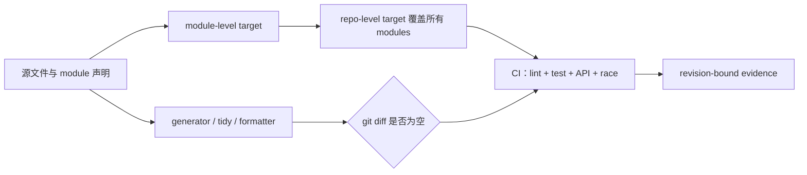

# RT-001 · OpenTelemetry Collector Go engineering practices

## 结论速览

<!-- topic-role: decision-brief -->

> **答案：** OpenTelemetry Collector 最值得复用的不是组件目录结构，而是把
> Go module、生成物、静态规则和测试矩阵都变成可重复生成、可比较且覆盖整个
> 仓库的机械契约。
>
> **置信度：** High。贡献指南、Make target 与 GitHub Actions 在固定 revision
> 上相互印证。
>
> **决策影响：** 将生成物一致性和 module 状态一致性列为新的 Go Spec 候选；
> 用现有生命周期要求承接 race test，不复制 Collector 专属模块与组件规则。
>
> **适用边界：** 结论基于 OpenTelemetry Collector
> `e8647437141c7c2cf76dfaa4d5e4bdc41d28dc9c`。项目专属组件命名、稳定性、
> `metadata.yaml` 和多 module 布局不视为通用 Go 约束。

关联研究问题：

- `RQ-001`
- `RQ-002`
- `RQ-004`

这个样本说明成熟项目如何把工程判断编译成 Agent 可见的反馈，但它不能单独证明
规则具有跨项目普适性。RT-003 会用 Grafana 与 Prometheus 证据交叉验证。

**按阅读目标选择路径：**

- 快速决策：结论速览 → 对 Spec 的影响；
- 理解机制：覆盖闭包 → 可重建状态 → 支持矩阵；
- 完整评审：继续阅读反例、证据索引与固定 revision 来源。

## Collector 把仓库质量建模为多个可重放的状态闭包

<!-- topic-role: mental-model -->

这里有三个不同的“真相”：作者维护的源、工具派生出的投影，以及 CI 对两者一致性
的证明。Collector 没有要求评审者凭肉眼猜测这三者是否同步，而是为每个 module
提供局部 target，再由仓库 target 建立覆盖闭包。下面的分析将判断哪些机制能够
脱离 Collector 架构继续成立。

## 从局部命令到 CI 证据的链路揭示了可复用边界

<!-- topic-role: analysis -->

先看覆盖如何建立，再看被覆盖的状态，最后区分通用机制与项目策略。

### 局部 target 与仓库 target 的组合防止多 module 漏检（A-001）

贡献指南明确区分 module-level 与 repo-level target，并要求二者形成对应关系；
根目录默认 target 应当“meaningfully validate the entire repo”。这不是单纯的
Makefile 风格，而是在多 module 仓库里定义验证覆盖闭包。[E-001](#e-001)

该机制的通用推论是：仓库声明了多少 Go module，canonical check 就必须覆盖多少
module。具体是否用 Make、Taskfile 或脚本并不重要，因此 target 分层适合作为
Harness 设计证据，不适合原样写成 `languages/go` 的工具规定。

### 生成物与 module 文件被当作可重建投影而非第二份手工源（A-002）

Collector CI 运行 `make gotidy`、`make gogenerate`、protobuf、pdata 和发行二进制
生成器，然后用 `git diff --exit-code` 拒绝漂移；跨 module replace 关系也用相同
模式校验。[E-002](#e-002) [E-003](#e-003)

这个链路比“提交前记得运行 generate”更强。它明确了源头、重建命令和失败观测，
因此 Agent 可以自行修复，而评审者只需检查源与生成差异。`go generate` 本身不会
被 build 或 test 自动调用，所以 CI 中的显式再生正好关闭了语言工具留下的空隙。

### Race 与受支持 Go 版本是声明过的测试维度（A-003）

module 测试默认在受支持平台启用 `-race`，CI 又对 stable 与 oldstable Go 版本运行
单元测试矩阵。[E-004](#e-004) [E-005](#e-005) 这表明“测试通过”不是一个无维度
布尔值；它必须绑定到会改变编译或运行行为的支持维度。

但 race detector 只能发现测试实际触发的数据竞争，而且存在平台与成本限制。
因此可复用规则应要求风险相关的覆盖和显式例外，而不是要求所有平台、所有测试都
无条件启用 `-race`。

### Linter 配置承载项目架构政策，但只有机制可以上浮（A-004）

Collector 同时启用 context、error、security、dependency 与 test helper 检查，
并用 `depguard` 指定替代库、用 `nolintlint` 要求 suppression 指明具体 linter。
[E-006](#e-006) 这证明反复出现的 review 意见可以成为精确错误信息。

然而禁止 `github.com/pkg/errors`、固定 semconv 版本或规定 Collector package
关系依赖本项目迁移路线。可复用结论是“项目政策应机械执行且例外应有作用域”，
不是把这张禁用清单写入所有 Go 仓库。

## 看似通用的 Collector 规则仍需降级

<!-- topic-role: alternatives -->

| 解释或方案 | 为什么看似合理 | 反证 | 当前判断 |
|---|---|---|---|
| 复制 Collector 的 module 布局 | 大型 Go 项目验证过 | 切分理由来自 Collector API 与 Builder 发布模型 | 项目级 |
| 复制全部 lint 列表 | 规则多且 CI 已通过 | 部分规则带迁移历史和性能取舍 | 只复用“机械政策”原则 |
| 所有测试强制 `-race` | Collector 默认启用 | 工具只覆盖被执行路径且有平台/成本限制 | 条件性要求 |
| 生成文件也由人正常编辑 | 调试时方便 | CI 会重建并拒绝差异 | 不应成为源头 |

## 对 Go Spec 的影响集中在状态一致性

<!-- topic-role: implications -->

RT-003 应评估两个新增 Requirement ID：一项约束已提交生成物必须由固定输入可重建
且 CI 无差异；另一项约束每个 Go module 的 `go.mod`、`go.sum` 和可选 vendor
状态必须由声明工具链规范化并覆盖全部 modules。测试矩阵只需补强
`GO-LIFECYCLE-001` 与 `GO-TEST-001`，不必先增加 Collector 专属规则。

项目级 Spec 可借鉴 `depguard`/`faillint` 的做法，把依赖方向和淘汰库编码成有替代
建议的错误；其具体包名不属于本仓库的通用 Go 规范。

## 哪些新证据会改变当前判断

<!-- topic-role: falsifiers -->

| 影响的分析 | 会削弱或推翻当前判断的证据 | 为什么重要 | 如何验证 |
|---|---|---|---|
| A-001 | repo-level target 实际漏掉已发布 module | 覆盖闭包不成立 | 比较 module inventory 与 target expansion |
| A-002 | generator 在相同 revision 和工具链下产生非确定输出 | clean-diff 不能作为稳定门禁 | 连续两次从 clean tree 运行生成 |
| A-003 | race 与版本矩阵只存在于未阻塞 CI | 不能证明合并门禁 | 检查 branch protection 与 required checks |
| A-004 | 项目普遍依赖无作用域 suppression 才能通过 | 机械政策的维护成本被低估 | 统计 suppression 与 lint baseline |

## 下游交接

<!-- topic-role: handoff -->

| 去向 | 状态 | 具体变化或约束 |
|---|---|---|
| Synthesis | integrated | 纳入生成物、module 一致性和条件测试矩阵 |
| ADR / ExecPlan | not-ready | 等待跨项目证据与 Owner 评审 |
| Project Specs | required | 精确 import、组件布局与工具选择留在项目层 |

## 证据索引

<!-- topic-role: evidence-index -->

| ID | 观察 | 精确来源 | 支持的分析 | 置信度 |
|---|---|---|---|---|
| E-001 | 指南要求 module/repo target 对应并覆盖整个仓库 | S-001 | A-001 | High |
| E-002 | CI 运行 tidy 后以 clean diff 检查 module 状态 | S-002 | A-002 | High |
| E-003 | 多类 generator 与 crosslink 都以再生后 clean diff 为门禁 | S-002 | A-002 | High |
| E-004 | module test target 在支持平台默认使用 `-race` | S-003 | A-003 | High |
| E-005 | CI 对 stable 与 oldstable Go 运行测试 | S-002 | A-003 | High |
| E-006 | lint 明确检查 context、error、dependency 与 suppression 作用域 | S-004 | A-004 | High |

## 来源

<!-- topic-role: sources -->

- S-001 — [Collector CONTRIBUTING at `e864743`, target model lines 425–459](https://github.com/open-telemetry/opentelemetry-collector/blob/e8647437141c7c2cf76dfaa4d5e4bdc41d28dc9c/CONTRIBUTING.md#L425-L459)。
- S-002 — [Collector build-and-test workflow at `e864743`, checks lines 96–175](https://github.com/open-telemetry/opentelemetry-collector/blob/e8647437141c7c2cf76dfaa4d5e4bdc41d28dc9c/.github/workflows/build-and-test.yml#L96-L175)。
- S-003 — [Collector Makefile.Common at `e864743`, tests and generators lines 12–91](https://github.com/open-telemetry/opentelemetry-collector/blob/e8647437141c7c2cf76dfaa4d5e4bdc41d28dc9c/Makefile.Common#L12-L91)。
- S-004 — [Collector golangci policy at `e864743`, enabled checks and settings](https://github.com/open-telemetry/opentelemetry-collector/blob/e8647437141c7c2cf76dfaa4d5e4bdc41d28dc9c/.golangci.yml#L27-L170)。
- S-005 — [Collector coding guidelines at `e864743`](https://github.com/open-telemetry/opentelemetry-collector/blob/e8647437141c7c2cf76dfaa4d5e4bdc41d28dc9c/docs/coding-guidelines.md)，用于识别并排除组件命名、module 布局和运行时策略等项目规则。

## 修订记录

<!-- topic-role: revision-notes -->

- 2026-07-30T16:31:19Z — RT-001 created for RR-001.
- 2026-07-31 — Added revision-pinned source analysis and downstream boundary.
