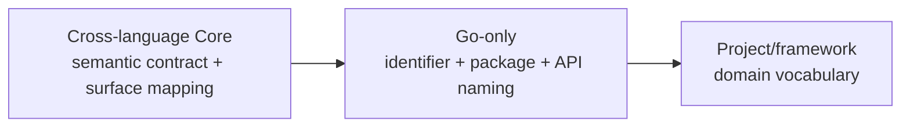

# Reusable Go engineering practices — Synthesis

This Synthesis is the bounded, living decision interface between the R-001
corpus and a later normative change to `languages/go`. Research readiness will
not conclude or archive the parent Research without explicit Owner
authorization.

## Executive Conclusion

Current evidence supports two new language-level requirements for reproducible
module state and reproducible committed generated artifacts. It also supports
narrow amendments to `GO-NAME-002`, lifecycle, and test requirements:
single-method interface/canonical method naming, risk-based race coverage, and
a support matrix. The evidence is decision-ready for Owner review, but it does
not authorize Research conclusion.

RR-002 additionally supports an explicit `languages/go/performance`
Specification. Its stable contract is the evidence loop—target, representative
diagnosis, bounded hotspot change, comparative verification, and low-level
admission. The source workflow's fixed memory/CPU/assembly order remains
non-normative. The current user task authorizes this scoped Spec integration;
the Research remains active until an Owner explicitly concludes it.

Naming remains deliberately layered:

Go casing, receiver, accessor, constructor, and interface conventions belong
only to `languages/go`. Java, Python, database, configuration, wire, storage,
and telemetry surfaces must follow their own applicable specifications.

## Supported Findings

| Finding | Confidence | Evidence |
|---|---|---|
| Checked-in module state should be canonical and verified across the declared module inventory. | high | `notes/cross-project-go-requirements.md` |
| Committed generated artifacts need authoritative inputs, a reproducible command, and a no-diff check. | high | `notes/cross-project-go-requirements.md` |
| Race and platform/toolchain/build-tag coverage should be risk-based amendments, not duplicated requirement IDs. | medium | `notes/cross-project-go-requirements.md` |
| Existing naming rules cover the shared baseline; only single-method interface and canonical method naming materially extend `GO-NAME-002`. | high | `notes/cross-project-go-naming.md` |
| Go-specific naming must not enter cross-language Core or overwrite external/project naming surfaces. | high | `notes/cross-project-go-naming.md` |
| Exact lint lists, package layouts, logger choices, and build target names remain project or Harness policy. | high | `notes/opentelemetry-collector-practices.md`; `notes/grafana-observability-practices.md` |
| Go performance changes need an explicit target, baseline, representative workload, and matching diagnostic evidence. | high | `notes/go-performance-optimization.md` |
| A performance claim needs repeated baseline-versus-experiment evidence plus correctness, repeated Profile, and end-to-end review. | high | `notes/go-performance-optimization.md` |
| Unsafe, assembly, and architecture-specific implementations require a stricter admission gate, fallback/reference equivalence, and affected-architecture coverage. | high | `notes/go-performance-optimization.md` |

## Rejected Hypotheses

- A practice does not become a language-level requirement merely because a
  well-known repository uses it.
- A universal linter list, Make target vocabulary, package layout, logger
  implementation, or vendor policy is not supported by the sample.
- Collector-specific `NewDefault`, `Config/Settings`, signal, enum, and
  component vocabulary is not a universal Go or cross-language naming system.
- Go MixedCaps, initialism, receiver, getter, and interface naming cannot be
  applied to Java, Python, database, configuration, wire, or telemetry names.
- Every test job need not run with the race detector; coverage depends on
  supported platforms, exercised paths, and resource cost.
- The memory-allocation phase does not always precede CPU, lock, I/O, or
  scheduler work; the measured bottleneck selects the branch.
- “Hot code is less than 1%” is an experience claim, not a conformance
  threshold.
- VictoriaMetrics product success does not by itself make one project's
  architecture or optimization history reusable normative behavior.

## Remaining Unknowns

- The Research Owner must decide whether the candidate module and generator
  requirements and three amendments are appropriate for the next minor version.
- Canonical local command and architecture-policy lint rules require a separate
  cross-language Harness or testing Research.
- The observability-heavy sample lowers confidence in prescribing an exact
  matrix, but it does not block tool-semantic module/generator requirements or
  official Go naming guidance.
- A future `testing/performance` Specification requires equivalent evidence
  from at least one materially different language/runtime and an ESP for the
  new cross-language testing abstraction.

## Options Comparison

| Option | Benefits | Costs and risks | Current rank |
|---|---|---|---|
| Keep `languages/go` unchanged | No migration cost | Leaves module and generator drift outside the normative contract | 3 |
| Add only cross-project gaps and amend existing rules | Closes mechanical gaps while preserving layer boundaries | Requires a minor version bump and consumer review | 1 |
| Copy the sampled project guides broadly | Produces a large checklist quickly | Imports project architecture and vendor history as false universals | 4 |
| Defer all findings to project Specs | Avoids language-level policy | Duplicates stable Go-tool semantics across projects | 2 |

For RR-002, a narrow Go performance Spec ranks ahead of expanding the parent
Go document or introducing a cross-language testing contract:

| RR-002 option | Benefits | Costs and risks | Current rank |
|---|---|---|---|
| Add `languages/go/performance` | Keeps Go tooling and optional task context together | Requires one new explicit Catalog entry | 1 |
| Expand `languages/go` | No additional selection step | Loads a large workflow for ordinary Go tasks | 3 |
| Add `testing/performance` now | Creates a future shared abstraction early | Current evidence cannot establish cross-language validity | 4 |
| Keep the best-practice document only | No normative migration | Leaves evidence and low-level admission unenforceable | 2 |

## Recommendation and Preconditions

Prepare a scoped `languages/go` minor revision containing the two strongly
corroborated new requirements and narrow amendments to existing naming,
lifecycle, and test rules. Final wording must remain independent of Make,
repository layout, specific linter implementations, and observability
frameworks. The naming amendment must remain Go-only; `core/semantic-naming`
continues to own only language-neutral semantics, explicit cross-surface
mappings, and compatibility.

Also publish Development `languages/go/performance` with five new Advisory
Requirements. It depends on `languages/go`, uses explicit selection, and
activates only for performance targets, profiles, benchmarks, hotspot changes,
or low-level Go implementations. It must not contain fixed thresholds, hotspot
percentages, product names, or an unconditional memory-before-CPU order.

## Handoff to ADR and ExecPlan

No ADR is required for the scoped language Specification. The current user
task authorizes integration and Catalog validation; only an explicit Research
Owner decision may conclude or archive R-001. The accumulated normative delta
is:

1. add `GO-MODULE-001`;
2. add `GO-GENERATE-001`;
3. amend `GO-NAME-002` with conditional single-method interface and canonical
   Go method naming;
4. amend `GO-LIFECYCLE-001` with risk-based race coverage and scoped
   exceptions;
5. amend `GO-TEST-001` with toolchain/platform/build-tag coverage.
6. add explicit `languages/go/performance` with `GO-PERF-TARGET-001`,
   `GO-PERF-DIAGNOSE-001`, `GO-PERF-CHANGE-001`, `GO-PERF-VERIFY-001`, and
   `GO-PERF-LOWLEVEL-001`.

Revision-pinned project observations remain audit evidence, not direct
normative text. Collector/Grafana/Prometheus local vocabulary remains
project-owned.

## Revision Notes

- 2026-07-30T16:30:25Z — Draft Synthesis created with R-001.
- 2026-07-31 — Restored the draft decision interface and recorded RQ-005 as a
  prerequisite for review readiness.
- 2026-07-31 — Integrated RQ-005, made the Core/Go/project naming boundary
  explicit, and prepared the five-part Go Spec delta for Owner review.
- 2026-08-10 — Integrated RR-002, selected a narrow Go performance Spec, and
  retained the four-stage sequence as non-normative guidance.
