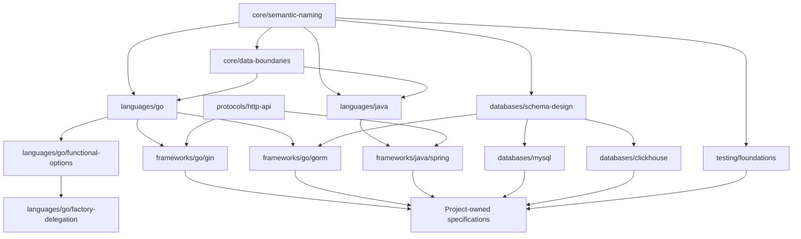
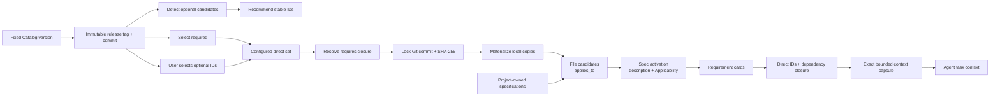
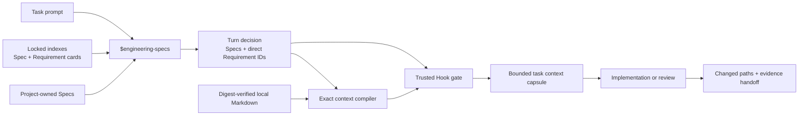
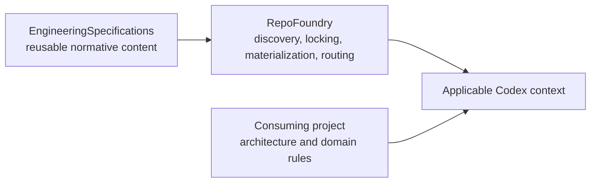

# Specification Model

[English](specification-model.md) |
[简体中文](specification-model.zh-CN.md)

EngineeringSpecifications organizes reusable engineering rules as one
versioned, composable catalog. A consuming project selects only the
specifications supported by repository evidence or explicit configuration,
locks their exact revision, and routes each task to the applicable local
copies.

## One catalog covers several reusable layers

The catalog is designed to grow across independent engineering dimensions.
This taxonomy defines where future specifications belong; only entries present
in `catalog.json` are currently published.

| Layer | Responsibility | Typical selection |
| --- | --- | --- |
| `core/` | Rules every implementation repository must carry, such as semantic operations and external-data boundaries | Required selection; task activation remains conditional |
| `languages/` | Language idioms, APIs, errors, concurrency, resources, and language-specific testing practices | Explicit selection aided by repository detection |
| `frameworks/` | Framework or major-library contracts, such as Go Gin/GORM or Java Spring/Netty | Explicit selection; deterministic dependency detection may be added later |
| `databases/` | Vendor-neutral schema design and database-specific behavior for systems such as MySQL or ClickHouse | Explicit selection or deterministic repository evidence |
| `testing/` | Cross-language test contracts plus focused unit, integration, contract, and end-to-end guidance | Explicit selection and test-file scopes |
| `protocols/` | Shared HTTP, gRPC, messaging, serialization, and compatibility contracts | Explicit selection or repository evidence |

Cross-language does not mean universally required. For example, a
vendor-neutral database schema specification can apply to several programming
languages while remaining irrelevant to a repository without a database.
`core/` is reserved for rules that every implementation repository must carry.

## Dependencies compose specifications

Every specification declares its dependencies through `requires`. Directory
nesting communicates ownership and discoverability; it does not create implicit
inheritance or override precedence.

The IDs beyond the current catalog in this diagram are illustrative. They show
the intended dependency model, not already published specifications.

Authors follow four composition rules:

1. Put a shared requirement in the broadest layer where it remains true.
2. Let a narrower specification describe only its additional constraints and
   idiomatic realization.
3. Declare every required upstream contract explicitly; do not copy its text.
4. Resolve contradictions as specification changes. Path specificity alone
   does not silently override an upstream contract.

For example, a future `frameworks/go/gin` specification would depend on
`languages/go` and a shared HTTP contract. A future
`frameworks/go/gorm` specification would depend on `languages/go` and
vendor-neutral database schema guidance.

## Selection and task-time reading are separate

RepoFoundry performs selection when it initializes or updates a
project. Codex performs task-time reading from the already locked local set.
The installation boundary implements
[ESP-0009](../proposals/0009_explicit-spec-selection.md): detection recommends,
while the consuming project selects optional IDs.

Selection separates one mandatory source from one project-owned source:

- **Required** specifications are selected and materialized for every
  implementation repository. Required does not mean always read.
- **Explicit** optional specifications are declared by the consuming project.
- **Detected** specifications use deterministic repository evidence only to
  recommend optional IDs. Detection never authorizes installation.

Dependency closure is added after direct selection. The current Catalog
contract limits detection to filenames and extensions. That is enough to
recommend language guidance but not to decide project adoption. Framework and
database specifications should remain explicit; future deterministic evidence
may improve their recommendations without taking selection authority from the
project.

Production selection starts from a fixed Catalog SemVer. RepoFoundry resolves
`MAJOR.MINOR.PATCH` through `refs/tags/vMAJOR.MINOR.PATCH`, verifies the tagged
Catalog declares the same version, and then locks the full commit and digests.
This separates a human-reviewable release identity from the immutable content
proof. An explicit branch ref remains useful for development testing but is not
a released contract.

At task time, `applies_to` scopes produce a conservative file candidate set.
The Catalog description provides a compact Spec activation summary for the
local index. A candidate becomes applicable only when task intent also matches
its Applicability section. The Router then exposes bounded Requirement cards,
records the smallest complete direct ID set with task-specific reasons, and
resolves the exact Requirement dependency closure in code.

The consumer compiles a digest-verified context capsule from each represented
Spec's interpretation frame, the exact selected Requirement blocks, and their
matching Verification rows. It does not summarize or truncate normative text.
Explicit supporting sections may be added when the task needs them. Legacy
documents without valid Requirement routing metadata, migrations, and
repository-wide audits use a recorded whole-Spec fallback.

For example, Go repository evidence recommends the Go Specification; the
project explicitly adopts it. A Go source change then makes it a task
candidate. A public API rename activates Semantic Naming; an HTTP request
parser activates Data Boundaries;
an internal arithmetic change may activate only the relevant Go requirements.
A Gin handler can additionally activate HTTP, Gin, and project Handler
guidance. Project-owned architecture and component rules join the same route
without being copied into this repository.

## Example compositions remain small

The following examples use future IDs to demonstrate composition:

| Project or task | Applicable set |
| --- | --- |
| Go command-line service | Core installed; Go recommended and explicitly selected; task intent activates the needed subset |
| Gin service backed by MySQL | Core + Go + HTTP + Gin + schema design + MySQL + testing candidates |
| Java Netty service writing ClickHouse | Core + Java + Netty + schema design + ClickHouse + testing candidates |
| Python library without persistence | Core + Python + testing candidates; no database specification |

The resolver installs the Spec dependency closure once. The task router then
filters by file scope, decides Spec applicability, and selects exact
Requirements. This progressive route keeps broad Core contracts locally
available without injecting every Core document or every Requirement into
every task.

## One Router Skill adapts the model to Codex

[ESP-0010](../proposals/0010_task-activation-router.md) defines the Codex
consumer adapter without changing the Agent-neutral Catalog. The approved
[Requirement-level context proposal](../proposals/0000_requirement-level-context-activation.md)
narrows that same Router from applicable Specs to exact Requirement capsules.
RepoFoundry generates one repository Skill named `$engineering-specs`; it does
not turn each Specification or Requirement into a Skill.

The adapter preserves five stages:

1. project selection determines what is locally available;
2. `applies_to` determines conservative candidates for planned files;
3. the Router reads candidate descriptions and Applicability sections, then
   records applicable Spec IDs;
4. bounded cards select direct Requirement IDs and code resolves their exact
   dependency closure;
5. the compiler emits one digest-verified capsule and a protocol-v2 receipt
   records direct/resolved IDs, sources, context epoch, digest, bytes, budget,
   and mode.

The root `AGENTS.md` routes implementation and review through the Skill. In a
trusted Codex project, lifecycle Hooks add the route to prompt and subagent
context, deny writes without a current decision, inject the exact local capsule
before the first write, and audit changed-path coverage plus the Agent handoff.
Compaction resume, fork, and subagent epochs must rehydrate the same verified
capsule before mutation. An explicit no-Spec decision remains valid when it
names the planned paths and explains why no installed contract governs the
task.

This is a consumer guarantee with a precise boundary. Project Hooks load only
for trusted projects and non-managed commands require Hook review. Other
Agents may implement the same activation receipt and evidence contract through
their own runtime. EngineeringSpecifications does not embed Codex Skill or
Hook files in normative documents.

## Repository ownership stays explicit

- EngineeringSpecifications owns reusable normative content, versions,
  dependencies, scopes, and content digests.
- RepoFoundry owns discovery, Git resolution, locking, local
  materialization, generated Agent adapters, and routing.
- A consuming project owns its architecture, domain vocabulary, framework
  choices, directory conventions, and component patterns.

A project rule belongs here only after it has proved reusable across
repositories and can be governed independently from its original codebase.

## Publishing a specification starts with applicability

Before adding a specification:

1. State which repositories and files it governs.
2. Choose the broadest valid catalog layer without making the rule universal by
   accident.
3. Identify reusable upstream contracts and declare them in `requires`.
4. Define deterministic `applies_to` scopes.
5. Write the Catalog description as a compact `Load when ...` activation
   summary and make the Applicability section decisive.
6. Give every Requirement a bounded `Activation` paragraph and exact,
   acyclic `Context dependencies`; keep each complete block within 8 KiB.
7. Add detection only when filenames or extensions provide reliable
   recommendation evidence; every optional Specification still requires
   explicit project selection.
8. Keep project names, private paths, internal frameworks, and domain-only
   terminology in the consuming project.

Read the [Governance Model](../governance/README.md) to determine whether the
change needs an Engineering Specification Proposal and which maturity promise
it carries. Read [CONTRIBUTING.md](../CONTRIBUTING.md) for the version, digest,
changelog, and validation process.

## The current catalog is the first slice

The current release publishes:

- `core/semantic-naming`, required for implementation repositories;
- `core/data-boundaries`, required for implementation repositories;
- `languages/go`;
- `languages/go/functional-options`, explicitly selected for functional-option
  API work and dependent on `languages/go`;
- `languages/go/factory-delegation`, explicitly selected for optional
  capability factories and dependent on `languages/go/functional-options`.

See the [Specification Index](../specification/README.md) for the current
normative documents and [catalog.json](../catalog.json) for the machine-readable
source of truth.
