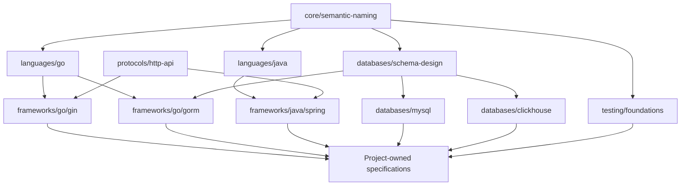
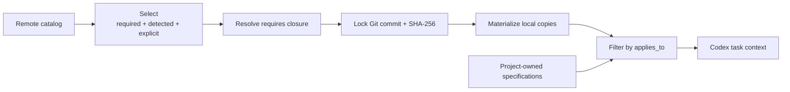
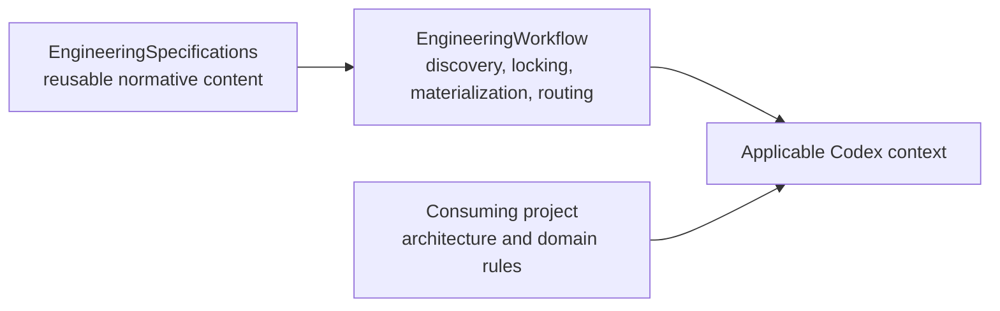

# Specification Model

[English](specification-model.md) |
[简体中文](specification-model.zh-CN.md)

EngineeringSpecifications organizes reusable engineering rules as one
versioned, composable catalog. A consuming project selects only the
specifications supported by repository evidence or explicit configuration,
locks their exact revision, and routes each task to the applicable local
copies.

## One catalog covers several reusable layers

The catalog is designed to grow across independent engineering dimensions.
This taxonomy defines where future specifications belong; only entries present
in `catalog.json` are currently published.

| Layer | Responsibility | Typical selection |
| --- | --- | --- |
| `core/` | Rules valid in every implementation repository, such as shared semantic verbs and boundary terminology | Required |
| `languages/` | Language idioms, APIs, errors, concurrency, resources, and language-specific testing practices | Repository detection |
| `frameworks/` | Framework or major-library contracts, such as Go Gin/GORM or Java Spring/Netty | Explicit selection; deterministic dependency detection may be added later |
| `databases/` | Vendor-neutral schema design and database-specific behavior for systems such as MySQL or ClickHouse | Explicit selection or deterministic repository evidence |
| `testing/` | Cross-language test contracts plus focused unit, integration, contract, and end-to-end guidance | Explicit selection and test-file scopes |
| `protocols/` | Shared HTTP, gRPC, messaging, serialization, and compatibility contracts | Explicit selection or repository evidence |

Cross-language does not mean universally required. For example, a
vendor-neutral database schema specification can apply to several programming
languages while remaining irrelevant to a repository without a database.
`core/` is reserved for rules that every implementation repository must carry.

## Dependencies compose specifications

Every specification declares its dependencies through `requires`. Directory
nesting communicates ownership and discoverability; it does not create implicit
inheritance or override precedence.

The IDs beyond the current catalog in this diagram are illustrative. They show
the intended dependency model, not already published specifications.

Authors follow four composition rules:

1. Put a shared requirement in the broadest layer where it remains true.
2. Let a narrower specification describe only its additional constraints and
   idiomatic realization.
3. Declare every required upstream contract explicitly; do not copy its text.
4. Resolve contradictions as specification changes. Path specificity alone
   does not silently override an upstream contract.

For example, a future `frameworks/go/gin` specification would depend on
`languages/go` and a shared HTTP contract. A future
`frameworks/go/gorm` specification would depend on `languages/go` and
vendor-neutral database schema guidance.

## Selection and task-time reading are separate

EngineeringWorkflow performs selection when it initializes or updates a
project. Codex performs task-time reading from the already locked local set.

Selection has three sources:

- **Required** specifications are selected for every implementation repository.
- **Detected** specifications use deterministic repository evidence.
- **Explicit** specifications are declared by the consuming project.

Dependency closure is added after the initial selection. The current Catalog
contract limits automatic detection to filenames and extensions. That is enough
for language discovery. Framework and database specifications should remain
explicit until the Catalog and EngineeringWorkflow introduce a reviewed,
deterministic dependency-evidence contract.

At task time, `applies_to` scopes keep unrelated specifications out of the
active context. A Go source change can load the shared Core and Go
specifications. A Gin handler change can additionally load HTTP and Gin
guidance. A ClickHouse migration can load schema-design and ClickHouse
guidance. Project-owned architecture and component rules join the same route
without being copied into this repository.

## Example compositions remain small

The following examples use future IDs to demonstrate composition:

| Project or task | Applicable set |
| --- | --- |
| Go command-line service | Core + Go + testing foundations |
| Gin service backed by MySQL | Core + Go + HTTP + Gin + schema design + MySQL + testing |
| Java Netty service writing ClickHouse | Core + Java + Netty + schema design + ClickHouse + testing |
| Python library without persistence | Core + Python + testing; no database specification |

The resolver installs the dependency closure once. The task router reads only
the subset whose scopes match the files being changed.

## Repository ownership stays explicit

- EngineeringSpecifications owns reusable normative content, versions,
  dependencies, scopes, and content digests.
- EngineeringWorkflow owns discovery, Git resolution, locking, local
  materialization, and routing.
- A consuming project owns its architecture, domain vocabulary, framework
  choices, directory conventions, and component patterns.

A project rule belongs here only after it has proved reusable across
repositories and can be governed independently from its original codebase.

## Publishing a specification starts with applicability

Before adding a specification:

1. State which repositories and files it governs.
2. Choose the broadest valid catalog layer without making the rule universal by
   accident.
3. Identify reusable upstream contracts and declare them in `requires`.
4. Define deterministic `applies_to` scopes.
5. Add detection only when filenames or extensions provide reliable evidence;
   otherwise require explicit project selection.
6. Keep project names, private paths, internal frameworks, and domain-only
   terminology in the consuming project.

Read the [Governance Model](../governance/README.md) to determine whether the
change needs an Engineering Specification Proposal and which maturity promise
it carries. Read [CONTRIBUTING.md](../CONTRIBUTING.md) for the version, digest,
changelog, and validation process.

## The current catalog is the first slice

The current release publishes:

- `core/semantic-naming`, required for implementation repositories;
- `languages/go`;
- `languages/python`;
- `languages/typescript`.

See the [Specification Index](../specification/README.md) for the current
normative documents and [catalog.json](../catalog.json) for the machine-readable
source of truth.
