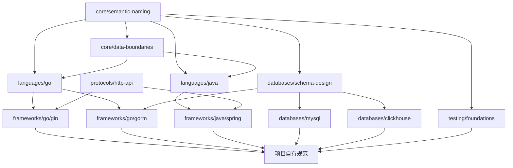
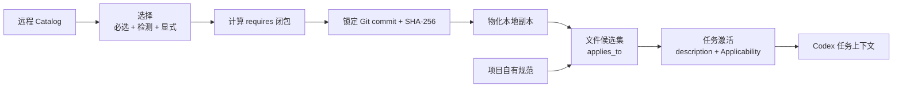
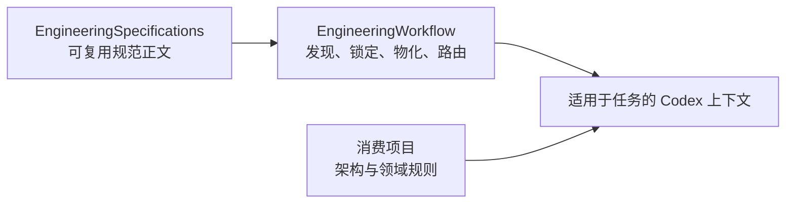

# 规范模型

[English](specification-model.md) |
[简体中文](specification-model.zh-CN.md)

EngineeringSpecifications 用一个可版本化、可组合的 Catalog 管理可复用工程规范。
消费项目只选择仓库证据或显式配置支持的规范，锁定精确 revision，再按任务读取本地
副本。

## 一个 Catalog 覆盖多个可复用层级

Catalog 会沿独立的工程维度扩展。下面的分类定义未来规范的归属；只有
`catalog.json` 中存在的条目才是当前已经发布的规范。

| 层级 | 职责 | 典型选择方式 |
| --- | --- | --- |
| `core/` | 每个实现型仓库都必须携带的规则，例如语义操作和外部数据边界 | 必选安装；任务激活仍按需判断 |
| `languages/` | 语言惯用法、API、错误、并发、资源和语言特有测试实践 | 仓库检测 |
| `frameworks/` | 框架或重要库契约，例如 Go Gin/GORM、Java Spring/Netty | 显式选择；未来可增加确定性的依赖检测 |
| `databases/` | 与厂商无关的 Schema 设计，以及 MySQL、ClickHouse 等数据库特有行为 | 显式选择或确定性仓库证据 |
| `testing/` | 跨语言测试契约，以及单元、集成、契约和端到端测试规范 | 显式选择与测试文件作用域 |
| `protocols/` | HTTP、gRPC、消息、序列化和兼容性契约 | 显式选择或仓库证据 |

跨语言可复用不等于所有项目必选。例如，与厂商无关的数据库建表规范可以服务多种
编程语言，但没有数据库的仓库不需要安装它。`core/` 只保留每个实现型仓库都应携带
的规则。

## 规范通过依赖关系组合

每份规范通过 `requires` 声明依赖。目录层级用于表达归属和帮助发现，不产生隐式
继承或覆盖优先级。

图中超出当前 Catalog 的 ID 只是分类示例，用于说明目标依赖模型，不代表这些规范
已经发布。

规范作者遵守四条组合规则：

1. 把共享要求放在它始终成立的最宽层级。
2. 更具体的规范只描述新增约束和符合该技术生态的实现方式。
3. 显式声明所有上游契约，不复制上游正文。
4. 通过规范变更解决冲突；路径更具体不会自动覆盖上游契约。

例如，未来的 `frameworks/go/gin` 应依赖 `languages/go` 和共享 HTTP 契约；
`frameworks/go/gorm` 应依赖 `languages/go` 和与厂商无关的数据库 Schema
规范。

## 选择规范与任务时读取是两个阶段

EngineeringWorkflow 在初始化或更新项目时选择规范。Codex 执行任务时，从已经锁定
的本地规范集合中按需读取。

规范选择有三个来源：

- **必选规范**进入所有实现型仓库并物化为本地副本。必选不代表每个任务都阅读全文。
- **检测规范**依赖确定性的仓库证据。
- **显式规范**由消费项目声明。

完成初始选择后，解析器再补齐依赖闭包。当前 Catalog 契约只允许通过文件名和扩展名
自动检测。这足以识别编程语言。框架和数据库规范应暂时保持显式选择，直到 Catalog
与 EngineeringWorkflow 引入经过评审的确定性依赖证据契约。

执行任务时，`applies_to` 先产生保守的文件候选集。Catalog `description` 为本地
索引提供简短激活摘要；只有任务意图也符合 Applicability，Codex 才读取候选规范
全文。

例如，修改 Go 文件会让 Go 规范成为候选。重命名公共 API 会激活 Semantic Naming；
解析 HTTP Request 会激活 Data Boundaries；只修改内部算术逻辑时，可能只需读取
相关 Go 要求。Gin Handler 还可以激活 HTTP、Gin 和项目 Handler 规则。项目自有
架构与组件规则进入同一路由，无需复制到本仓库。

## 项目组合保持精简

下面使用未来 ID 演示组合方式：

| 项目或任务 | 适用规范集合 |
| --- | --- |
| Go 命令行服务 | 安装 Core，检测 Go，再按任务意图激活需要的子集 |
| 使用 MySQL 的 Gin 服务 | Core + Go + HTTP + Gin + Schema 设计 + MySQL + 测试候选集 |
| 写入 ClickHouse 的 Java Netty 服务 | Core + Java + Netty + Schema 设计 + ClickHouse + 测试候选集 |
| 不使用持久化的 Python 库 | Core + Python + 测试候选集；没有数据库规范 |

解析器只安装一次依赖闭包。任务路由器先按文件作用域过滤，再判断任务激活。这个
两阶段路由让 Core 契约始终在本地可用，同时避免每个任务都注入全部 Core 文档。

## 三个仓库边界保持明确

- EngineeringSpecifications 负责可复用规范正文、版本、依赖、作用域和摘要。
- EngineeringWorkflow 负责发现、Git 解析、锁定、本地物化和路由。
- 消费项目负责自身架构、领域词汇、框架选择、目录约定和组件模式。

一条项目规则只有在被多个仓库复用，并且能够脱离原代码库独立治理后，才适合进入
本仓库。

## 新规范先定义适用范围

新增规范前：

1. 说明它约束哪些仓库和文件。
2. 选择规则始终成立的最宽 Catalog 层级，避免意外把条件规则变成全局规则。
3. 找出可复用的上游契约并写入 `requires`。
4. 定义确定性的 `applies_to` 作用域。
5. 把 Catalog `description` 写成简短的“何时加载”摘要，并让 Applicability 作最终判断。
6. 只有文件名或扩展名能够提供可靠证据时才增加 detection；否则要求项目显式选择。
7. 项目名称、私有路径、内部框架和领域专属术语留在消费项目。

先通过[治理模型](../governance/README.md)判断变更是否需要 Engineering
Specification Proposal，以及它承载什么成熟度承诺。版本、摘要、Changelog
与验证流程见 [CONTRIBUTING.md](../CONTRIBUTING.md)。

## 当前 Catalog 是第一组规范

当前版本发布：

- `core/semantic-naming`，实现型仓库必选；
- `core/data-boundaries`，实现型仓库必选；
- `languages/go`。

当前规范正文见[规范索引](../specification/README.md)，机器事实源见
[catalog.json](../catalog.json)。
