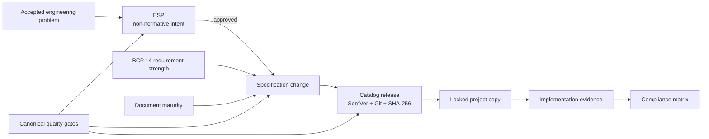

# Specification Governance

EngineeringSpecifications adapts six governance mechanisms proven useful in
the OpenTelemetry specification repository. Each mechanism answers a different
question: what a requirement means, how a significant change is proposed, how
stable a document is, how releases are identified, how implementations report
conformance, and which checks protect the repository.

## Six independent contracts keep governance clear

| Contract | Question answered | Repository mechanism |
| --- | --- | --- |
| Normative language | How strong is this requirement? | BCP 14 keywords in `specification/README.md` |
| Proposal process | Why should a significant change exist? | Non-normative Engineering Specification Proposals under `proposals/` |
| Maturity | What compatibility promise does this document carry? | `Development`, `Stable`, and `Deprecated` lifecycle |
| Versioning | Which released contract did a project consume? | Catalog and per-Spec SemVer, Git revision, and SHA-256 |
| Compliance | Which implementation satisfies which requirement? | Stable requirement IDs and evidence-backed matrices |
| Quality gates | Can the repository prove structural integrity? | One canonical `scripts/check.py` entrypoint |

These contracts remain separate. An approved proposal has no normative force
until its behavior is integrated into `specification/`. A Stable status does
not replace a version. A valid Catalog does not prove that an implementation
conforms to every requirement.

## Adoption is intentionally incremental

The current repository is at `0.x`, so the governance foundation arrives
before every enforcement mechanism:

- BCP 14 interpretation, change lanes, Proposal templates, principles, and
  maturity definitions are documented now.
- Catalog and per-Spec versions, content digests, dependency validation, link
  checking, and tests are already mechanically enforced.
- Current `0.1.0` specifications predate explicit maturity markers and are
  treated as Development.
- Compliance data remains empty until specifications publish stable requirement
  IDs and implementation repositories provide reviewable evidence.
- A future machine-readable Catalog maturity field or dependency-package
  detector requires a coordinated Proposal and EngineeringWorkflow change.

This sequencing preserves compatibility with the current Catalog consumer
while making the target governance explicit.

## Principles decide what belongs in a specification

[Specification Principles](specification-principles.md) define the design
rubric: reusable, behavior-focused, evidence-backed, stable, consistent, simple,
and verifiable.

[Specification Lifecycle](lifecycle.md) defines compatibility expectations for
Development, Stable, and Deprecated documents.

[Engineering Specification Proposals](../proposals/README.md) define how
significant changes move from intent to normative integration.

[Compliance](../compliance/README.md) defines the evidence contract for future
implementation matrices.

## OpenTelemetry is prior art, not a copied governance scale

The model draws from the OpenTelemetry
[notation conventions](https://github.com/open-telemetry/opentelemetry-specification/blob/main/specification/README.md#notation-conventions-and-compliance),
[OTEP process](https://github.com/open-telemetry/opentelemetry-specification/blob/main/oteps/README.md),
[document statuses](https://github.com/open-telemetry/opentelemetry-specification/blob/main/specification/document-status.md),
[contribution process](https://github.com/open-telemetry/opentelemetry-specification/blob/main/CONTRIBUTING.md),
and
[quality checks](https://github.com/open-telemetry/opentelemetry-specification/blob/main/.github/workflows/checks.yaml).

EngineeringSpecifications keeps its own scale:

- one canonical standard-library validation command;
- no fixed multi-company approval count;
- per-Spec versions and digests for selective consumption;
- explicit project-owned rules outside the central Catalog;
- machine-readable dependencies and scopes from the first release.
