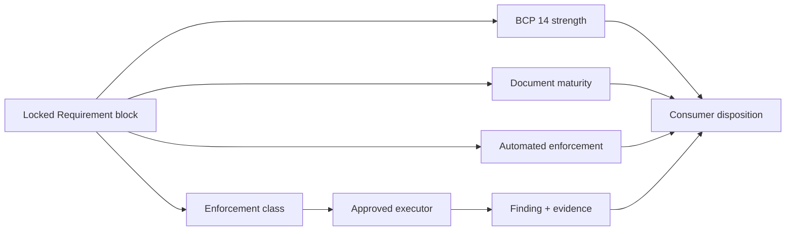
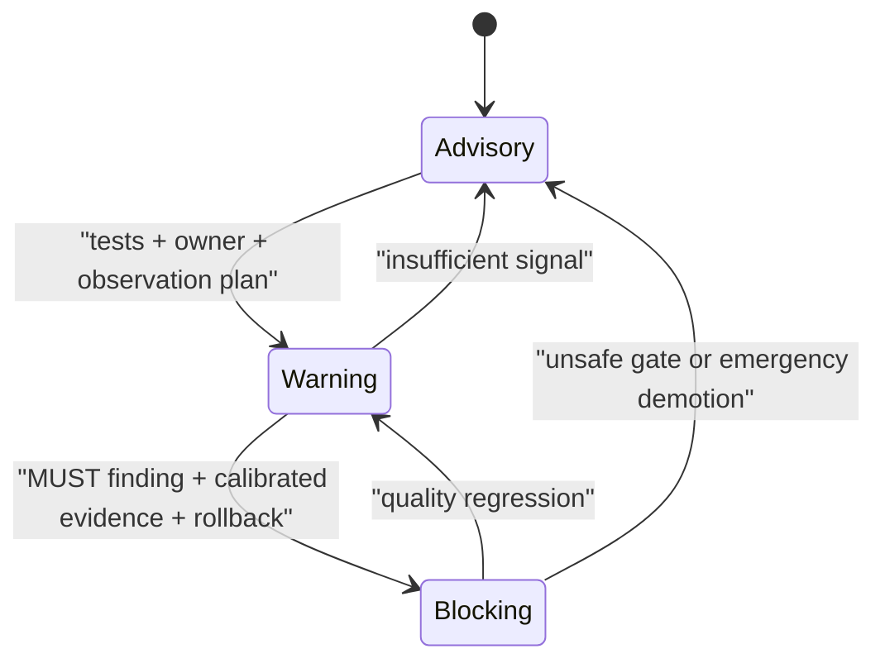

# Automated Enforcement Lifecycle

Automated enforcement controls the strongest action a generic consumer may
take on a Requirement finding. It does not change what the Requirement means,
how stable the document is, or how compliance is verified.

## Four independent dimensions prevent accidental authority

| Dimension | Question | Source |
| --- | --- | --- |
| Requirement strength | Is the behavior required, recommended, or optional? | BCP 14 wording |
| Maturity | What compatibility promise applies to future revisions? | Development, Stable, or Deprecated document status |
| Enforcement class | Which mechanism can verify compliance? | Mechanical, review, or hybrid Requirement metadata |
| Automated enforcement | What may an automated finding do now? | Advisory, Warning, or Blocking Requirement metadata |



A Development `MUST` remains normative for a pinned version. A mechanical
check does not become blocking merely because it is deterministic. Stable
maturity does not prove that an AI reviewer is accurate enough to gate work.

## Every Requirement declares one level

The formal Requirement block places this scalar marker after Activation and
Context dependencies:

```md
**Automated enforcement:** Advisory
```

The allowed levels are:

- **Advisory:** an automated consumer may report the finding. The finding does
  not change approval or completion state.
- **Warning:** the consumer surfaces the finding and records its disposition.
  The finding alone does not reject the change.
- **Blocking:** an approved executor may reject a confirmed violation of a
  `MUST` or `MUST NOT` obligation.

Human reviewers continue to apply the locked normative Requirement at every
level. Automated enforcement governs machine action, not human review
authority.

New Requirements and Requirements migrated from an older source format
**MUST** start at Advisory. A generic consumer **MAY** use a lower effective
level when its trust boundary, executor, or local policy cannot support the
published ceiling. It **MUST NOT** raise the level implicitly. A project may
publish a higher project-owned policy only when it records an owner, equivalent
promotion evidence, and its distinct source identity.

## Promotion requires observed enforcement evidence



Promotion to Warning **MUST** identify the executor and versioned
configuration, positive and negative cases, non-applicable cases, the owning
reviewer, an observation window, and rollback behavior.

Promotion to Blocking **MUST** additionally identify the exact `MUST` or
`MUST NOT` obligation, warning-period outcomes, false-positive and override
evidence, a deterministic or calibrated adjudication path, break-glass
ownership, expiry behavior, and immediate demotion instructions.

Only the violated `MUST` or `MUST NOT` sentence may cause an automated block
when one Requirement block contains obligations with different BCP 14
strengths. A `SHOULD` or `SHOULD NOT` finding has Warning as its maximum generic
level. A `MAY`-only Requirement remains Advisory.

Every promotion changes consumer-visible behavior. Authors **MUST** bump the
Specification version, refresh its digest, record the evidence and migration
effect, and update the Changelog. An unsafe gate may be demoted immediately;
the source change and evidence record follow before release.

## Overrides change workflow disposition, not conformance

An automated-gate override **MUST** record:

- Requirement ID, Specification version and source digest;
- repository revision and stable finding ID;
- justification, approving identity, and responsible owner;
- expiry time and remediation reference.

Expiry is mandatory. An override does not make a violated `MUST` conforming.
A legitimate `SHOULD` exception follows the Specification's Exceptions
contract and is reported separately from an automated-gate override.

## Warning and Blocking claims require durable observations

A consumer that claims Warning or Blocking operation **MUST** retain an
append-only finding lifecycle containing:

- a schema version, unique event ID, and observation time;
- Catalog ID, version, resolved commit, Specification ID and version, source
  digest, Requirement ID, and Requirement-block digest;
- consumer repository identity and immutable revision;
- stable finding ID, SDLC stage, changed artifact, and executor identity,
  version, and configuration digest;
- published and effective levels;
- an outcome of `detected`, `rechecked`, `remediated`,
  `dismissed_false_positive`, `accepted_should_exception`, `overridden`,
  `override_expired`, or `escaped_defect`;
- a durable evidence reference and any override owner, expiry, and remediation
  reference.

One event ID identifies one observation. One finding ID joins the same issue
across rechecks and dispositions. Reports **MUST** distinguish event volume
from unique findings and affected changes. Required aggregate data excludes
source text, secrets, and personal content.

The repository does not yet publish a portable event JSON Schema. A consumer
prototype must validate optionality, privacy, and lifecycle semantics before a
new public interchange format is approved.

## Exact source remains authoritative

Derived Requirement indexes may copy the scalar level, source boundaries, and
digests. They do not copy or paraphrase the normative obligation. A stale
index, changed digest, unknown level, missing telemetry for a claimed level, or
unapproved executor prevents automated Warning or Blocking action.

See
[ESP-0000: Govern automated enforcement at Requirement granularity](../proposals/0000-enforcement-levels-and-telemetry.md)
for the approved rationale, alternatives, migration, and future consumer work.
