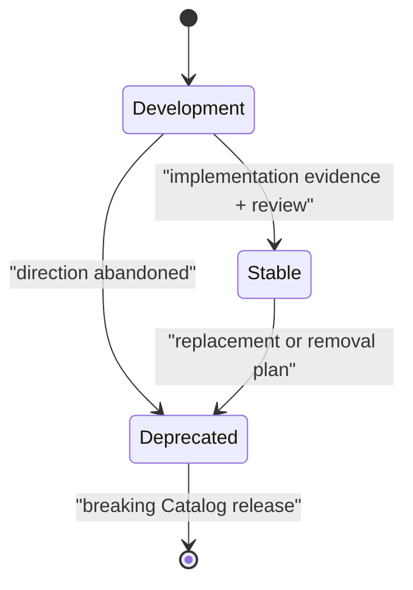

# Specification Lifecycle

Maturity communicates the compatibility promise of a specification document.
Version numbers identify revisions. The two dimensions evolve independently.

## Development allows learning

A Development specification is available for real use and feedback, but its
requirements may change incompatibly. Consumers should pin an exact revision
and review every update.

BCP 14 requirements remain normative within the pinned Development version.
Development describes the compatibility promise of future revisions; it does
not downgrade `MUST` to advice or prevent a repository from enforcing the
current version mechanically.

New documents start in Development. The `0.1.0` specifications created before
this lifecycle was documented are also treated as Development.

## Stable protects observable contracts

A Stable specification has implementation evidence, clear conformance
expectations, and enough adoption to support a compatibility promise.

Stable requirements:

- preserve existing required behavior within the same major version;
- add compatible behavior through a minor version;
- clarify wording without changing required behavior through a patch version;
- document migration and consequences before any breaking major release.

Moving from Development to Stable changes the support promise and must appear
in the Changelog.

## Deprecated preserves a migration window

A Deprecated specification remains available while consumers migrate. It
identifies one of:

- the specification that replaces it;
- a removal condition and target release;
- the reason no replacement exists.

Removing a Deprecated specification from the Catalog is a breaking Catalog
change. Its stable ID remains reserved and must never be reassigned.

## Mixed maturity should trigger a split

A document can temporarily contain sections with different maturity, but
authors should split independently evolving contracts into separate
specifications. Smaller documents produce clearer versions, dependencies,
scopes, and migration paths.

## Status metadata will become mechanical through a Proposal

The current Catalog schema has no maturity field. Until a coordinated Catalog
and EngineeringWorkflow change is approved:

- a document may display `**Status**: Development`, `Stable`, or `Deprecated`
  immediately after its title;
- absence of a marker means Development;
- reviewers enforce transition evidence and Changelog entries;
- the Catalog remains the machine source for version, dependency, scope, and
  digest data.

A future required status field must arrive through an Engineering Specification
Proposal because it changes the public Catalog contract.

