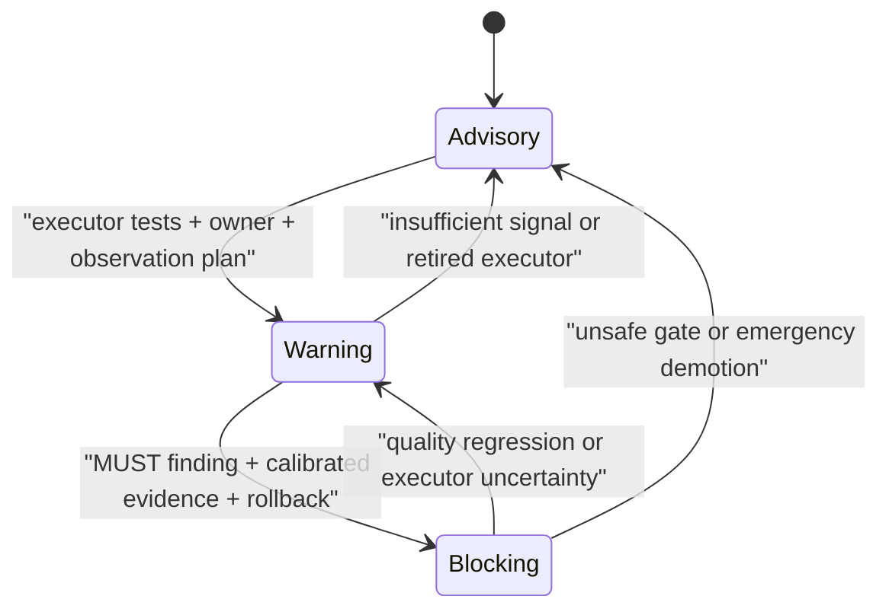

# ESP-0000: Govern automated enforcement at Requirement granularity

> - **Status:** Approved
> - **Normative:** No
> - **Extends:** ESP-0010 and the approved Requirement-level context Proposal
> - **Approval:** The repository owner explicitly directed implementation of
>   the proposed enforcement lifecycle and telemetry changes in the current
>   Codex task on 2026-08-09.
> - **Integration targets:** Requirement authoring metadata, canonical
>   validation, governance and compliance documentation, generated Requirement
>   indexes, consumer enforcement policy, and observation evidence.

## Summary

Give every Requirement an **Automated enforcement** level of `Advisory`,
`Warning`, or `Blocking`. The level controls the strongest action a generic
automated consumer may take on a finding. It remains independent from BCP 14
requirement strength, document maturity, and the existing mechanical, review,
or hybrid enforcement class. New and migrated Requirements begin at
`Advisory`; promotion requires versioned evidence, an observable warning
period, a rollback path, and stable Requirement-level telemetry. Automated
overrides remain temporary evidence records and never turn a violated `MUST`
into conforming behavior.

## Motivation

The repository currently answers three separate questions: how strong a
Requirement is, how compatible its next revision promises to be, and which
mechanism can verify it. It does not answer whether an automated finding may
inform, warn, or block a consuming workflow. Consumers can therefore infer a
gate from `MUST`, mistake Development maturity for weak normativity, or let an
uncalibrated semantic reviewer block a change.

Stable Requirement IDs, exact context capsules, and one Verification row per
Requirement already provide the join keys needed for controlled rollout. A
small additional metadata field can make automated action explicit without
turning generated summaries or model output into normative authority.

Finding volume alone cannot demonstrate quality. Repeated reviews can inflate
counts, and a blocked change can represent a defect, a false positive, or a
temporary tool failure. Promotion therefore needs durable observations that
distinguish unique findings, rechecks, dispositions, overrides, remediation,
and escaped defects.

## Scope and non-goals

This Proposal covers:

- one ordered Automated enforcement marker in every formal Requirement block;
- three rollout levels and evidence-gated transitions between them;
- the relationship between rollout, BCP 14 strength, maturity, and enforcement
  class;
- temporary automated-gate overrides with owners and expiry;
- an append-only Requirement observation contract for consumer telemetry;
- deterministic source validation and an Advisory migration baseline.

It does not:

- change the normative meaning of any existing Requirement;
- authorize generated summaries to replace exact normative Markdown;
- add model names, CI vendors, or organization-specific thresholds to the
  Catalog;
- require every consumer to run an automated reviewer;
- define organization workflow code in this repository;
- change Catalog schema version 1;
- promote an existing Requirement beyond `Advisory` without observed evidence.

## Proposed behavior

### Every Requirement declares an automated action ceiling

The marker appears after routing metadata and before normative text:

```md
### DATA-PARSE-001 — Parse into a valid domain value

**Activation:** Load when converting an untrusted shape into a domain value.

**Context dependencies:** `DATA-SHAPE-001`

**Automated enforcement:** Advisory

The boundary parser **MUST** reject invalid input.
```

The levels have these meanings:

| Level | Generic automated consumer action |
| --- | --- |
| `Advisory` | May report a finding. The finding cannot change approval or completion state. |
| `Warning` | Must surface a finding and durable disposition. The finding alone cannot reject the change. |
| `Blocking` | May reject a change only for a confirmed violation of a `MUST` or `MUST NOT` obligation and only through an approved executor. |

The level governs automated action. A human reviewer continues to apply the
locked normative Requirement and may reject non-conforming work regardless of
the automated level.

BCP 14 strength constrains automated promotion. A `MAY`-only obligation stays
`Advisory`. A `SHOULD` or `SHOULD NOT` finding can reach `Warning`, preserving
its legitimate exception path. Only a Requirement containing a `MUST` or
`MUST NOT` obligation can reach `Blocking`, and only that obligation can cause
the automated block when a block contains mixed strengths.

A generic consumer may select a lower effective level when its executor,
trust boundary, or local policy cannot support the published ceiling. Raising
the level requires a versioned central change or an explicit project-owned
policy with equivalent evidence; repository discovery or an Agent decision
cannot promote it implicitly.

### Promotion follows evidence, not age



Promotion to `Warning` records:

- the executor identity and versioned configuration;
- positive, negative, and non-applicable test cases;
- a Requirement owner and observation window;
- a stable finding identity across rechecks;
- the expected disposition and rollback behavior.

Promotion to `Blocking` additionally records:

- the exact `MUST` or `MUST NOT` obligation that can block;
- warning-period precision, false-positive, override, and remediation results;
- a deterministic or calibrated adjudication path;
- break-glass ownership, expiry, and audit behavior;
- migration and immediate demotion instructions.

Every promotion changes consumer-visible behavior. It bumps the affected
Specification version, refreshes its digest, and appears in the Changelog.
An emergency demotion may proceed immediately to protect consumers, followed
by the same versioned evidence record before release.

### Overrides preserve non-conformance

An automated-gate override records the Requirement ID, locked Specification
version and digest, repository revision, finding ID, justification, owner,
expiry, remediation reference, and approving identity. Expiry is mandatory.

An override changes workflow disposition only. A violated `MUST` remains
non-conforming. A conforming exception to `SHOULD` follows the Specification's
`Exceptions` contract and is classified separately from an automated-gate
override.

### Telemetry uses an append-only finding lifecycle

Consumers that claim `Warning` or `Blocking` enforcement retain durable events
with these fields:

- event schema version, unique event ID, and observation timestamp;
- Catalog ID, Catalog version, resolved commit, Specification ID and version,
  source digest, Requirement ID, and Requirement-block digest;
- consumer repository identity and immutable revision;
- stable finding ID, SDLC stage, changed artifact, and executor identity,
  version, and configuration digest;
- published and effective automated enforcement levels;
- outcome: `detected`, `rechecked`, `remediated`, `dismissed_false_positive`,
  `accepted_should_exception`, `overridden`, `override_expired`, or
  `escaped_defect`;
- durable evidence reference and, when applicable, override owner, expiry, and
  remediation reference.

An event ID identifies one observation. A finding ID joins the same issue
across reruns and dispositions. Reports publish both event volume and unique
finding or affected-change counts so repeated review does not masquerade as
additional defects. Central aggregation excludes source text, secrets, and
personal content unless a separately governed policy authorizes them.

## Composition and routing impact

No Specification ID, Catalog dependency, selection mode, `applies_to` scope,
or Catalog schema field changes. Automated enforcement is Requirement metadata
inside the digest-verified Markdown block.

Requirement cards and generated indexes add the published level without
copying normative text. The exact context compiler preserves the marker with
the Requirement block. Selection still determines local availability;
Applicability and Activation still determine task context; automated
enforcement begins only after a consumer confirms a violation against that
context.

Project-owned Specifications may declare the same marker. Their policy cannot
silently rewrite the central source. Any higher project level identifies its
own owner, evidence, and source identity in the observation record.

## Compatibility and maturity

This is a backward-compatible addition to formal Requirement metadata and does
not change Catalog schema version 1. Existing consumers that preserve exact
Requirement blocks continue to receive valid normative content while treating
the new field as informational until they implement the lifecycle.

All current Requirements migrate to `Advisory`. Their BCP 14 strength,
Requirement IDs, context dependencies, Verification rows, and compliance
meaning remain unchanged. Each affected Development Specification receives a
minor version bump because its consumer contract gains a new capability. The
Catalog receives a minor release. Locked consumers change only after an
explicit update.

Automated enforcement remains independent from `Development`, `Stable`, and
`Deprecated`. Development permits incompatible future revisions; it does not
prevent a pinned Requirement from being enforced. Stable maturity does not
provide the evidence needed for automatic blocking.

## Failure modes and corner cases

- A missing, duplicated, or unknown marker fails the canonical check.
- A `Blocking` block without a `MUST` or `MUST NOT` obligation is invalid.
- A stale generated index or mismatched block digest blocks automated action.
- An Agent-generated paraphrase cannot supply the obligation used to gate; the
  finding cites the exact Requirement ID and locked source.
- Missing telemetry prevents a consumer from claiming calibrated `Warning` or
  `Blocking` operation, but does not weaken normative requirements.
- Rechecks reuse the finding ID and append events rather than inflating the
  unique-finding count.
- A broken executor triggers immediate local demotion or break glass, then a
  versioned central demotion when the problem affects the published ceiling.
- An expired override returns to the unresolved finding state and becomes an
  auditable event.
- Conflicting project policy stays explicit as project-owned evidence; path
  specificity alone does not override the central level.

## Trade-offs and mitigations

One extra line in every Requirement block increases source and index size.
Requirement-level placement avoids promoting a broad Specification when only
one rule has credible enforcement evidence.

An Advisory baseline delays automated blocking. It prevents legacy
Requirements from inheriting unmeasured authority and creates an observable
promotion path.

Telemetry creates storage, privacy, and operational cost. The event contract
keeps source content out of the required payload, supports local retention,
and requires only durable evidence references for aggregation.

Generic thresholds cannot fit every executor or repository. The central
contract requires the measurements and decision record while leaving numeric
promotion thresholds to the approved owner and consumer risk policy.

## Prior art and alternatives

[Cloudflare's Engineering Codex](https://blog.cloudflare.com/engineering-standards-enforcement/)
separates approved RFCs from enforced RFCs, assigns stable statement IDs,
uses progressive disclosure, and applies the same source across code, design,
and incident review. Its production scale supports an explicit rollout model;
its published finding counts do not provide enough accuracy evidence to copy a
blocking policy without local calibration.

Alternatives rejected:

- **Infer action from `MUST` and `SHOULD`:** requirement strength describes
  conformance, not evaluator quality or rollout readiness.
- **Use document maturity:** maturity describes future compatibility and would
  couple unrelated contracts.
- **Put one level on each Specification:** broad documents contain Requirements
  with different executors and evidence quality.
- **Let each Agent decide:** findings would be irreproducible and promotion
  would escape governance.
- **Generate a concise normative JSON copy:** model extraction can omit or
  weaken context. Derived indexes retain only metadata and exact source
  boundaries.
- **Count findings without lifecycle identity:** reruns and duplicates would
  overstate coverage and defects.

## Prototypes and evidence

The current Catalog publishes 32 stable Requirement blocks. Every block already
has bounded activation metadata, exact dependency closure, one enforcement
class, one Evidence contract, one Verification row, and a source digest. This
allows a deterministic parser to add and validate the new scalar marker
without changing the Catalog schema or summarizing normative content.

The initial integration assigns `Advisory` to all 32 blocks and adds negative
tests for missing, invalid, duplicated, and ineligible `Blocking` markers.
Canonical validation proves source consistency. No current repository evidence
supports promoting a Requirement to `Warning` or `Blocking`; those transitions
remain future, separately reviewable changes.

## Open questions

No open question changes the source contract. A portable JSON Schema for
observation exchange should follow a real RepoFoundry consumer prototype so
field optionality, privacy boundaries, and finding lifecycle semantics are
tested before becoming another public format.

## Integration plan

1. Add the lifecycle to governance and compliance documentation.
2. Extend the formal Specification template and notation guidance.
3. Add `Automated enforcement: Advisory` to every current Requirement.
4. Make the canonical parser reject missing, duplicate, unknown, or ineligible
   levels and add focused unit tests.
5. Update the English and Chinese repository and Specification model docs.
6. Bump affected Specification and Catalog minor versions, refresh digests,
   update the Changelog, and pass the canonical check.
7. Extend RepoFoundry's derived Requirement index, receipt, and evidence export
   in a separately validated consumer change before claiming active warning or
   blocking enforcement.

## Future possibilities

- a versioned, privacy-reviewed observation JSON Schema;
- domain-specific promotion thresholds and calibrated adjudicators;
- dashboards joining Requirement changes to false positives, remediation time,
  overrides, and escaped defects;
- spec and incident reviewers that emit the same finding lifecycle;
- deterministic linters that promote individual mechanical Requirements after
  warning-period evidence.
