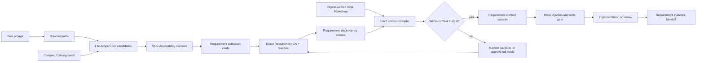
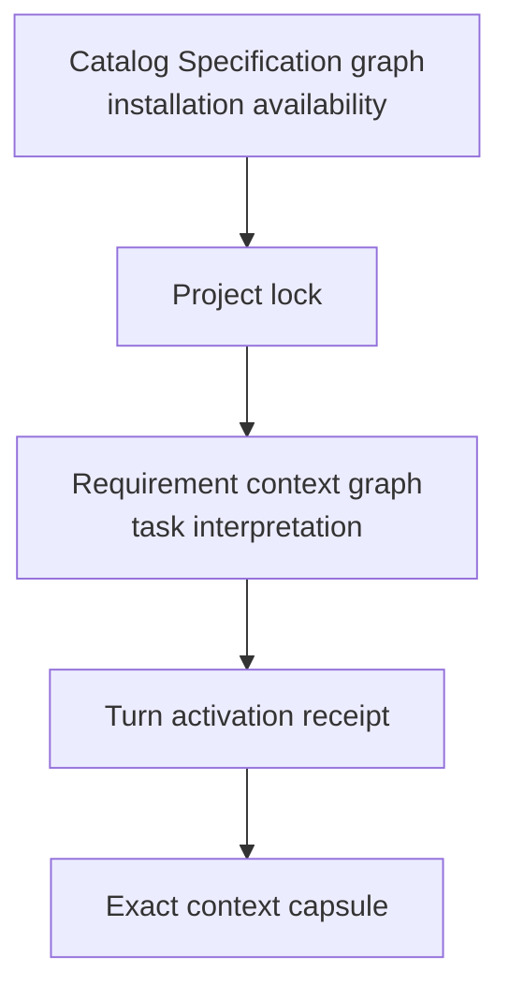

# ESP-0000: Compile task context at Requirement granularity

[English](0000_requirement-level-context-activation.md) |
[简体中文](0000_requirement-level-context-activation.zh-CN.md)

> - **Status:** Approved
> - **Normative:** No
> - **Extends:** ESP-0007 and ESP-0010
> - **Approval:** The repository owner explicitly directed implementation in
>   the current Codex task on 2026-08-05.
> - **Integration targets:** Formal Specification authoring, canonical
>   validation, published Requirement routing metadata, and RepoFoundry's
>   context index, Router, activation receipt, and Hook injection.

## Summary

Extend task activation from whole Specifications to stable Requirement IDs.
The Router first selects applicable Specifications, then exposes compact
activation cards for their Requirements. It records the directly selected IDs,
resolves an explicit Requirement dependency graph, and compiles a bounded
**Requirement context capsule** from exact digest-verified Markdown. The
capsule preserves the selected Requirement blocks, their interpretation frame,
and their Verification rows without summarizing or truncating normative text.
Task context therefore grows with the Requirements a change can affect rather
than with the total size of the installed Catalog.

## Motivation

ESP-0010 prevents every installed Specification from entering every task, but
its smallest injection unit is still one complete document. This becomes
expensive when a narrow Specification depends on several broad ones.

The five currently published Specification sources contain 2,042 lines and
87,614 UTF-8 bytes. Their Requirements sections contain 32 blocks and 39,883
bytes. Individual Requirement blocks range from 518 to 3,059 bytes. Activating
`languages/go/factory-delegation` currently resolves a Specification dependency
closure containing all five documents, even when a task only changes
unsupported-capability error behavior.

More model context does not remove this scaling problem. Irrelevant rules
compete with code, decisions, test output, and task history. Conversation
compaction cannot safely solve it because a summary may weaken a `MUST`, omit
an exception, or lose an exact Requirement ID. Prompt caching can reduce
latency or cost while leaving the same irrelevant bytes in the model's context.

The repository already has the right stable boundary. Every load-bearing rule
has a Requirement ID, a mechanically recognizable block, one Verification
entry, and a content digest. The consumer should route and compile at that
boundary.

## Scope and non-goals

This Proposal covers:

- one compact activation summary for every Requirement;
- explicit context dependencies between Requirement IDs;
- a generated, digest-bound Requirement context index;
- two-stage Spec and Requirement routing;
- deterministic compilation of exact context capsules;
- byte budgets, overflow behavior, and context rehydration;
- a versioned activation receipt that records the complete decision.

It does not:

- change required, detected, or explicit project selection;
- change the meaning of Catalog `requires` or `applies_to`;
- split one human-readable Specification into one file per Requirement;
- use embeddings, semantic search, or model-generated summaries as a
  normative-selection authority;
- put one Skill around every Specification or Requirement;
- prescribe one model's tokenizer or context-window size;
- change the behavioral meaning of existing Requirements;
- change Catalog schema version 1.

The generated index is a consumer artifact derived from locked Markdown. The
Markdown source and Catalog digest remain authoritative.

## Proposed behavior



The public behavior has four contracts: authoring metadata, routing, exact
context compilation, and context lifetime.

### Every Requirement has a compact routing card

Every formal Requirement block adds two mechanically parsed lines immediately
after its heading:

```md
### GO-FACTORY-ABSENCE-001 — Unsupported capability is explicit

**Activation:** Load when changing capability absence, no-op, discovery, or
unsupported-error behavior.

**Context dependencies:** `GO-ERROR-001`
```

`Activation` is non-normative routing metadata. It describes observable task
intent, starts with `Load when `, occupies one Markdown paragraph, and contains
at most 180 Unicode code points. It does not introduce implementation
requirements.

`Context dependencies` lists the exact Requirement IDs needed to interpret or
apply the block. `None` is explicit. Prefixes and wildcards such as
`GO-OPTION-*` are invalid because they make the closure change when unrelated
Requirements are added.

A context dependency may target:

- another Requirement in the same Specification; or
- a Requirement in the transitive Catalog dependency closure of that
  Specification.

The Requirement graph must be acyclic. A narrower Specification cannot create
a hidden dependency on an unrelated or downstream Specification. Every
Requirement ID referenced as an applicable contract inside a Requirement block
must appear in `Context dependencies`; the canonical check rejects an omitted,
unknown, wildcard, or out-of-closure reference.

One Requirement block may contain at most 8 KiB of UTF-8 source. A larger block
must be divided along independently activatable behavioral obligations. This
limit applies to the complete block, including rationale, enforcement, and
evidence, and prevents one selected ID from becoming an unbounded context unit.

### A generated index exposes metadata without copying normative text

RepoFoundry compiles a Requirement context index when it materializes or
validates the locked Specification set. For each Requirement, the index records:

- Specification ID, version, source path, and source SHA-256;
- Requirement ID, title, and Activation summary;
- direct Context dependencies;
- exact source byte boundaries and block SHA-256;
- the matching Verification row;
- byte boundaries for the Specification interpretation frame.

The index contains no independently authored normative wording. It is a
reproducible cache tied to the project lock and may be deleted and regenerated
offline. A stale index, changed source digest, invalid byte boundary, symbolic
link, or block digest mismatch blocks routing before a write.

Project-owned Specifications may use the same markers. Their project lock or
manifest supplies the source identity and digest; they do not become central
Catalog entries.

### Routing narrows progressively from paths to exact IDs

The generated `$engineering-specs` Skill remains the only Specification Router
Skill. Root `AGENTS.md` continues to require it for implementation and review.
The Router changes its task-time sequence:

1. The Agent declares the planned repository-relative paths.
2. Deterministic `applies_to` matching returns only candidate Specification
   cards from the installed set.
3. The Agent evaluates each candidate's description and Applicability contract
   and records the applicable Specification IDs.
4. The Router returns Requirement activation cards only for those
   Specifications. It does not inject their full text.
5. The Agent records the smallest complete set of direct Requirement IDs and a
   non-empty task-specific reason for each ID.
6. Code resolves the transitive Requirement dependency closure. Agent prose
   cannot add, remove, or rewrite closure edges.
7. The context compiler produces one exact capsule and the trusted Hook injects
   it before mutation or final review.

Catalog `requires` still determines which Specifications are installed.
Requirement dependencies determine which parts of those installed documents
enter one task. Selecting a Requirement does not activate every Requirement in
its Specification or in an upstream Specification.

An explicit no-Spec decision from ESP-0010 remains valid. When a Specification
is applicable, its ordinary route selects at least one Requirement.
Repository-wide audits, Specification migrations, and legacy documents may use
explicit `whole-spec` mode with a recorded reason instead of inventing an
artificial list of IDs.

### A context capsule preserves exact meaning

For every Specification represented in the resolved Requirement closure, the
compiler includes one interpretation frame:

- title, Catalog ID, version, and source digest;
- Purpose;
- Agent workflow;
- Terminology;
- Exceptions;
- Agent handoff.

The compiler then includes the exact source bytes of every resolved Requirement
block and the exact Verification row for each ID. It preserves source order
within a Specification and dependency order across Specifications. Generated
headers distinguish directly selected Requirements from dependency-only
Requirements.

Applicability is consumed during routing and its matched reason is retained in
the activation receipt. Approved patterns, rejected patterns, compatibility and
migration guidance, and references remain available as exact on-demand
sections. The Agent may add those sections to the receipt when they materially
help the task. The compiler never substitutes a generated summary for source
text.

Normative behavior must live in a Requirement block. Authors cannot place a
new `MUST` only in an example, routing summary, or compatibility narrative and
then depend on full-document injection to make it effective.

### The activation receipt is complete and replayable

The RepoFoundry activation receipt advances to a new schema version and records:

- session, turn, and context-epoch identity;
- planned paths;
- applicable Specification IDs;
- directly selected Requirement IDs and reasons;
- resolved Requirement IDs and dependency edges;
- requested supporting sections;
- every source version and SHA-256;
- capsule SHA-256 and UTF-8 byte count;
- configured budget, mode, and any approved override.

A receipt identifies the decision; the capsule proves the exact derived bytes.
Both are reproducible from the same lock without network access.

### Context budgets fail visibly instead of truncating rules

The protocol measures canonical size in UTF-8 bytes because tokenization varies
by model and version. An Agent adapter may also report an estimated token count.

The initial Codex adapter uses two configurable defaults:

- 16 KiB for Requirement activation cards returned during one routing step;
- 32 KiB for the compiled context capsule injected into one context epoch.

Neither limit permits silent truncation. If cards exceed their budget, the
Router returns deterministic pages or asks for a narrower Specification query.
If a resolved capsule exceeds its budget, it reports the direct and transitive
IDs, per-block byte costs, and largest interpretation frames. The Agent must
then narrow the IDs, partition the task into independently verifiable turns, or
record an explicit budget override or `whole-spec` mode. Every selected block
remains byte-complete.

### Compaction and delegation create new context epochs

An activation decision may survive a long session while its injected text does
not. Resume, fork, conversation compaction, and non-fork subagent delegation
therefore create a new context epoch. Before that context may write or complete
a governed review, the adapter rehydrates the exact capsule from its receipt
and verified local sources.

A subagent receives only the Requirement subset delegated to its planned paths,
plus the resolved dependencies of that subset. Its summary may report evidence
to the parent, but the summary never replaces exact Requirement text in a
context that performs governed work.

## Composition and routing impact

This Proposal does not change Specification selection or installation
composition. Required Specifications remain locally available everywhere;
optional Specifications remain explicitly selected; Catalog dependencies still
produce the installed closure.

It adds a second, deliberately narrower graph:



The two graphs answer different questions. Catalog `requires` says which source
contracts must be locally present. `Context dependencies` says which exact
Requirements must be visible when one Requirement is applied. The second graph
may reference only content made available by the first.

Catalog descriptions remain Spec-level activation summaries. Requirement
cards live in the digested Markdown and generated index, so `catalog.json`
schema version 1 does not duplicate dozens of per-Requirement records.

## Compatibility and maturity

All current Specifications are Development. Adding Activation and Context
dependency markers changes routing metadata without changing their behavioral
requirements. Integration should advance each affected per-Spec patch version,
refresh its digest, and publish the complete consumer capability in the next
minor Catalog release.

Old RepoFoundry versions continue to inject full documents and remain correct,
with the existing context cost. A new consumer uses Requirement granularity
only when every selected source has valid routing metadata and a verified
context index. A legacy or project-owned Specification without the markers
falls back to explicit `whole-spec` mode; it is never heuristically sliced.

Mixed activation is valid. One task may use Requirement capsules for central
Specifications and full-document mode for a legacy project Specification. The
receipt distinguishes both sources and accounts for their complete byte cost.

Rollback disables Requirement compilation and returns to ESP-0010's full-Spec
injection. No normative source is rewritten or lost.

## Failure modes and corner cases

- An unknown or duplicate Requirement ID fails canonical validation.
- A missing Activation or Context dependency marker fails publication for a
  central Specification; a legacy project Specification uses full mode.
- A dependency cycle, wildcard, or edge outside the Catalog Spec closure fails
  before index generation.
- A Requirement reference omitted from Context dependencies fails canonical
  validation when it is mechanically recognizable. Review remains responsible
  for semantic dependencies that contain no explicit ID reference.
- A source or block digest mismatch invalidates the index and receipt and
  blocks injection.
- A newly planned or changed path outside the receipt blocks the write until
  routing is repeated.
- An oversized closure produces a diagnostic and no capsule; it is never
  clipped to the configured limit.
- A broad refactor may legitimately activate many IDs. The Agent partitions it
  only when the resulting edits and verification can also be partitioned.
- A task that primarily needs an Approved pattern still selects the governing
  Requirement and requests the pattern as a supporting section.
- An Agent may under-select semantically relevant IDs. Conservative activation
  wording, explicit dependency edges, changed-path auditing, verification, and
  review reduce this risk; the receipt cannot prove model understanding.
- Compaction, resume, fork, and delegation invalidate the previous context
  epoch until exact capsule rehydration succeeds.

## Trade-offs and mitigations

Authors maintain two additional metadata lines and a Requirement dependency
graph. The canonical checker catches structural drift, while review decides
whether the graph is semantically complete. This cost makes hidden upstream
assumptions visible and reviewable.

The Router performs an additional selection step. Local precompiled metadata
keeps it deterministic and avoids network latency. The step also produces a
more useful plan: reviewers can see which exact contracts the Agent believes a
change affects before any edit occurs.

Exact capsules are larger than summaries. That is intentional for BCP 14
requirements. Progressive loading removes irrelevant blocks while preserving
the bytes whose wording carries the contract.

The initial byte budgets are conservative and model-independent, but they do
not predict exact token cost. Adapters can tune lower limits and display token
estimates without changing the integrity or overflow contract.

Keeping Specifications human-readable means interpretation frames repeat when
several Specs contribute Requirements. The compiler includes each frame once
per capsule and hashes the result. A future format may make frames more granular
after evidence shows that repetition is material.

## Prior art and alternatives

Codex Skills use progressive disclosure: the product starts with names and
descriptions, then loads a selected `SKILL.md` and its references on demand.
Codex also limits automatically discovered project instructions and recommends
small `AGENTS.md` files. This Proposal applies the same control-plane pattern
inside one Specification corpus while preserving exact normative blocks.

- [Codex Skills](https://learn.chatgpt.com/docs/build-skills)
- [Codex AGENTS.md](https://learn.chatgpt.com/docs/agent-configuration/agents-md)

Claude Code loads path-scoped rules and nested project instructions only when
matching files are read, and loads Skill bodies only when used. Its context
documentation also separates subagent context and conversation compaction.

- [Claude Code memory and rules](https://code.claude.com/docs/en/memory)
- [Claude Code Skills](https://code.claude.com/docs/en/slash-commands)
- [Claude Code context window](https://code.claude.com/docs/en/context-window)

Alternatives rejected:

- **Keep full-Spec injection:** simple and exact, but context grows with
  document and dependency-closure size.
- **Split every Requirement into a file:** improves physical selection while
  fragmenting human review, duplicating document frames, and turning file
  layout into a public dependency surface.
- **One Skill per Requirement or Specification:** exposes unbounded metadata,
  creates overlapping triggers, and makes Agent-specific packaging part of an
  Agent-neutral source repository.
- **Embedding or keyword retrieval:** useful for discovery but probabilistic or
  brittle as the authority deciding which `MUST` text reaches a task.
- **Generated Requirement summaries:** compact but cannot preserve exact
  strength, exceptions, error semantics, or evidence wording.
- **Always use a larger context window:** raises the ceiling without bounding
  relevance, adherence, or future Catalog growth.
- **Put Requirement cards in Catalog schema version 2:** machine-readable but
  duplicates metadata already versioned with the Requirement source. A future
  Catalog may publish a precompiled index after the derived format is proven.

## Prototypes and evidence

The existing canonical checker already parses every Requirement boundary,
validates block metadata, finds duplicate IDs, and joins each ID to exactly one
Verification row. It can be extended into an index compiler without introducing
a second Markdown parser.

Current repository evidence provides the scaling baseline:

| Measure | Current value |
| --- | ---: |
| Published Specifications | 5 |
| Full source size | 87,614 bytes |
| Requirement blocks | 32 |
| Requirements section size | 39,883 bytes |
| Smallest Requirement block | 518 bytes |
| Largest Requirement block | 3,059 bytes |

The integration prototype must demonstrate:

1. byte-identical index and capsule generation across repeated offline runs;
2. digest failure after any source-byte mutation;
3. a factory absence task that selects
   `GO-FACTORY-ABSENCE-001`, resolves its explicit error dependency, and stays
   below 16 KiB without omitting its interpretation frame;
4. a construction task that resolves explicit `GO-OPTION-TYPE-001`,
   `GO-OPTION-APPLY-001`, and `GO-OPTION-VALIDATE-001` dependencies without
   loading unrelated naming, module, lifecycle, or factory-surface
   Requirements;
5. a broad compatibility migration that either remains below the configured
   capsule budget or produces a complete overflow diagnostic;
6. mixed Requirement and legacy whole-document activation;
7. exact rehydration after compaction and inside a delegated context;
8. Stop auditing that reports direct and dependency-only Requirement IDs plus
   revision-bound verification evidence.

The prototype should record full-document bytes, capsule bytes, estimated
tokens, routing latency, selected-ID precision, and any missed Requirement
found during review. Context reduction alone is insufficient if selection
recall falls.

## Open questions

The protocol, integrity boundary, and overflow behavior do not depend on a
particular model. The initial 16 KiB and 32 KiB Codex defaults remain subject to
prototype measurement. Other Agent adapters may choose different defaults
while preserving byte-complete blocks and explicit overflow.

A precompiled Requirement index in a future Catalog schema remains deferred
until RepoFoundry demonstrates that local derivation is a measurable latency or
portability problem.

## Integration plan

1. Add Activation and Context dependency markers to the formal Specification
   template and authoring guidance.
2. Extend `scripts/check.py` and unit tests with activation-card shape, block
   size, referenced-ID coverage, graph closure, cycle, and byte-range checks.
3. Add routing metadata and explicit Requirement edges to every published
   Specification without changing normative behavior; bump patch versions and
   refresh Catalog digests.
4. Generate a versioned Requirement context index from RepoFoundry's locked
   central and project-owned sources.
5. Update `$engineering-specs` to perform path, Spec, and Requirement routing
   and to emit the new activation receipt.
6. Replace full-document first-write injection with exact capsule compilation,
   budget checks, and explicit legacy fallback.
7. Rehydrate capsules on new context epochs and pass only delegated
   Requirement subsets to subagents.
8. Add isolated consumer tests for stale locks, malformed metadata, overflow,
   dirty files, path expansion, compaction, delegation, and Stop handoff.
9. Update the English and Chinese Specification model, governance, compliance,
   README, RepoFoundry documentation, and Changelog.
10. Run both repositories' canonical checks and publish the change through a
    new minor Catalog release after Proposal approval.

## Future possibilities

- structured path or task predicates on Requirement cards after routing data
  shows stable signals;
- a signed or Catalog-published precompiled context index;
- per-Requirement activation precision and recall reports from reviewed tasks;
- automatic task partition suggestions based on closure and verification
  boundaries;
- finer interpretation-frame fragments when repeated frame cost becomes
  material;
- Agent adapters for Claude Code and other runtimes using the same receipt and
  exact-capsule contract.
