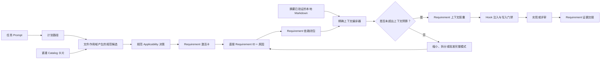
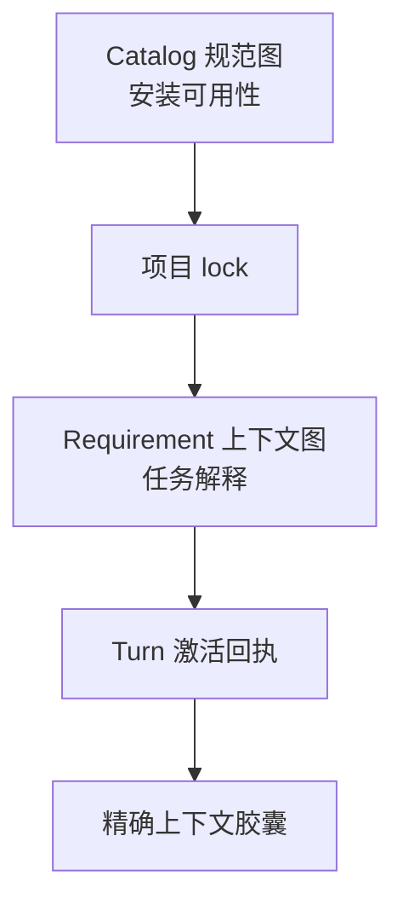

# ESP-0000：按 Requirement 粒度编译任务上下文

[English](0000_requirement-level-context-activation.md) |
[简体中文](0000_requirement-level-context-activation.zh-CN.md)

> - **状态：** Approved
> - **规范性：** 否
> - **扩展：** ESP-0007 和 ESP-0010
> - **批准：** 仓库所有者在 2026-08-05 的当前 Codex 任务中明确要求实施。
> - **集成目标：** 正式规范创作、规范检查、已发布 Requirement 路由元数据，
>   以及 RepoFoundry 的上下文索引、Router、激活回执和 Hook 注入。

## 摘要

把任务激活粒度从整份规范细化到稳定的 Requirement ID（规范要求标识符）。
Router 先选择适用规范，再暴露这些规范的紧凑 Requirement 激活卡。Router 记录
直接选择的 ID，解析显式 Requirement 依赖图，并从摘要已验证的精确 Markdown
编译一个有界的 **Requirement 上下文胶囊（Requirement context capsule）**。
上下文胶囊完整保留选中的 Requirement 块、解释框架和 Verification 行，不对
规范性文本做摘要或截断。任务上下文的增长由变更可能影响的 Requirement 数量
决定，不再跟随已安装 Catalog 的总规模增长。

## 动机

ESP-0010 已阻止所有已安装规范进入每个任务，但它的最小注入单元仍是一份完整
文档。当一份窄规范依赖多份宽规范时，这个单元会消耗大量上下文。

当前发布的五份规范源码共有 2,042 行、87,614 个 UTF-8 字节。其中
Requirements 章节包含 32 个块，共 39,883 字节；单个 Requirement 块介于
518 到 3,059 字节之间。激活 `languages/go/factory-delegation` 时，当前规范依赖
闭包会包含全部五份文档，即使任务只修改“不支持能力”的错误行为也一样。

扩大模型上下文无法消除这个扩展问题。无关规则会与代码、决策、测试输出和任务
历史争夺上下文。对话压缩无法安全承担这项工作，因为摘要可能削弱 `MUST`、遗漏
例外条件或丢失精确的 Requirement ID。Prompt 缓存可以降低延迟或成本，但相同的
无关字节仍会进入模型上下文。

仓库已经具备合适的稳定边界。每条承重规则都有 Requirement ID、可机械识别的块、
唯一的 Verification 条目和内容摘要。消费端应在这一边界上执行路由和编译。

## 范围与非目标

本提案覆盖：

- 为每个 Requirement 提供一条紧凑的激活摘要；
- 在 Requirement ID 之间声明显式上下文依赖；
- 生成与摘要绑定的 Requirement 上下文索引；
- 执行 Spec 和 Requirement 两阶段路由；
- 确定性编译精确的上下文胶囊；
- 定义字节预算、溢出行为和上下文重建；
- 用版本化激活回执记录完整决策。

本提案不涉及：

- 改变 required、detected 或 explicit 项目选择；
- 改变 Catalog `requires` 或 `applies_to` 的含义；
- 把一份适合人类阅读的规范拆成每个 Requirement 一个文件；
- 让 embedding、语义搜索或模型生成的摘要决定规范性文本选择；
- 为每份规范或每个 Requirement 分别创建 Skill；
- 规定某个模型的 tokenizer 或上下文窗口大小；
- 改变现有 Requirement 的行为语义；
- 改变 Catalog schema version 1。

生成索引是由已锁定 Markdown 派生的消费端产物。Markdown 源文件和 Catalog
摘要仍是事实源。

## 提议行为



这项公开行为包含四份契约：创作元数据、路由、精确上下文编译和上下文生命周期。

### 每个 Requirement 都有一张紧凑路由卡

每个正式 Requirement 块都在标题后紧接两行可机械解析的内容：

```md
### GO-FACTORY-ABSENCE-001 — Unsupported capability is explicit

**Activation:** Load when changing capability absence, no-op, discovery, or
unsupported-error behavior.

**Context dependencies:** `GO-ERROR-001`
```

`Activation` 是非规范性的路由元数据。它描述可观察的任务意图，以 `Load when `
开头，占一个 Markdown 段落，最多包含 180 个 Unicode 码点。它不能引入实现要求。

`Context dependencies` 列出解释或应用当前块所需的精确 Requirement ID。没有依赖
时显式写 `None`。`GO-OPTION-*` 这类前缀和通配符无效，因为添加无关 Requirement
也会改变其闭包。

一条上下文依赖可以指向：

- 同一份规范中的另一个 Requirement；或
- 当前规范的传递 Catalog 依赖闭包中的 Requirement。

Requirement 图必须无环。窄规范不能暗中依赖无关或下游规范。Requirement 块中作为
适用契约引用的每个 Requirement ID，都必须出现在 `Context dependencies` 中；
规范检查会拒绝遗漏、未知、通配符或闭包外引用。

一个 Requirement 块最多包含 8 KiB UTF-8 源码。更大的块必须按照可独立激活的
行为义务拆分。这个限制覆盖完整块，包括 rationale、enforcement 和 evidence，
防止一个选中 ID 变成无界的上下文单元。

### 生成索引只保存元数据，规范正文保持唯一

RepoFoundry 在物化或验证已锁定规范集合时，编译 Requirement 上下文索引。索引为
每个 Requirement 记录：

- 规范 ID、版本、源路径和源 SHA-256；
- Requirement ID、标题和 Activation 摘要；
- 直接 Context dependencies；
- 精确的源字节边界和块 SHA-256；
- 对应的 Verification 行；
- 规范解释框架的字节边界。

索引不包含独立创作的规范性措辞。它是与项目锁绑定的可复现缓存，可以删除并离线
重建。索引过期、源摘要变化、字节边界无效、符号链接或块摘要不匹配，都会在写入前
阻断路由。

项目自有规范可以使用相同标记。它们的项目锁或 manifest 提供源身份与摘要；这些
规范不会因此成为中央 Catalog 条目。

### 路由从路径逐步收敛到精确 ID

生成的 `$engineering-specs` Skill 仍是唯一的规范 Router Skill。根 `AGENTS.md`
继续要求所有实现和评审先经过它。Router 的任务时序调整为：

1. Agent 声明计划处理的仓库相对路径。
2. 确定性的 `applies_to` 匹配只从已安装集合返回候选规范卡片。
3. Agent 根据候选的 description 和 Applicability 契约，记录适用的规范 ID。
4. Router 只返回这些规范的 Requirement 激活卡，不注入全文。
5. Agent 记录最小且完整的直接 Requirement ID 集合，并为每个 ID 提供非空的
   任务原因。
6. 代码解析传递 Requirement 依赖闭包。Agent 文字不能增加、删除或改写闭包边。
7. 上下文编译器生成一个精确胶囊，可信 Hook 在修改或最终评审前完成注入。

Catalog `requires` 继续决定安装哪些规范。Requirement 依赖决定这些已安装文档的
哪些部分进入当前任务。选择一个 Requirement 不会激活同一规范或上游规范中的所有
Requirement。

ESP-0010 定义的显式 no-Spec 决策继续有效。某份规范适用时，普通路由至少选择一个
Requirement。仓库级审计、规范迁移和旧文档可以显式使用 `whole-spec` 模式并记录
原因，无需编造 Requirement ID 列表。

### 上下文胶囊完整保留解释所需内容

Requirement 闭包涉及的每份规范，都会向编译器提供一份解释框架：

- 标题、Catalog ID、版本和源摘要；
- `Purpose`；
- `Agent workflow`；
- `Terminology`；
- `Exceptions`；
- `Agent handoff`。

随后，编译器加入每个已解析 Requirement 块的精确源字节，以及各 ID 对应的精确
Verification 行。它在单份规范内保留源码顺序，在多份规范之间保留依赖顺序。生成
标题会区分直接选择的 Requirement 和只因依赖进入的 Requirement。

路由阶段已经消费 Applicability，其匹配原因保留在激活回执中。`Approved patterns`、
`Rejected patterns`、兼容与迁移说明以及引用，仍以精确的按需章节提供。任务确有帮助
时，Agent 可以把这些章节加入回执。编译器不会用生成摘要替换源文本。

规范性行为必须位于 Requirement 块中。作者不能只在示例、路由摘要或兼容性说明中
新增 `MUST`，再依赖全文注入使其生效。

### 激活回执完整且可重放

RepoFoundry 激活回执升级到新的 schema version，并记录：

- session、turn 和 context epoch 身份；
- 计划路径；
- 适用规范 ID；
- 直接选择的 Requirement ID 及原因；
- 已解析 Requirement ID 和依赖边；
- 请求的辅助章节；
- 每个源文件的版本和 SHA-256；
- 上下文胶囊 SHA-256 和 UTF-8 字节数；
- 配置预算、模式以及任何获批 override。

回执标识决策，上下文胶囊证明精确的派生字节。二者都能从同一个 lock 离线复现。

### 上下文预算显式失败，规则保持完整

协议以 UTF-8 字节作为标准大小度量，因为不同模型和版本的 tokenization 不同。
Agent 适配器还可以报告估算 token 数量。

初始 Codex 适配器采用两个可配置默认值：

- 单次路由返回的 Requirement 激活卡最多 16 KiB；
- 单个 context epoch 注入的上下文胶囊最多 32 KiB。

两个限制都不允许静默截断。卡片超过预算时，Router 返回确定性分页，或要求进一步
收窄规范查询。已解析胶囊超过预算时，Router 报告直接与传递 ID、每个块的字节开销
以及最大的解释框架。随后，Agent 必须收窄 ID、把任务拆成可独立验证的 turn，或
记录显式预算 override 或 `whole-spec` 模式。每个已选择块都保持字节完整。

### Compaction 与委派会创建新的 context epoch

激活决策可能在长会话中继续有效，但已注入文本可能已经丢失。因此，resume、fork、
对话 compaction 和非 fork subagent 委派都会创建新的 context epoch。新上下文执行
写入或完成受治理评审之前，适配器必须根据回执和已验证本地源重建精确胶囊。

Subagent 只接收分配给其计划路径的 Requirement 子集，以及该子集的已解析依赖。
Subagent 摘要可以向父 Agent 报告证据，但摘要不能替代执行受治理工作的上下文中的
精确 Requirement 文本。

## 组合与路由影响

本提案不改变规范选择或安装组合。Required 规范继续在所有仓库本地可用；可选规范
继续由项目显式选择；Catalog 依赖继续产生安装闭包。

本提案新增第二张范围更窄的图：



两张图回答不同问题。Catalog `requires` 表示哪些源契约必须在本地可用；
`Context dependencies` 表示应用某个 Requirement 时，必须看到哪些精确
Requirement。第二张图只能引用第一张图已经提供的内容。

Catalog description 继续承担规范级激活摘要。Requirement 卡片位于有内容摘要保护的
Markdown 和生成索引中，因此 `catalog.json` schema version 1 无需复制数十条
Requirement 记录。

## 兼容性与成熟度

当前所有规范都处于 Development。增加 Activation 和 Context dependency 标记只会
改变路由元数据，不改变行为要求。集成时应递增每份受影响规范的 patch version、
刷新摘要，并在下一个 minor Catalog release 中发布完整消费端能力。

旧版 RepoFoundry 继续注入全文，在保留现有上下文成本的同时保持正确。只有每个已选
源都具备有效路由元数据和已验证上下文索引时，新消费端才采用 Requirement 粒度。
缺少标记的旧规范或项目自有规范会回退到显式 `whole-spec` 模式，禁止启发式切片。

混合激活有效。一个任务可以对中央规范使用 Requirement 胶囊，对旧项目规范使用全文
模式。回执区分两类来源，并计入完整字节成本。

回滚会停用 Requirement 编译，恢复 ESP-0010 的完整 Spec 注入。规范源文件不会被
改写或丢失。

## 失败模式与边界情况

- 未知或重复 Requirement ID 无法通过规范检查。
- 中央规范缺少 Activation 或 Context dependency 标记时无法发布；旧项目规范改用
  完整模式。
- 依赖成环、使用通配符或边超出 Catalog 规范闭包时，索引生成失败。
- Context dependencies 遗漏了可机械识别的 Requirement 引用时，规范检查失败。
  没有显式 ID 的语义依赖仍由评审确认。
- 源摘要或块摘要不匹配会使索引与回执失效，并阻断注入。
- 新计划路径或变更路径不在回执内时，写入会被阻断，直至重新路由。
- 闭包超过预算时只返回诊断，不生成胶囊，也不会裁剪到配置上限。
- 宽范围重构可能合理地激活多个 ID。只有对应修改和验证也能拆分时，Agent 才能
  拆分任务。
- 主要需要 `Approved patterns` 的任务仍需选择其治理 Requirement，并把该模式作为
  辅助章节请求。
- Agent 可能漏选语义相关 ID。保守的激活措辞、显式依赖边、变更路径审计、验证和
  评审可以降低风险；回执无法证明模型已经理解正文。
- Compaction、resume、fork 和委派会使前一个 context epoch 失效，直到精确胶囊
  重建成功。

## 权衡与缓解措施

作者需要维护两行额外元数据和一张 Requirement 依赖图。规范检查负责发现结构漂移，
评审负责确认语义完整性。这项成本会把隐藏的上游假设变成可见、可评审的依赖。

Router 会多执行一步选择。本地预编译元数据保证确定性，并避免网络延迟。这一步还能
产出更有价值的计划：评审者可以在任何修改发生前，看到 Agent 判断本次变更影响的
精确契约。

精确胶囊比摘要更大。这是 BCP 14 Requirement 的完整性成本。渐进加载移除无关块，
同时保留承载契约含义的源字节。

初始字节预算较为保守且与模型无关，但不能预测精确 token 成本。适配器可以调低
限制并展示 token 估算，不改变完整性或溢出契约。

保持规范适合人类阅读，会让多份规范的解释框架在一个胶囊中重复。编译器让每份框架
只出现一次，并对结果计算摘要。未来格式可以在证据表明重复成本显著后进一步拆分
框架。

## 现有实践与备选方案

Codex Skill 使用渐进式披露（progressive disclosure）：产品先加载名称和描述，再
按需读取选中的 `SKILL.md` 及其引用。Codex 还限制自动发现的项目指令，并建议保持
`AGENTS.md` 精简。本提案把同一种控制面模式应用到一个规范语料库内部，同时保留
精确的规范块。

- [Codex Skill](https://learn.chatgpt.com/docs/build-skills)
- [Codex AGENTS.md](https://learn.chatgpt.com/docs/agent-configuration/agents-md)

Claude Code 只在读取匹配文件时加载路径范围规则和嵌套项目指令，只在使用 Skill 时
加载其正文。它的上下文文档也把 subagent context 与对话 compaction 分开处理。

- [Claude Code memory 与 rules](https://code.claude.com/docs/en/memory)
- [Claude Code Skill](https://code.claude.com/docs/en/slash-commands)
- [Claude Code context window](https://code.claude.com/docs/en/context-window)

未采用的备选方案：

- **继续完整 Spec 注入：** 简单且精确，但上下文随文档和依赖闭包规模增长。
- **每个 Requirement 拆成一个文件：** 便于物理选择，却会割裂人工评审、重复文档
  框架，并让文件布局成为公开依赖面。
- **每个 Requirement 或规范一个 Skill：** 元数据规模无界、触发条件重叠，还会把
  Agent 特定的包装写进 Agent 中立的源仓库。
- **Embedding 或关键词检索：** 适合发现，但作为决定哪些 `MUST` 文本进入任务的
  权威机制时具有概率性或过于脆弱。
- **生成 Requirement 摘要：** 更紧凑，却无法保留精确的强度、例外、错误语义和
  证据措辞。
- **始终使用更大的上下文窗口：** 只提高上限，无法约束相关性、遵循效果或未来
  Catalog 增长。
- **把 Requirement 卡片写入 Catalog schema version 2：** 机器可读，但会重复
  已随 Requirement 源完成版本化的元数据。派生格式得到验证后，未来 Catalog 可以
  发布预编译索引。

## 原型与证据

现有规范检查已经能够解析每个 Requirement 边界、验证块元数据、发现重复 ID，并把
每个 ID 连接到唯一的 Verification 行。因此，可以直接扩展当前解析器来生成索引，
无需引入第二个 Markdown 解析器。

当前仓库证据给出扩展基线：

| 度量 | 当前值 |
| --- | ---: |
| 已发布规范 | 5 |
| 完整源码大小 | 87,614 字节 |
| Requirement 块 | 32 |
| Requirements 章节大小 | 39,883 字节 |
| 最小 Requirement 块 | 518 字节 |
| 最大 Requirement 块 | 3,059 字节 |

集成原型必须证明：

1. 多次离线运行生成字节完全一致的索引和胶囊；
2. 任意源字节变化都会触发摘要校验失败；
3. 工厂能力缺失任务选择 `GO-FACTORY-ABSENCE-001`，解析其显式错误依赖，并在
   不遗漏解释框架的前提下保持低于 16 KiB；
4. 构造任务解析显式的 `GO-OPTION-TYPE-001`、`GO-OPTION-APPLY-001` 和
   `GO-OPTION-VALIDATE-001` 依赖，同时不加载无关的 naming、module、lifecycle
   或 factory-surface Requirement；
5. 宽范围兼容性迁移保持在配置胶囊预算内，或产生完整的溢出诊断；
6. Requirement 激活与旧文档全文激活可以混合；
7. compaction 后以及委派上下文中都能精确重建；
8. Stop 审计报告直接和仅依赖的 Requirement ID，以及与 revision 绑定的验证证据。

原型应记录全文字节、胶囊字节、估算 token、路由延迟、选中 ID 的 precision 与
recall，以及评审发现的任何漏选 Requirement。如果选择 recall 下降，仅减少上下文
没有价值。

## 开放问题

协议、完整性边界和溢出行为都不依赖特定模型。初始的 16 KiB 和 32 KiB Codex
默认值仍需原型测量。其他 Agent 适配器可以选择不同默认值，但必须保留字节完整的块
和显式溢出。

未来 Catalog schema 是否预编译 Requirement 索引继续保持延期，直到 RepoFoundry
证明本地派生会产生可测量的延迟或可移植性问题。

## 集成计划

1. 在正式规范模板和创作指南中加入 Activation 与 Context dependency 标记。
2. 扩展 `scripts/check.py` 和单元测试，检查激活卡形状、块大小、引用 ID 覆盖、
   图闭包、环和字节范围。
3. 在不改变规范性行为的前提下，为每份已发布规范增加路由元数据和显式 Requirement
   边；递增 patch version 并刷新 Catalog 摘要。
4. 根据 RepoFoundry 已锁定的中央和项目自有源，生成版本化 Requirement 上下文索引。
5. 更新 `$engineering-specs`，执行路径、Spec、Requirement 路由并产生新版激活回执。
6. 用精确胶囊编译、预算检查和显式旧版回退替代首次写入前的全文注入。
7. 在新 context epoch 中重建胶囊，并只向 subagent 传递委派的 Requirement 子集。
8. 为过期 lock、错误元数据、预算溢出、dirty files、路径扩展、compaction、委派和
   Stop 交接增加隔离消费端测试。
9. 更新中英文规范模型、治理、合规、README、RepoFoundry 文档和 Changelog。
10. 两个仓库都通过规范检查后，在提案获批后通过新的 minor Catalog release 发布。

## 未来可能

- 根据路由数据已经证明稳定的信号，为 Requirement 卡片增加结构化路径或任务谓词；
- 签名的或由 Catalog 发布的预编译上下文索引；
- 根据已评审任务统计每个 Requirement 的激活 precision 和 recall；
- 根据闭包与验证边界自动建议任务拆分；
- 当重复框架成本变得显著时，进一步细分解释框架；
- 为 Claude Code 和其他运行时提供 Agent 适配器，复用同一回执和精确胶囊契约。
