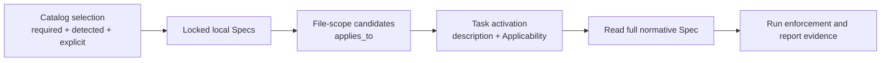

# ESP-0007: Separate Spec selection from task activation

> - **Status:** Approved
> - **Normative:** No
> - **Approval:** The user explicitly directed implementation in the current
>   Codex task on 2026-08-01.
> - **Integration targets:** Catalog routing semantics,
>   `core/semantic-naming`, new `core/data-boundaries`, `languages/go`, the
>   formal Specification template, and canonical validation.

## Summary

Keep required Specifications installed and revision-locked in every consuming
repository, but load their full text only when both file scope and task intent
make them relevant. Move data-shape parsing out of Semantic Naming into a
dedicated Core contract. Require every formal Requirement block to identify
its rationale, enforcement path, evidence, and verification mapping.

## Motivation

The current Catalog correctly separates project selection from task-time file
scopes, but a required Core Specification with `applies_to: ["**/*"]` becomes
a candidate for every change. Its own Applicability section can narrow the
task only after the full document has already been opened. This does not scale
as the Core catalog grows.

`core/semantic-naming` also contains a broad architectural rule for parsing
external data before side effects. The rule is reusable, but its current title
does not make it discoverable to an agent working on an HTTP, configuration,
storage, message, or tool boundary.

The repository already publishes stable Requirement IDs. Its canonical check
validates ID syntax and uniqueness, but it does not yet prove that every block
contains the enforcement and evidence structure promised by the authoring
template.

## Scope and non-goals

This Proposal covers:

- the distinction between selection, file candidacy, and task activation;
- a dedicated `core/data-boundaries` Specification;
- a concise Agent workflow and evidence handoff in the formal template;
- structural validation of published Requirement blocks and Verification
  coverage.

It does not add a Catalog field, change Catalog schema version 1, prescribe a
language-specific validation library, or define project-specific Handler
architecture.

## Proposed behavior

Selection answers which Specifications a project carries. `applies_to`
produces a conservative candidate set from changed files. The Catalog
description gives an index-sized activation summary. The document's
Applicability section makes the final task-intent decision.

Required therefore means selected, materialized, and available. It does not
mean that every task injects every required document into context.

The new data-boundary contract defines untrusted shapes, semantic parsing,
side-effect gating, error safety, protocol-owned bytes, and verification. It
depends on Semantic Naming for stable meanings of `Decode`, `Parse`,
`Validate`, and `Normalize`. Go guidance depends on both Core contracts and
describes their idiomatic realization.

## Composition and routing impact

- `core/semantic-naming` remains Required and applies across file types when a
  task introduces or changes shared names, mappings, units, or compatibility.
- `core/data-boundaries` is Required and applies across file types when a task
  consumes external data or can trigger downstream effects.
- `languages/go` remains Detected and depends on both Core Specifications.
- Catalog descriptions become concise activation summaries surfaced by the
  generated local index.
- Project-owned Handler and architecture rules remain outside this Catalog.

## Compatibility and maturity

All affected Specifications remain Development. Their requirements are
normative within a pinned version, while later Development versions may change
incompatibly.

Moving `SEM-BOUNDARY-001` changes the published Requirement-ID contract.
`core/semantic-naming` advances to `1.0.0`; its migration section maps the old
ID to the new data-boundary requirements. `core/data-boundaries` starts at
`0.1.0`. `languages/go` advances compatibly because its Go-specific boundary
requirement keeps the same meaning and gains an explicit upstream dependency.

The Catalog adds one required entry without changing its JSON shape. Existing
schema-v1 consumers can parse it and adopt it during their normal explicit
update.

## Failure modes and corner cases

- A consumer that treats Required as always-read remains correct but uses more
  context until it adopts task activation.
- A task can touch a broad file scope without activating the full Spec. The
  index summary must therefore name concrete activation conditions.
- A task that introduces a new boundary in an unexpected file still activates
  the Spec because task intent is evaluated after conservative file matching.
- Generated, vendored, and protocol-owned spellings remain governed by their
  owning source; adapters still satisfy internal boundary contracts.
- Missing evidence blocks a conformance claim, not the publication of a
  Development Specification.

## Trade-offs and mitigations

Task-intent activation requires Agent judgment. Compact Catalog descriptions,
explicit Applicability sections, stable IDs, and an evidence handoff make that
judgment reviewable. File scopes remain deterministic and conservative.

Splitting the boundary contract creates another Core document. Task activation
prevents the split from increasing context for unrelated changes, while the
dependency graph keeps terminology coherent.

## Prior art and alternatives

One alternative is to keep every Core rule in Semantic Naming. That minimizes
file count but hides an architectural invariant under a naming title and
couples independently evolving contracts.

Another alternative adds machine-readable `load_when` fields immediately.
That would require a Catalog schema and consumer migration. The proposed
description-plus-Applicability contract improves routing without breaking
schema-v1 consumers and leaves structured activation metadata as future work.

The design follows the Harness Engineering pattern of a small map, progressive
disclosure, explicit boundaries, and mechanical checks:
[Harness engineering](https://openai.com/index/harness-engineering/).

## Prototypes and evidence

- Existing Catalog descriptions already appear in generated managed indexes,
  so they can carry activation summaries without a schema change.
- Existing `applies_to` and Requirement-ID checks provide the deterministic
  base for candidate routing and evidence joins.
- The integration on this branch adds negative tests for malformed Requirement
  blocks, missing Verification coverage, and mismatched document metadata.

## Open questions

No open question changes this integration. A future Proposal may add structured
activation metadata after the consumer contract has implementation evidence.

## Integration plan

1. Update the formal template and authoring guidance.
2. Publish `core/data-boundaries` and narrow `core/semantic-naming`.
3. Update Go dependencies and cross-references.
4. Refresh Catalog versions, descriptions, and digests.
5. Update governance, compliance, indexes, bilingual documentation, and the
   Changelog.
6. Enforce document metadata, Requirement block shape, and Verification
   coverage in the canonical check.

## Future possibilities

A later Catalog schema may encode structured activation keys, enforcement
classes, maturity, or compliance manifests after RepoFoundry has a reviewed
consumer design and migration path.
