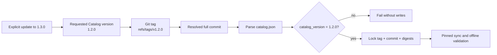

# ESP-0008: Versioned Catalog releases

> - **Status:** Approved
> - **Normative:** No
> - **Integration targets:** Catalog release contract and RepoFoundry consumer
>   version selection.

## Summary

Publish every production EngineeringSpecifications Catalog revision as an
immutable Git tag named `vMAJOR.MINOR.PATCH`. RepoFoundry selects an explicit
Catalog version, resolves that tag to a full commit, verifies that the checked
out Catalog declares the same semantic version, and records the source tag,
resolved commit, Catalog digest, and per-Spec digests in the project lock. A
branch such as `main` remains available only as an explicit development source.

## Motivation

The Catalog already carries `catalog_version`, and RepoFoundry already records
an immutable commit after resolution. However, initial installation defaults to
the moving `main` branch. Two projects initialized at different times can
therefore request the same implicit source and receive different contracts.
The version field describes content but does not yet provide a stable public
release address.

Harness Engineering needs both properties:

- a human selects a meaningful, reviewable version;
- the resolver proves the exact immutable bytes used by Codex and CI.

OpenTelemetry uses semantic versions and immutable `vX.Y.Z` release tags for
its Specification, while implementations state which Specification version
they implement. Its schema URLs are likewise versioned and immutable. This
Proposal adapts that release identity without copying OpenTelemetry's website,
multi-repository release automation, or governance scale.

## Scope and non-goals

This Proposal covers:

- the Catalog release tag convention;
- validation between a requested version and `catalog_version`;
- fixed-version initialization and explicit version upgrades in RepoFoundry;
- immutable lock and offline-validation behavior;
- a documented release checklist.

It does not introduce a package registry, hosted documentation versions,
automatic project upgrades, a new Catalog JSON schema version, or synchronized
versions for every individual Specification. Per-Spec versions remain
independent metadata within a Catalog release.

## Proposed behavior

The public contract is:

1. A production Catalog release has exactly one SemVer identity and an
   immutable `vMAJOR.MINOR.PATCH` Git tag.
2. The tagged `catalog.json` declares the same `catalog_version`.
3. RepoFoundry accepts `--spec-version MAJOR.MINOR.PATCH`, normalizes it to the
   fully qualified tag ref, and resolves it to a full commit.
4. Initial Bootstrap uses a documented fixed default version when no manifest
   exists. It does not silently follow `main`.
5. `spec sync` continues to use the lock's commit, even if a remote ref moves.
6. `spec update --spec-version ...` is the explicit operation that changes the
   selected release after a dry-run.
7. `--spec-ref` remains an explicit development escape hatch for a branch,
   custom tag, or commit. It is never the production default.
8. `spec validate` remains fully offline.

## Composition and routing impact

No normative Specification ID, dependency, `applies_to` scope, detection rule,
or task-time activation contract changes. The change affects the Catalog as a
release package and the RepoFoundry source resolver before Specification
selection occurs. Project-owned Specifications remain outside the central
Catalog and continue to be referenced from the project manifest.

## Compatibility and maturity

The Catalog JSON and project manifest/lock remain schema version 1. Existing
manifests that explicitly name a branch, tag, or commit continue to work.
Existing locks remain reproducible because they already contain a full commit.

New projects receive a fixed released version by default. Projects following
`main` keep that behavior until they explicitly migrate their manifest to a
release version. Changing the RepoFoundry default release is a consumer-tool
change; it does not alter an existing project's lock.

Catalog SemVer and per-Spec SemVer remain independent. A Catalog release may
package several Spec versions, and a Spec version may appear unchanged across
multiple Catalog releases.

## Failure modes and corner cases

- A requested version has no remote tag: resolution fails before local writes.
- The tag exists but `catalog_version` differs: resolution fails as a release
  integrity error.
- A tag is force-moved after a project is locked: `sync` still uses the locked
  commit; a reviewed `update` exposes the changed commit. Repository policy
  MUST still treat release tags as immutable.
- The remote is unavailable: planning or updating a release fails, while local
  validation continues offline.
- A legacy manifest follows `main`: it remains valid but is visibly a
  development source, not a released version.
- An individual Spec version is unchanged: its digest and version remain
  independently verified inside the new Catalog release.

## Trade-offs and mitigations

Git tags are simpler than a package registry and reuse the existing resolver,
but Git hosting policy must prevent tag mutation. The lock's full commit and
digests provide a second immutable identity and make any unexpected movement
reviewable.

A fixed default version requires RepoFoundry releases to intentionally advance
their default. This avoids silent upgrades. Users can select a newer version
immediately with `--spec-version` without waiting for a new tool default.

## Prior art and alternatives

OpenTelemetry publishes Specification releases with semantic versions and
`vX.Y.Z` tags, and separates release identity from document stability. Its
versioned schemas demonstrate the same principle: once published, a versioned
contract is immutable.

- [OpenTelemetry Specification versioning](https://github.com/open-telemetry/opentelemetry-specification/blob/main/README.md#versioning-the-specification)
- [OpenTelemetry release process](https://github.com/open-telemetry/opentelemetry-specification/blob/main/RELEASING.md)
- [OpenTelemetry versioning and stability](https://opentelemetry.io/docs/specs/otel/versioning-and-stability/)
- [OpenTelemetry schemas](https://opentelemetry.io/docs/specs/otel/schemas/)

Alternatives rejected:

- **Keep defaulting to `main`:** commit locking makes one installation
  reproducible but does not make the requested release identity stable.
- **Select only a commit:** immutable but not meaningful to human reviewers and
  release notes.
- **Use only Catalog SemVer without a tag:** descriptive metadata has no stable
  fetch address.
- **Version every Spec as a separate Git package:** creates unnecessary release
  and dependency complexity for the current Catalog scale.

## Prototypes and evidence

The existing resolver proves remote Git content can be parsed without checkout
or execution, locked to a full commit, restored with pinned `sync`, upgraded by
explicit `update`, and validated offline. Integration tests will add versioned
tag fixtures, version/tag mismatch rejection, fixed default selection, and
explicit version upgrade coverage.

The user explicitly approved this direction in the current Codex task after
reviewing the fixed-version model. That instruction records decision approval;
the implementation and pull requests remain separately reviewable.

## Open questions

None that change the integration contract. Hosted, browsable historical
documentation can be added later while preserving tag and lock identities.

## Integration plan

1. Add a release guide and tighten README, governance, contribution, and
   Changelog wording around immutable release tags.
2. Publish the current Catalog `1.2.0` as `v1.2.0` after canonical validation.
3. Add `--spec-version` to RepoFoundry and use `1.2.0` as the initial fixed
   default.
4. Verify requested release version against `catalog_version`.
5. Preserve explicit `--spec-ref` development sources and schema-v1 manifests.
6. Add resolver, CLI, compatibility, and offline-validation tests.

## Future possibilities

- protected release-tag policy and signed tags;
- generated release notes and GitHub Releases;
- hosted immutable documentation snapshots;
- tooling that reports available versions without mutating a project;
- compatibility metadata between Catalog releases.
