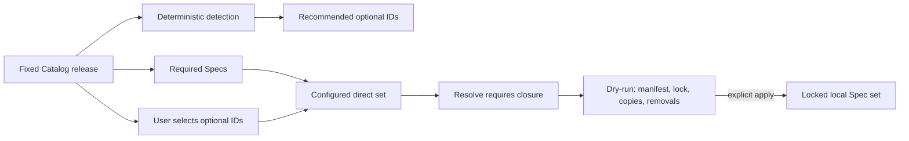

# ESP-0009: Make optional Specification installation explicit

> - **Status:** Approved
> - **Normative:** No
> - **Integration targets:** Catalog detection semantics and RepoFoundry
>   installation selection.

## Summary

Treat Catalog `detection` evidence as a recommendation, not authorization to
install an optional Specification. RepoFoundry always includes required
Specifications, displays deterministically detected optional candidates, and
installs an optional Specification only when the consuming project explicitly
selects its stable ID. Dependencies remain automatic after that direct
selection. Existing project manifests remain the source of truth until a user
performs an explicit, previewed selection update.

## Motivation

Repository evidence can prove that a technology appears in a tree, but it
cannot prove that the project wants every related engineering contract. A
`go.mod` may belong to an example, generator, migration tool, or supported but
inactive component. Future framework, database, protocol, and testing layers
will make this ambiguity more important: discovering MySQL files does not
authorize installing every MySQL policy, and discovering Gin does not identify
the intended Handler architecture.

Harness Engineering needs recommendation and decision to remain separate:

- the Catalog supplies stable options, dependencies, scopes, and evidence;
- RepoFoundry reports candidates and computes a valid closure;
- the repository owner chooses the optional contracts adopted by the project;
- the manifest, lock, and Git history preserve that choice for Codex and CI.

## Scope and non-goals

This Proposal covers initial installation, selection updates, dependency
closure, safe deselection of managed local copies, and dry-run visibility. It
does not make required Core Specifications optional, introduce a terminal UI,
change task-time activation, change project-owned Specification references, or
change the Catalog, manifest, or lock JSON schema.

## Proposed behavior

The public contract is:

1. Every `required: true` Specification is included in the configured direct
   set for an implementation repository.
2. A `detection` match is reported as a recommendation. It MUST NOT mutate the
   configured set by itself.
3. A user may name zero or more optional stable IDs. That list is the complete
   desired optional direct set, not an additive hint.
4. The resolver adds every transitive `requires` dependency and reports the
   resulting selected closure separately from the direct configured set.
5. Initial use without optional IDs produces a required-only plan plus
   recommendations. It does not silently accept the recommendations.
6. `sync` reproduces the current manifest and locked commit; it never changes
   direct selection.
7. `update` preserves direct selection unless the user supplies a replacement
   set. Catalog version and Spec selection may be reviewed in one update.
8. A deselected RepoFoundry-managed copy may be removed only when its bytes
   still match the previous lock. Drift, symlinks, or path conflicts fail
   before mutation.
9. Dry-run output distinguishes available, required, recommended, configured,
   and dependency-closed selected Specifications.

## Composition and routing impact

No Specification ID, `requires` edge, `applies_to` scope, description, or
task-time Applicability changes. `required` continues to mean local
installation. `detection` becomes advisory selection evidence. Explicitly
selected framework, database, testing, protocol, and language Specs compose
through the same dependency graph.

Project-owned rules remain references in the consuming repository and are not
copied into the central Catalog.

## Compatibility and maturity

Existing manifest and lock files remain schema version 1. Existing projects
retain their configured IDs through `sync` and ordinary version updates. A
project that previously acquired a detected language Specification continues
to carry that ID because it is already explicit in its manifest.

The change affects only selection for a fresh project or an explicitly
reviewed replacement selection. No normative Specification Markdown or
per-Spec version changes. The Catalog version need not change solely for the
consumer-tool rollout; the model documentation and Changelog record the new
meaning, and a future Catalog release packages that documentation normally.

## Failure modes and corner cases

- Unknown or duplicate IDs fail before manifest creation.
- Omitting a dependency is safe because the resolver adds the closure.
- Omitting a required ID is safe because required IDs are always added.
- No optional IDs means required-only, not an empty invalid project.
- A detected but unselected framework remains visible as a recommendation.
- A moved Catalog release or digest mismatch still fails under the independent
  fixed-version contract.
- A deselected managed file with local edits is retained and blocks the update
  instead of being deleted.
- A stale untracked Markdown file below the managed root is never inferred to
  be owned or deleted.

## Trade-offs and mitigations

Explicit selection adds one user decision during setup. The dry-run reduces
that cost by listing stable IDs, concise descriptions, required status,
dependencies, and recommendations. A repeatable command-line ID is less
convenient than a terminal menu but is reviewable, scriptable, and reproducible
across Codex, CI, and local shells.

Required Core Specifications still limit choice. That is intentional: `core/`
is reserved for contracts every implementation repository must carry. A rule
that is not universal belongs in another optional layer.

## Prior art and alternatives

Package managers separate discovery from an explicit dependency declaration:
a registry or dependency scanner can recommend a package, while the project
manifest records the adopted set. OpenTelemetry similarly distinguishes
available Specification components and implementation choices; this Proposal
adapts that explicit-adoption principle to local Harness guidance without
copying its component or governance model.

Alternatives rejected:

- **Continue auto-installing detected Specs:** low-friction but lets incidental
  repository evidence make a durable governance decision.
- **Interactive terminal checkboxes:** friendly for one person but unsuitable
  for Codex, non-interactive CI, recorded reviews, and deterministic reruns.
- **Require users to list dependencies:** creates avoidable invalid states and
  leaks Catalog graph mechanics into project configuration.
- **Edit `specs.json` manually only:** possible but provides no discoverable,
  validated, preview-first workflow.

## Prototypes and evidence

The existing resolver already validates IDs, computes dependency closure,
locks exact Git content, and performs dry-run/apply preflight. Integration tests
will prove recommendation-only detection, required-only defaults, explicit Go
selection, replacement selection, safe managed-file removal, and selection
preservation across sync and version updates.

The repository owner explicitly requested user choice at installation time in
the current Codex task. That direction approves this Proposal's distinction
between recommendations and explicit optional selection; implementation and
pull requests remain separately reviewable.

## Open questions

None that change the integration contract. A future UI may render the same
machine-readable plan as checkboxes without changing manifest semantics.

## Integration plan

1. Update the English and Chinese Specification model, repository README, and
   contribution guidance so `detection` means recommendation.
2. Add RepoFoundry dry-run Catalog summaries and repeatable explicit IDs.
3. Stop initial and update flows from auto-adding detected optional IDs.
4. Preserve required and dependency closure mechanically.
5. Add digest-guarded removal for deselected managed copies.
6. Add resolver, CLI, compatibility, and failure-safety tests.

## Future possibilities

- a UI backed by the same plan payload;
- named selection profiles that expand to explicit stable IDs;
- deterministic framework or database evidence that improves recommendations
  without taking selection authority from the project;
- organization policy that constrains allowed or required optional IDs.
