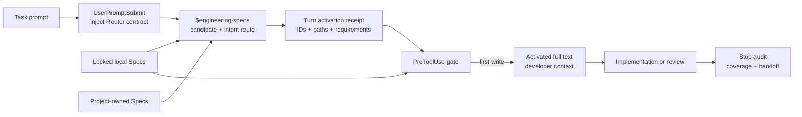

# ESP-0010: Enforce task-time Specification activation

> - **Status:** Approved
> - **Normative:** No
> - **Approval:** The repository owner explicitly selected the Router Skill,
>   AGENTS route, and trusted Hook enforcement in the current Codex task on
>   2026-08-03.
> - **Integration targets:** RepoFoundry task routing, generated project-local
>   Codex Skill and Hooks, activation evidence, and the Specification model.

## Summary

Have RepoFoundry generate one project-local `engineering-specs` Router Skill
for every Codex Harness. The Router selects task-applicable Specifications from
the already installed and locked set, records the decision for the active turn,
and loads their local content before implementation or review. A short root
`AGENTS.md` route makes the workflow mandatory. Trusted project Hooks inject
the route at prompt and subagent boundaries, deny writes without a current
activation decision, inject activated content before the first write, and
check changed-path coverage plus the Agent handoff before completion.

## Motivation

ESP-0007 separates installation, file candidacy, and task activation. The
current consumer implements installation, locking, local materialization, and
a generated routing index, but activation still depends on an Agent noticing
one prose instruction. Required Specifications can therefore be locally
correct yet absent from the task context that needs them.

Treating every Specification as a separate Skill would improve discovery at
the cost of an unbounded Skill list, ambiguous overlapping triggers, and a
Codex-specific shape in the Agent-neutral specification repository. The
consumer instead needs one stable workflow that understands the complete
locked set and progressively loads only applicable documents.

## Scope and non-goals

This Proposal covers:

- one generated project-local Router Skill;
- a deterministic candidate and activation-record script bundled with it;
- a mandatory root `AGENTS.md` route;
- trusted Codex Hooks for prompt injection, write gating, and completion
  auditing;
- explicit evidence and bounded failure behavior.

It does not change Catalog schema version 1, add structured intent keywords,
make one Skill per Specification, move project rules into this repository,
claim enforcement in untrusted projects, or prove that a language model
understood a document. Normative Specification text remains Agent-neutral.

## Proposed behavior

The consumer contract is:

1. RepoFoundry creates exactly one Skill named `engineering-specs` under the
   repository's `.agents/skills/` layer. Specification documents remain local
   Markdown inputs, not independent Skills.
2. The Skill first obtains file-scope candidates from the lock and project
   manifest, then uses each candidate's Catalog description and Applicability
   section to make the task-intent decision.
3. Before implementation or review, the Agent records either the applicable
   Specification IDs or an explicit no-Spec decision with a reason. The record
   includes planned repository-relative paths and the transitive dependency
   closure.
4. The root `AGENTS.md` **MUST** route implementation and review through
   `$engineering-specs`. Detailed rules stay out of `AGENTS.md`.
5. A trusted `UserPromptSubmit` Hook adds the Router workflow and current local
   index to developer context. `SubagentStart` applies the same contract to
   delegated work.
6. A trusted `PreToolUse` Hook denies an edit when the active turn has no
   activation record or the edit targets an undeclared path. Before the first
   permitted write, it injects the activated local Specification content and
   asks the Agent to retry the edit with that context.
7. A `Stop` Hook checks that paths changed during the turn are covered by the
   activation record and that the final handoff names activated Specification
   and Requirement IDs, verification, exceptions, and compatibility effects.
8. Local managed content is verified against the lock before injection. Remote
   content is never fetched at task time.

An Agent may record no applicable central Specification. That is a reviewed
route result, not a way to skip the Router. The record must state a reason and
cover the planned paths.

## Composition and routing impact

No Specification ID, dependency, selection mode, scope, or Catalog digest
changes. The Router consumes the selected dependency closure and joins
project-owned Specification references from `specs.json`.

`applies_to` remains a conservative file filter. A candidate is not activated
solely because its scope matches. The Skill retains Agent judgment for
Applicability, as approved by ESP-0007, while the Hook makes recording and
loading that judgment mechanical.

## Compatibility and maturity

This is a backward-compatible consumer capability and does not create a new
Catalog release. Existing locked Specification sets remain valid.

Existing Codex Harnesses must rerun a previewed RepoFoundry Bootstrap to add
the Router Skill and Hook definition. RepoFoundry never overwrites an existing
`.codex/hooks.json`; a repository with custom Hooks must merge the documented
groups explicitly and then pass validation. Removing the generated Router and
Hooks returns to advisory index routing.

Project Hooks load only in a trusted project and non-managed command Hooks
require explicit trust review. RepoFoundry reports this boundary; it does not
represent project-local Hooks as an administrator-enforced guarantee.

## Failure modes and corner cases

- Missing or untrusted Hooks leave `AGENTS.md` and the Skill as instruction
  layers; validation reports the missing mechanical layer.
- A missing, stale, or digest-mismatched local Specification blocks context
  injection and directs the user to offline validation or a previewed sync.
- A newly targeted path outside the activation record blocks the write until
  the Router extends the record.
- A no-Spec decision without a non-empty reason is invalid.
- Concurrent turns use session and turn identifiers so their receipts do not
  overwrite one another.
- Existing dirty files are fingerprinted at prompt time so the Stop audit does
  not claim unrelated user changes as Agent work, while further edits to those
  files remain detectable.
- Shell parsing cannot prove every possible side effect. The Hook treats local
  tool gating as a guardrail and relies on final changed-path auditing for the
  complete repository delta.
- Codex may run from a subdirectory; commands resolve the Git root before
  locating generated resources.

## Trade-offs and mitigations

The Router adds one explicit step before editing. It pays for that cost by
making the activation set reviewable, reusing one Skill for every present and
future category, and avoiding full-Catalog context injection.

Hooks are Codex-specific while Specifications are not. Keeping Hook templates
and runtime scripts in RepoFoundry preserves the Agent-neutral Catalog and
allows another Harness to implement the same activation contract differently.

The first-write retry is intentionally conservative. It proves that activated
content reached model-visible developer context before mutation, rather than
assuming a file path printed by a script was read.

## Prior art and alternatives

Codex officially uses repository `.agents/skills` for project-local Skills,
loads `AGENTS.md` before work, and supports `UserPromptSubmit`,
`SubagentStart`, `PreToolUse`, and `Stop` lifecycle Hooks. Project Hooks require
repository trust and separate Hook review. The design composes these surfaces
instead of assigning one surface several incompatible responsibilities.

Alternatives rejected:

- **One Skill per Specification:** unbounded metadata, overlapping implicit
  activation, and Codex-specific normative packaging.
- **AGENTS route only:** concise and portable, but cannot prove that a missed
  instruction was corrected before a write.
- **Inject every installed Specification:** deterministic but defeats
  progressive disclosure and makes Required equivalent to always-read.
- **Keyword-only routing:** deterministic but too brittle for task intent and
  would introduce a new Catalog schema before implementation evidence exists.
- **Hook-only routing:** mechanical but removes the Agent judgment that the
  Applicability contract intentionally retains.

Official Codex references:

- [Build skills](https://learn.chatgpt.com/docs/build-skills)
- [Custom instructions with AGENTS.md](https://learn.chatgpt.com/docs/agent-configuration/agents-md)
- [Hooks](https://learn.chatgpt.com/docs/hooks)

## Prototypes and evidence

RepoFoundry already materializes digest-verified local copies and generates a
scope/description index. The integration will add isolated target-repository
tests for Skill discovery layout, candidate routing, no-Spec decisions,
dependency closure, activation receipts, prompt/subagent context, first-write
injection, uncovered-path denial, Stop handoff checks, Hook trust guidance, and
byte-preserving custom-Hook conflicts.

The repository owner approved this Proposal's exact surface split in the
current Codex task. Implementation and pull requests remain independently
reviewable.

## Open questions

No open question changes the integration route. Structured activation metadata
may be proposed after real Router evidence shows where prose Applicability is
insufficient.

## Integration plan

1. Update the English and Chinese Specification model with the Router/Hook
   consumer contract and trust boundary.
2. Generate the project-local Skill, metadata, runtime script, and Hook config
   from RepoFoundry Bootstrap without embedding normative content.
3. Make the AGENTS route and Harness/Spec validation mechanically required.
4. Add candidate, activation, injection, path-coverage, handoff, migration,
   failure-safety, package, and Skill validation tests.
5. Update RepoFoundry design and user documentation, then validate both
   repositories and forward-test the generated Skill in an isolated project.

## Future possibilities

- structured Catalog activation predicates after a schema Proposal;
- organization-managed Hooks for policy-level enforcement;
- adapters for non-Codex Agents using the same activation receipt contract;
- durable PR evidence export for cross-session compliance reporting.
