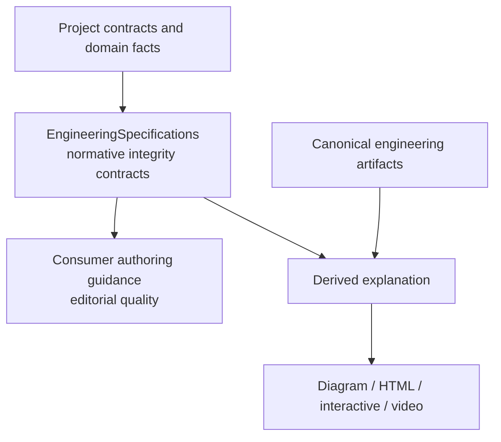

# ESP-0014: Reusable documentation integrity contracts

> - **Status:** Approved
> - **Normative:** No
> - **Approval:** The repository owner explicitly approved the proposed
>   documentation-layer direction and requested implementation in the current
>   task on 2026-10-04.
> - **Normative:** No
> - **Integration targets:** New `documentation/` Catalog layer,
>   `documentation/technical-documentation`, and
>   `documentation/derived-explanations`.

## Summary

Introduce an optional `documentation/` specification layer for reusable
engineering-documentation correctness contracts. Keep editorial style in the
consumer's authoring guidance, while central Specifications govern the parts
that can change engineering meaning: lifecycle state, evidence-backed claims,
procedure semantics, terminology ownership, freshness, derived-view authority,
source provenance, and accessibility of unique engineering information.

The first slice contains two Development Specifications. 
`documentation/technical-documentation` governs human-readable engineering
documents. `documentation/derived-explanations` governs diagrams, interactive
views, and video or other generated explanation surfaces without making a
renderer or media format normative.

## Motivation

RepoFoundry now has reusable authoring guidance that combines selected
ASD-STE100 clarity principles with Google-informed documentation practices.
That guidance correctly owns editorial choices such as reader orientation,
progressive disclosure, natural paragraphs, headings, concise wording, and
presentation structure.

Some documentation failures are not editorial. They alter engineering truth or
make a review unsafe:

- rewriting a proposed behavior as current behavior;
- stating a measured, verified, safety, reliability, or performance claim
  without the evidence and revision that support it;
- presenting a mutating command without distinguishing preview, mutation,
  verification, or authority effects;
- duplicating normative terminology until two sources disagree;
- leaving current operational documentation stale while historical decisions
  remain valid records of the past;
- presenting a generated diagram, HTML view, simulation, or video as if it were
  an authoritative requirement, decision, or evidence source;
- publishing a derived view without enough provenance to tell which source
  revision it explains;
- placing unique engineering information only in color, interaction, or audio.

These risks recur across repositories and are independent of one language,
framework, or RepoFoundry implementation. They therefore belong in a reusable
Specification layer rather than in one consumer's prose style guide.

## Scope and non-goals

This Proposal introduces a `documentation/` Catalog category and two explicit
optional Specifications.

`documentation/technical-documentation` covers:

- preservation of current, proposed, accepted, verified, and historical state;
- evidence binding for strong engineering claims;
- semantics of executable procedures and commands;
- stable terminology ownership through `core/semantic-naming`;
- freshness and historical/current-document boundaries.

`documentation/derived-explanations` covers:

- non-authoritative status of generated explanation surfaces;
- provenance from a derived surface to its source revision and artifacts;
- equivalent access to unique engineering information when color, interaction,
  or audio is otherwise required.

This Proposal does **not**:

- make Google Developer Documentation Style Guide or ASD-STE100 normative;
- copy either external style guide into this repository;
- require short sentences, active voice, sentence case, a word-count limit, or
  one documentation template;
- require Mermaid, HTML, p5.js, Remotion, Manim, PowerPoint, or any renderer;
- require every repository to select documentation Specifications;
- define project-specific headings, directory layouts, terminology, ADR
  templates, or publication workflows;
- make generated explanations canonical engineering artifacts;
- add a new Catalog schema field or change Router protocol semantics;
- claim accessibility certification or semantic verification by a linter.

## Proposed behavior

The ownership model is:



Project contracts and evidence remain authoritative. Central documentation
Specifications define reusable integrity constraints. Consumer authoring
guidance can then choose clearer wording and organization without changing the
underlying state, requirement strength, evidence, or authority.

The first normative integration should define these Requirement families:

1. **DOC-STATE** — Preserve engineering lifecycle and epistemic state. A
   document must not turn a proposal, expectation, unverified implementation,
   accepted decision, or historical fact into another state through editing.
2. **DOC-EVIDENCE** — Bind strong engineering claims to evidence. Measured or
   verified claims identify the evidence and applicable source revision; missing
   evidence remains explicitly missing.
3. **DOC-PROC** — Preserve procedure semantics. Procedures distinguish
   prerequisites, preview/read-only actions, mutation, verification, stop or
   failure conditions, and authority-changing actions when those distinctions
   affect the operator.
4. **DOC-TERM** — Reuse stable technical terminology. The Specification depends
   on `core/semantic-naming` instead of restating naming semantics.
5. **DOC-FRESH** — Keep current guidance distinguishable from historical
   records. A historical ADR can remain correct history without being used as
   evidence that the current implementation still behaves the same way.
6. **DOC-DERIVED-AUTH** — Derived explanation surfaces do not become the
   authoritative source for a requirement, decision, approval, or verification
   result merely because they are easier to consume.
7. **DOC-DERIVED-PROV** — A derived surface that makes engineering claims
   identifies its source artifacts or snapshot and the source revision/digests
   needed to detect staleness.
8. **DOC-A11Y** — Unique engineering information must have an equivalent
   non-color, non-pointer, and non-audio representation appropriate to the
   medium; a textual equivalent is the default portable form.

Exact IDs and block boundaries are an integration detail as long as the
approved semantic split is preserved.

## Composition and routing impact

The new Catalog layer is independent of programming-language and framework
layers.

Proposed Catalog composition:

```text
core/semantic-naming
        |
        +--> documentation/technical-documentation
                    |
                    +--> documentation/derived-explanations
```

Both Specifications are **Explicit** and optional. A repository that does not
adopt them sees no new installed contract.

Proposed routing:

- `documentation/technical-documentation`
  - `requires`: `core/semantic-naming`
  - conservative scopes: Markdown and MDX documentation
  - activation summary: load when writing or reviewing engineering
    documentation, procedures, architecture explanations, or evidence-backed
    technical claims.
- `documentation/derived-explanations`
  - `requires`: `documentation/technical-documentation`
  - conservative scope may be broad because derived surfaces can be generated
    from many source types; task-intent Applicability must keep activation
    narrow.
  - activation summary: load when generating or reviewing diagrams,
    interactive views, presentations, or video that explain engineering facts.

No deterministic repository detection is proposed. Documentation adoption is a
project decision and must remain explicit.

Project-owned rules remain outside the central Catalog, including document
trees, local templates, required headings, domain vocabulary, publication
approval, and organization-specific accessibility targets.

## Compatibility and maturity

This adds new Development Specifications without changing existing Requirement
semantics. Existing consumers and locks remain valid.

The normative integration should:

- start both Specs at version `0.1.0`;
- start every Requirement at `Automated enforcement: Advisory`;
- increase the Catalog minor version because the released Catalog gains
  backward-compatible optional capabilities;
- preserve Catalog schema version 1;
- require an explicit consumer update before any existing project adopts the
  new Catalog release.

No existing Requirement is promoted, weakened, removed, or reinterpreted.

Rollback is removal of the optional Spec selection from a consuming project and
return to its previous locked Catalog revision. Existing project documentation
is not rewritten automatically.

## Failure modes and corner cases

- **Editorial rule masquerades as conformance:** reviewers reject requirements
  whose only purpose is sentence length, capitalization, tone, or stylistic
  preference.
- **State loss during polishing:** DOC-STATE keeps proposed/current/historical
  and verified/unverified distinctions intact even when prose is rewritten.
- **Evidence unavailable:** DOC-EVIDENCE requires the gap to remain explicit;
  an agent does not invent a benchmark, command result, or approval.
- **Project heading conflicts:** project-required structure wins; central Specs
  do not rename stable headings or anchors.
- **Normative keyword editing:** BCP 14 strength is owned by the source
  contract; documentation editing does not replace `MUST`, `SHOULD`, or
  `MAY` to satisfy prose preferences.
- **Derived surface drifts:** provenance makes staleness detectable but does not
  create automatic freshness monitoring.
- **Historical records:** an accepted historical ADR remains immutable history;
  current operational documentation can point to newer evidence without
  rewriting the ADR.
- **Accessibility tooling unavailable:** the requirement is still to preserve
  equivalent information; lack of a particular renderer or checker does not
  justify inventing a pass result.
- **Generated source bundle contains canonical text:** exact embedded source
  remains canonical only in its owning artifact. The bundle remains derived.
- **Broad derived-view scope:** Applicability must require task intent; matching
  a source extension alone does not activate the whole Spec.

## Trade-offs and mitigations

A documentation layer adds another optional Catalog dimension. The benefit is a
clear separation between engineering integrity and prose preference. Explicit
selection prevents repositories that only need language/runtime contracts from
paying the context or governance cost.

Some requirements require human review rather than a deterministic linter.
They therefore start Advisory and use review evidence. Mechanical checks may
verify digests, source revisions, required metadata, or structural
equivalents, but they must not claim to prove semantic clarity, truth, or
accessibility.

A single documentation Specification would be simpler. Splitting derived
explanations lets provenance and accessibility evolve without changing the
core contract for ordinary Markdown design documents.

## Prior art and alternatives

The design selectively adapts ideas already used by RepoFoundry authoring
guidance: reader-oriented technical writing, stable terminology,
evidence/state separation, and derived explanation surfaces. Those consumer
rules are implementation evidence, not normative input by themselves.

Relevant external references include:

- Google Developer Documentation Style Guide and Technical Writing courses for
  reader/task orientation, procedures, formatting, and accessible explanation;
- ASD-STE100 for controlled technical language and ambiguity reduction;
- WCAG principles for alternatives to sensory-only information.

The integration should cite primary sources for provenance but restate only
independently reviewed EngineeringSpecifications requirements. External
references do not add undeclared normative obligations.

Alternatives rejected:

- **Keep everything in RepoFoundry writing guidance:** leaves reusable
  correctness boundaries consumer-specific and unavailable to other harnesses.
- **Put the whole style guide in Specifications:** turns editorial preference
  into conformance, increases context cost, and creates unnecessary external
  standard coupling.
- **Make documentation Core:** not every implementation repository needs the
  same documentation contract.
- **Name Specs after Google or ASD-STE100:** confuses provenance with ownership
  and could imply conformance to third-party standards.
- **Make renderer choices normative:** couples engineering truth to a temporary
  presentation technology.

## Prototypes and evidence

RepoFoundry provides current implementation evidence:

- professional Skills share one controlled-writing guide and keep project
  contracts, exact evidence, normative keywords, and lifecycle state above
  editorial defaults;
- `detailed-design` already separates observed, decided, proposed, derived,
  and open information;
- Explanation IR and its HTML/p5/Remotion renderers mark generated views as
  derived, preserve exact source snapshots and digests, and explicitly deny
  activation or approval authority;
- regression tests verify guide distribution and source-bound explanation
  projections.

This evidence shows the proposed boundaries can be implemented without turning
style heuristics into blocking policy. It does not prove that every future
consumer will satisfy the contracts or that automated tools can judge semantic
quality.

## Open questions

No open question blocks the category direction.

Integration review should settle the narrowest useful `applies_to` scopes for
`documentation/derived-explanations`. If source-code renderer paths require
`**/*`, the Applicability section must explicitly prevent file-scope matching
from becoming task activation.

A later Proposal may add structured provenance metadata to the Catalog or
consumer protocol if experience shows that Markdown requirements are
insufficient. This Proposal does not change schema version 1.

## Integration plan

After approval:

1. add `documentation/` to the English and Chinese taxonomy and contribution
   guidance;
2. create `documentation/technical-documentation` and
   `documentation/derived-explanations` from the formal Specification
   template;
3. add stable Requirement IDs for the eight approved integrity families;
4. add both optional entries to `catalog.json`, with explicit dependencies,
   scopes, activation summaries, versions, and digests;
5. update the Specification index and Changelog;
6. add structural tests for the new category, dependency split, activation
   summaries, Requirement routing metadata, Verification coverage, and
   non-normative external references;
7. run `python3 -B scripts/check.py`;
8. review the normative wording separately from this Proposal;
9. prepare a new Catalog release and only then update RepoFoundry's default
   Spec version in a separate consumer change.

## Future possibilities

- a focused documentation-testing Specification when enough cross-project
  evidence exists;
- machine-readable source/provenance descriptors after a Catalog-schema
  Proposal;
- organization-specific accessibility profiles layered as project-owned Specs;
- richer Explanation IR renderers without changing derived-authority rules;
- conformance tooling that checks structural evidence without claiming semantic
  truth.
