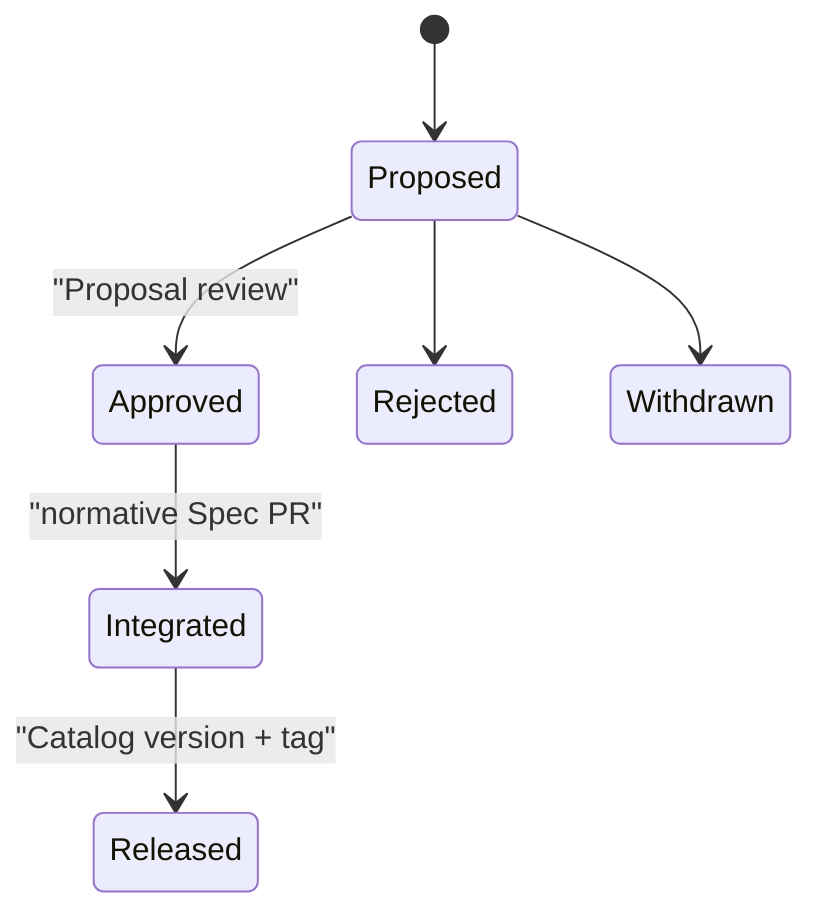

# Engineering Specification Proposals

An Engineering Specification Proposal (ESP) records the intent and trade-offs
of a significant change. It is non-normative. Requirements change only when an
approved Proposal is integrated into `specification/`, versioned in
`catalog.json`, and released through the normal validation path.

## Significant changes use an ESP

Create an ESP when a change:

- introduces a new top-level specification category;
- adds cross-language or cross-implementation behavior;
- changes a Stable requirement or compatibility promise;
- changes the Catalog schema, detection model, lifecycle metadata, or consumer
  contract;
- introduces a framework, database, protocol, or testing abstraction with
  dependencies across several existing specifications;
- requires prototypes or migration evidence before normative wording can be
  reviewed.

Editorial fixes, broken links, digest refreshes, and scoped clarifications can
go directly through the normal contribution process. A focused Development
specification change may also proceed directly when its compatibility impact is
already understood.

## A Proposal stays smaller than the problem space

Copy [`0000-template.md`](0000-template.md) to `0000-short-title.md`. Keep
`0000` while drafting. When the Proposal PR exists, replace it with the PR
number so the discussion and document share a stable identifier.

One Proposal should contain one coherent behavioral decision. Independent
features receive separate Proposals even when they support the same roadmap.

## Approval records intent

- **Proposed**: the ESP is under review.
- **Approved**: reviewers accept the direction and trade-offs.
- **Integrated**: normative Markdown and Catalog metadata implement the
  approved intent.
- **Released**: the integrated change is part of a versioned Catalog revision.
- **Rejected** or **Withdrawn**: the PR history preserves the discussion.

Approval requirements follow repository branch protection and ownership
policy. This repository does not copy OpenTelemetry's fixed reviewer count.

## Integration performs a separate review

The integration change:

1. links the approved ESP;
2. translates intent into clear normative and non-normative text;
3. updates affected Spec versions, dependencies, scopes, and SHA-256 digests;
4. preserves the distinction between installation selection and task
   activation;
5. adds migration or compatibility guidance;
6. updates the Changelog;
7. passes `python3 -B scripts/check.py`.

Integration review confirms that the specification implements the approved
direction. New architectural trade-offs return to the Proposal process.

The process is adapted from the OpenTelemetry
[OTEP workflow](https://github.com/open-telemetry/opentelemetry-specification/blob/main/oteps/README.md).
