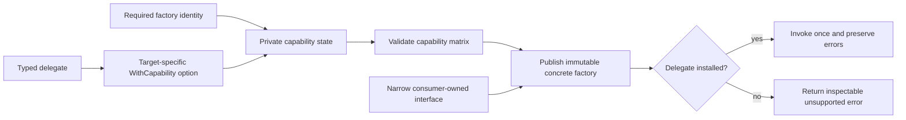

# Go Capability Factory Delegation

> **Status:** Development
>
> **Catalog ID:** `languages/go/factory-delegation`
>
> **Selection:** Explicit
>
> **Routing:** Selection installs this Specification. Load it only when a task
> designs, changes, migrates, or reviews a Go plugin or component factory that
> installs optional capabilities through functional options and named function
> delegates.
>
> **Catalog metadata:** `catalog.json` is the source of truth for version,
> dependencies, file scopes, detection evidence, activation summary, and
> content digest.

## Purpose

Capability factory delegation lets plugin and component providers contribute
only supported creation behaviors. The framework owns a stable immutable
factory surface, typed delegates, and explicit capability-absence semantics.

It prevents fat interfaces, nil-as-absence, false-success no-ops,
post-publication mutation, and incompatible additions. Runtime loading,
dependency injection, registries, shutdown, domain names, and configuration
schemas are out of scope.

## Applicability

### Load this specification when

- constructing a Go plugin, component, pipeline, middleware, or provider
  factory from optional capability functions;
- defining named creation function types such as `CreateMetricsFunc` or
  `CreateMessageHandlerFunc`;
- installing delegates through `WithMetrics`, `WithLogs`, `WithHandler`, or
  equivalent functional options;
- adding a capability to a published factory or replacing a provider-facing
  interface with delegate functions;
- defining unsupported-capability errors, no-op defaults, or capability
  discovery;
- reviewing factory immutability, delegate concurrency, error propagation, or
  compatibility.

### Do not apply this specification when

- a factory has one required construction path and no optional capability
  matrix;
- ordinary configuration values or dependencies are being passed without
  behavior delegation;
- runtime mutation or hot-swapping is the intended contract; that design needs
  explicit synchronization, lifecycle, and versioning rules outside this
  construction-time Specification;
- generated or protocol-owned APIs determine the factory interface;
- a project Specification owns the plugin registry, capability vocabulary, or
  component lifecycle without weakening this Specification or its upstream
  requirements.

The `**/*.go` Catalog scope creates conservative candidates. A factory name,
Go file, or functional option alone does not activate this Specification; the
task must involve optional capability delegation.

## Agent workflow

When this Specification is activated, the implementing or reviewing agent:

1. inventories constructors, returned types, implementers, mocks, assignments,
   and consumers;
2. records the required, optional, discoverable, unsupported, and safe-no-op
   capability matrix;
3. defines delegate inputs, results, errors, lifecycle, and concurrency owner;
4. selects a concrete or closed surface and migrates open interfaces;
5. applies `languages/go/functional-options` to option semantics; and
6. verifies installed, absent, nil, duplicate, failure, and concurrency paths,
   then reports affected Requirement IDs.

## Terminology

- A **capability** is one independently optional factory behavior.
- A **delegate** is a named function installed at construction for one operation.
- A **capability factory** is an immutable value that dispatches to delegates.
- **Capability absence** means an optional delegate was not installed.
- An **unsupported outcome** is the documented zero result plus inspectable
  error for an absent capability.
- **Capability discovery** reports support without invoking a delegate.
- A **closed factory interface** has a package-owned unexported method and
  excludes ordinary external implementations.

## Requirements

### GO-FACTORY-SURFACE-001 — Factory evolution does not create fat implementer contracts

**Activation:** Load when adding a factory capability, changing provider interfaces, or evolving narrow consumer contracts.

**Context dependencies:** `GO-API-001`, `GO-COMPAT-001`

A public constructor **SHOULD** return a concrete factory type. Callers that
need substitution **SHOULD** declare narrow consumer-owned interfaces
containing only the capabilities they invoke.

When an API returns an exported factory interface, it **MUST** document whether
external implementation is supported. A package-owned interface **MUST** be
closed against ordinary external implementations. An externally implementable
interface **MUST NOT** gain a method as a compatible capability addition; the
API **MUST** use a sibling extension interface, adapter, new entry point, or
versioned breaking migration.

Adding an optional capability **MUST NOT** require existing plugin or component
providers to implement unrelated methods or placeholder stubs. Factory surface
changes **MUST** also satisfy `GO-API-001` and `GO-COMPAT-001`.

**Rationale (non-normative):** Concrete types can gain methods without adding
obligations to external implementers. Narrow consumer interfaces preserve
substitution without turning every provider into an implementation of the
framework's complete capability matrix.

**Enforcement (hybrid):** Type-check external implementation and consumer
fixtures, run API-diff tooling, and review the declared ownership of every
exported factory interface.

**Evidence:** Public API documentation, old-provider and old-consumer compile
fixtures, and an API diff showing the effect of each capability addition.

### GO-FACTORY-DELEGATE-001 — Each capability has a typed immutable delegate

**Activation:** Load when defining, storing, forwarding to, or concurrently invoking a named factory capability delegate.

**Context dependencies:** `GO-ERROR-001`, `GO-LIFECYCLE-001`

Each semantically distinct capability **MUST** use a named function type with
typed inputs, results, and errors. A delegate that can block, perform I/O, or be
cancelled **MUST** accept `context.Context` as its first parameter. Distinct
capabilities **SHOULD NOT** be collapsed into a generic
`func(context.Context, any) (any, error)` when static Go types can express
their contracts.

Delegates **MUST** be installed only during construction and stored in private
factory state. A construction-time capability factory **MUST NOT** expose
post-publication mutation of its delegate set. Runtime replacement requires a
separate synchronized lifecycle contract.

Factory methods **MUST** forward the caller's context and typed arguments to
the selected delegate exactly once. They **MUST NOT** store request-scoped
contexts. Delegate errors **MUST** preserve identity under `GO-ERROR-001`, and
the factory **MUST** document whether concurrent calls require thread-safe
delegates.

**Rationale (non-normative):** Named function types make individual
capabilities independently injectable and testable. Freezing the delegate set
after construction removes races between capability discovery and invocation.

**Enforcement (hybrid):** Type checking verifies delegate signatures. Focused
and race-enabled tests verify forwarding, single invocation, immutability,
error identity, and the documented concurrency contract.

**Evidence:** Reviewed delegate declarations plus tests capturing the received
context and arguments, call count, error cause, and concurrent behavior.

### GO-FACTORY-CONSTRUCT-001 — Construction distinguishes absence from invalid injection

**Activation:** Load when constructing a factory with required inputs, optional delegates, nil handling, metadata, or capability validation.

**Context dependencies:** `GO-OPTION-USE-001`, `GO-OPTION-TYPE-001`,
`GO-OPTION-APPLY-001`, `GO-OPTION-VALIDATE-001`

Required factory identity and required capabilities **MUST** remain explicit
typed constructor inputs. Optional delegates **MUST** be installed through
target-specific options that satisfy `GO-OPTION-USE-001`,
`GO-OPTION-TYPE-001`, `GO-OPTION-APPLY-001`, and
`GO-OPTION-VALIDATE-001`.

Omitting an optional delegate **MAY** represent capability absence. Explicitly
supplying a nil or typed-nil delegate **MUST** fail construction as an invalid
option; it **MUST NOT** be silently reinterpreted as omission. Duplicate
delegate options and capability metadata such as stability, priority, or mode
**MUST** have deterministic validation and application semantics.
Metadata that declares a capability supported **MUST** be committed atomically
with a non-nil delegate and **MUST NOT** survive a rejected option.

The constructor **MUST** validate the final capability matrix before publishing
the factory. A failed construction **MUST NOT** return a usable factory or
perform construction effects. A factory with no installed optional capability
is valid only when the documented default call assigns that state useful
behavior, metadata, or discovery semantics.

**Rationale (non-normative):** Omission is an intentional use of a default.
Passing nil through a named option expresses an attempted installation and is
usually a wiring defect that should fail before the factory is used.

**Enforcement (hybrid):** Review required inputs and option ownership, then run
constructor tests for omitted, nil, typed-nil, duplicate, conflicting, and
metadata-inconsistent delegates.

**Evidence:** Focused construction tests proving the accepted capability
matrix, stable validation errors, no partial factory, and no effects on every
rejected path.

### GO-FACTORY-ABSENCE-001 — Unsupported capability is an explicit stable outcome

**Activation:** Load when changing capability absence, no-op, discovery, unsupported errors, or delegate-error distinction.

**Context dependencies:** `GO-ERROR-001`

Invoking an absent capability **MUST NOT** panic. Unless a documented no-op is
semantically valid, the factory **MUST** return the operation's zero result and
a stable inspectable unsupported-capability error. The error **MUST** identify
the requested capability and support `errors.Is` or `errors.As` according to
the published error contract.

A factory **MUST NOT** return success when required work was not performed. A
no-op default **MAY** replace an absent delegate only when doing nothing fully
satisfies the capability's documented contract and callers can distinguish or
accept that behavior. Errors returned by an installed delegate **MUST NOT** be
rewritten as unsupported-capability errors.

When callers need to route or validate a graph before invocation, the factory
**SHOULD** expose capability discovery. Any discovery API **MUST** be
side-effect-free and agree with dispatch for the same immutable factory: an
absent result leads to the unsupported outcome, while a supported result
dispatches to an installed delegate or documented no-op. The delegated
operation may still return its own failure.

**Rationale (non-normative):** Stable absence semantics let a framework compose
partial providers without nil dereferences or false success. Discovery avoids
probing a potentially effectful creation method merely to learn support.

**Enforcement (hybrid):** Contract tests compare discovery and invocation,
inspect unsupported and delegate errors, and verify that no-op paths meet their
documented observable behavior.

**Evidence:** Installed, absent, no-op, unknown-capability, and failing-delegate
tests with error identity and discovery consistency assertions.

### GO-FACTORY-TEST-001 — Tests cover the complete capability matrix

**Activation:** Load when testing factory capability presence, injection failures, dispatch, errors, compatibility, discovery, or concurrency.

**Context dependencies:** `GO-FACTORY-SURFACE-001`,
`GO-FACTORY-DELEGATE-001`, `GO-FACTORY-CONSTRUCT-001`,
`GO-FACTORY-ABSENCE-001`, `GO-TEST-001`

Tests **MUST** cover every capability when installed and absent, explicit nil
and typed-nil delegates, duplicate and conflicting options, argument and
context forwarding, single delegate invocation, delegate error identity,
unsupported error identity, and any no-op or discovery behavior.

Adding or migrating a public capability **MUST** include compile fixtures for
existing providers, consumers, mocks, factory values, and narrow interfaces
that can be affected. A factory documented for concurrent use **MUST** run
race-enabled delegate and discovery tests on the repository's declared
race-capable target.

**Rationale (non-normative):** Factory correctness is a matrix of capability
presence, construction validity, invocation behavior, and interface ownership.
Testing only a successful injected delegate leaves the compatibility and
absence contracts unproved.

**Enforcement (mechanical):** Run focused table-driven tests, external compile
fixtures, API-diff checks, applicable race tests, and the canonical Go
validation required by `GO-TEST-001`.

**Evidence:** Revision-bound capability-matrix results, compatibility fixture
output, API diff, race result when applicable, and canonical Go validation.

## Approved patterns

The following flow is non-normative. It shows a capability delegate installed
once, frozen into a concrete factory, and dispatched without conflating
absence with invalid injection.



This example is one non-normative implementation. It uses a concrete factory,
a closed option type, explicit nil rejection, immutable delegate state,
capability discovery, and a stable unsupported error.

```go
var (
	ErrCapabilityNotSupported = errors.New("capability not supported")
	ErrInvalidFactoryOption   = errors.New("invalid factory option")
)

type PluginType string
type Capability string

const CapabilityMessages Capability = "messages"

type MessageConfig struct {
	Route string
}

type MessageHandler interface {
	HandleMessage(context.Context, string) error
}

type CreateMessageHandlerFunc func(
	context.Context,
	MessageConfig,
) (MessageHandler, error)

type factoryOptions struct {
	createMessageHandler CreateMessageHandlerFunc
}

type FactoryOption interface {
	apply(*factoryOptions) error
}

type factoryOptionFunc func(*factoryOptions) error

func (f factoryOptionFunc) apply(options *factoryOptions) error {
	return f(options)
}

func WithMessageHandler(create CreateMessageHandlerFunc) FactoryOption {
	return factoryOptionFunc(func(options *factoryOptions) error {
		if create == nil {
			return fmt.Errorf(
				"%w: message handler delegate is nil",
				ErrInvalidFactoryOption,
			)
		}
		if options.createMessageHandler != nil {
			return fmt.Errorf(
				"%w: message handler delegate is duplicated",
				ErrInvalidFactoryOption,
			)
		}
		options.createMessageHandler = create
		return nil
	})
}

type Factory struct {
	pluginType           PluginType
	createMessageHandler CreateMessageHandlerFunc
}

func NewFactory(pluginType PluginType, opts ...FactoryOption) (*Factory, error) {
	if pluginType == "" {
		return nil, errors.New("plugin type is required")
	}

	options := factoryOptions{}
	for index, opt := range opts {
		if opt == nil {
			return nil, fmt.Errorf(
				"%w: option %d is nil",
				ErrInvalidFactoryOption,
				index,
			)
		}
		if err := opt.apply(&options); err != nil {
			return nil, fmt.Errorf("apply option %d: %w", index, err)
		}
	}

	return &Factory{
		pluginType:           pluginType,
		createMessageHandler: options.createMessageHandler,
	}, nil
}

func (factory *Factory) Supports(capability Capability) bool {
	switch capability {
	case CapabilityMessages:
		return factory.createMessageHandler != nil
	default:
		return false
	}
}

func (factory *Factory) CreateMessageHandler(
	ctx context.Context,
	config MessageConfig,
) (MessageHandler, error) {
	if factory.createMessageHandler == nil {
		return nil, fmt.Errorf(
			"%w: %s",
			ErrCapabilityNotSupported,
			CapabilityMessages,
		)
	}
	if config.Route == "" {
		return nil, errors.New("message route is required")
	}

	handler, err := factory.createMessageHandler(ctx, config)
	if err != nil {
		return nil, fmt.Errorf("create message handler: %w", err)
	}
	return handler, nil
}
```

A consumer declares only the behavior it needs:

```go
type messageHandlerFactory interface {
	CreateMessageHandler(
		context.Context,
		MessageConfig,
	) (MessageHandler, error)
}
```

An intentionally abstract framework may return a closed interface instead of a
concrete type. The unexported method makes package ownership explicit:

```go
type Factory interface {
	CreateMessageHandler(
		context.Context,
		MessageConfig,
	) (MessageHandler, error)
	factoryOwned()
}
```

## Rejected patterns

- Returning an externally implementable multi-method `Factory` interface and
  later adding another capability method as a compatible change violates
  `GO-FACTORY-SURFACE-001`.
- Requiring every plugin to implement one interface containing all optional
  capabilities and return `ErrNotSupported` from unrelated stubs violates
  `GO-FACTORY-SURFACE-001`.
- Reusing one untyped delegate such as
  `func(context.Context, any) (any, error)` for unrelated statically typed
  capabilities may violate
  `GO-FACTORY-DELEGATE-001`.
- Exposing `SetMessageHandler` after the factory has been published violates
  `GO-FACTORY-DELEGATE-001` without a separate synchronized lifecycle
  contract.
- Treating `WithMessageHandler(nil)` as if the option were omitted violates
  `GO-FACTORY-CONSTRUCT-001`.
- Returning a successful nil handler or a no-op handler for an operation that
  promises real message processing violates `GO-FACTORY-ABSENCE-001`.
- Converting every delegate failure into `ErrCapabilityNotSupported` violates
  `GO-FACTORY-ABSENCE-001`.
- Reporting support while the corresponding delegate is nil violates
  `GO-FACTORY-ABSENCE-001`.
- Testing only one installed delegate violates `GO-FACTORY-TEST-001`.

## Exceptions

Generated or protocol-owned interfaces retain their owning contract, but an
adapter that installs delegates or exposes absence remains governed here.
Existing open interfaces may stay stable while a sibling interface or concrete
factory is introduced; they do not gain methods, and compile fixtures remain.

No-op defaults are permitted only by `GO-FACTORY-ABSENCE-001`. A `SHOULD`
departure records API scope, owner, compatibility effect, alternate evidence,
and review or removal condition. No `MUST` exception is defined.

## Verification

| Requirement | Minimum verification |
| --- | --- |
| `GO-FACTORY-SURFACE-001` | External provider and narrow consumer compile fixtures plus API diff |
| `GO-FACTORY-DELEGATE-001` | Delegate type, forwarding, identity, immutability, and race tests |
| `GO-FACTORY-CONSTRUCT-001` | Omitted, nil, duplicate, conflict, and no-partial-result tests |
| `GO-FACTORY-ABSENCE-001` | Unsupported, no-op, delegate-error, and discovery contract tests |
| `GO-FACTORY-TEST-001` | Full capability matrix and canonical Go validation |

## Agent handoff

Report:

```text
Activated requirements: <factory/upstream IDs>
Factory surface: <constructors, owners, consumers, providers>
Capability matrix: <required/installed/absent/no-op/discoverable>
Delegates: <types, I/O, errors, concurrency>
Verification: <compile/API/test/race/canonical evidence>
Exceptions: none | <scope, rationale, evidence, owner>
Compatibility or migration: none | <interfaces, adapters, deprecation/removal>
```

## Compatibility and migration

Version `0.1.1` adds non-normative Requirement activation summaries and exact
context-dependency metadata. It does not change the behavioral meaning of any
`GO-FACTORY-*` Requirement ID.

Version `0.1.0` introduces `GO-FACTORY-SURFACE-001`,
`GO-FACTORY-DELEGATE-001`, `GO-FACTORY-CONSTRUCT-001`,
`GO-FACTORY-ABSENCE-001`, and `GO-FACTORY-TEST-001` as a Development
contract.

New factories should prefer a concrete return type and let consumers define
narrow interfaces. A framework that intentionally owns all implementations may
return a closed interface when that boundary is documented and tested.

An existing fat or externally implementable interface should remain unchanged
while providers migrate to named delegates behind an adapter. New capabilities
arrive through new options and concrete methods, sibling capability interfaces,
or a versioned new factory contract. Legacy provider methods can delegate to
the same internal functions during the migration window.

Rollback preserves the old factory entry point and adapters. A published
capability, unsupported error, default, or discovery result must follow normal
deprecation and versioning rules rather than being silently removed.

## References

- [Go Functional Options](functional-options.md)
- [Go Implementation Specification](../go.md)
- [Keeping Your Modules Compatible](https://go.dev/blog/module-compatibility)
- [OpenTelemetry Collector Exporter Factory](https://pkg.go.dev/go.opentelemetry.io/collector/exporter)
- [Go `context` package](https://pkg.go.dev/context)
