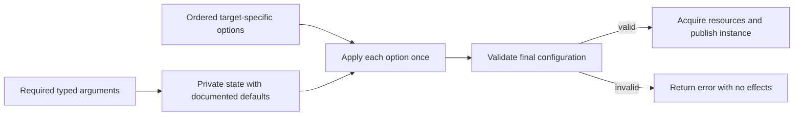

# Go Functional Options

> **Status:** Development
>
> **Catalog ID:** `languages/go/functional-options`
>
> **Selection:** Explicit
>
> **Routing:** Selection installs this Specification. Load it only when a task
> designs, changes, migrates, or reviews a Go API that uses or is considering
> functional options.
>
> **Catalog metadata:** `catalog.json` is the source of truth for version,
> dependencies, file scopes, detection evidence, activation summary, and
> content digest.

## Purpose

Functional options provide an extensible construction API when callers usually
accept defaults and selectively override independent settings. This
Specification keeps that benefit without hiding required inputs, leaving option
order and conflicts undefined, performing effects before validation, or
mistaking call compatibility for full Go API compatibility.

The pattern is conditional. Public configuration structs, dedicated
constructors, and configuration methods remain valid when they make state more
inspectable, serializable, reusable, or easier to evolve.

This Specification does not govern command-line flags, configuration-file
schemas, dependency-injection containers, builders with compile-time state
transitions, or post-construction mutation APIs.

## Applicability

### Load this specification when

- designing a Go constructor or public function with several optional
  settings and a useful default invocation;
- adding, removing, renaming, or changing a functional option or its default;
- defining an `Option`, `ServerOption`, `ClientOption`, or equivalent type;
- deciding between functional options and a public configuration struct;
- reviewing option ordering, duplication, conflicts, validation, errors,
  side effects, or compatibility;
- migrating an existing constructor to or from functional options.

### Do not apply this specification when

- every input is required and belongs in the ordinary function signature;
- an exported configuration value is intentionally the reusable,
  serializable, inspectable, or comparable contract;
- the task only changes private construction code with no functional-option
  shape or caller-visible behavior;
- generated or protocol-owned APIs determine the constructor signature;
- a stricter project Specification owns the same decision without weakening
  this Specification or `languages/go`.

The `**/*.go` Catalog scope creates conservative candidates. A Go file match
alone does not activate this Specification.

## Agent workflow

When this Specification is activated, the implementing or reviewing agent:

1. inventories constructor call sites, function-value assignments, public
   option types, defaults, duplicate behavior, errors, and initialization
   effects;
2. classifies every input as required, optional, derived, or externally owned;
3. records why functional options fit better than a configuration struct,
   dedicated constructor, or configuration method;
4. defines option ownership, application order, duplicate and conflict
   semantics, validation timing, and nil behavior before implementation;
5. keeps resource acquisition, goroutine startup, and publication after final
   validation;
6. runs the applicable Verification entries and reports affected
   `GO-OPTION-*` and upstream `GO-*` Requirement IDs.

## Terminology

- A **functional option** is a typed value that records or applies one
  configuration operation during construction.
- A **default call** supplies all required ordinary arguments and no functional
  options.
- **Application order** is the deterministic order in which a constructor
  applies the options supplied by its caller.
- A **closed option type** can be created only through APIs owned by the
  defining package during ordinary, type-safe Go use.
- A **construction effect** is externally observable work such as I/O,
  resource acquisition, goroutine startup, registration, or publication of
  the constructed value.

## Requirements

### GO-OPTION-USE-001 — Functional options remain a conditional API choice

**Activation:** Load when choosing between Go functional options, a configuration struct, a dedicated constructor, or configuration methods.

**Context dependencies:** `GO-API-001`

A public Go API **SHOULD** use functional options only when it has a useful
default call, multiple independent optional settings, and a credible need to
add settings without expanding its function signature. Values required to
construct a valid instance **MUST** remain ordinary typed parameters or belong
to a separate type-state contract that makes their presence explicit;
functional options **MUST NOT** be the sole representation of required inputs.

An API **SHOULD** prefer a configuration struct when callers need to decode,
store, compare, inspect, validate independently, or reuse the complete
configuration. It **SHOULD** prefer a dedicated constructor or configuration
method when the behavior is a distinct mode rather than an independent
optional setting.

**Rationale (non-normative):** Functional options improve extensibility and
default-call readability, but add package-level symbols, obscure the complete
configuration shape, and require a separate contract for order and conflicts.

**Enforcement (review):** Review representative call sites, input
classification, expected API evolution, and the configuration alternatives.

**Evidence:** An API example or design record showing the default call,
required arguments, optional settings, and why the selected representation
fits their lifecycle.

### GO-OPTION-TYPE-001 — Option types encode target and extension ownership

**Activation:** Load when defining a Go option type, target ownership, external extension boundary, or option representation.

**Context dependencies:** `GO-API-001`

Independently configured targets **MUST** use distinct option types unless the
options have exactly the same documented semantics for every target. An API
**MUST** make option extension ownership explicit. A package-owned option type
**MUST** prevent ordinary external implementations; an externally extensible
option type **MUST** expose and document the state or behavior that external
implementations may change.

Exported option constructors **MUST NOT** return a nil or typed-nil option.
Option implementations **MUST NOT** retain a pointer to mutable construction
state after application returns.

The concrete representation—function type, closed interface, or another typed
adapter—**SHOULD** be the smallest representation that satisfies the declared
extension, debugging, comparison, and testing contract. Representation styles
are not interchangeable after publication.

**Rationale (non-normative):** Target-specific types reject accidental
cross-use at compile time. An explicit extension boundary prevents callers
from depending on internal configuration while preserving deliberate plugin
contracts.

**Enforcement (hybrid):** Type-check positive and negative usage fixtures, then
review exported signatures, documentation, implementation ownership, and
retained references.

**Evidence:** Passing compile fixtures for accepted and rejected option use,
plus reviewed public documentation for extension ownership.

### GO-OPTION-APPLY-001 — Application is deterministic and effect-free

**Activation:** Load when changing functional-option defaults, order, duplicates, conflicts, nil behavior, or construction effects.

**Context dependencies:** `GO-LIFECYCLE-001`

The constructor **MUST** initialize private construction state from the
required inputs and documented defaults. The default call **MUST** produce a
valid baseline configuration. It **MUST** apply each supplied option exactly
once in documented application order.

The API **MUST** define how duplicate and conflicting options behave. Override,
composition, and rejection are all permitted when the selected behavior is
deterministic and documented. The constructor **MUST** either reject a nil
option with an error or document and implement it as a no-op; it **MUST NOT**
invoke a nil option blindly.

Option application **MUST NOT** perform construction effects. The constructor
**MUST** complete final validation before it acquires resources, starts
goroutines, registers callbacks globally, or publishes the new instance.

**Rationale (non-normative):** Deterministic, effect-free application lets the
constructor reject invalid combinations without leaking partially initialized
objects or irreversible work.

**Enforcement (hybrid):** Review the construction sequence and instrument
focused tests to observe option count, order, conflict behavior, and effects on
rejected paths.

**Evidence:** Tests proving documented defaults, single ordered application,
duplicate and conflict semantics, nil behavior, and zero construction effects
before successful validation.

### GO-OPTION-VALIDATE-001 — Invalid option state fails through the constructor

**Activation:** Load when validating individual options, final option combinations, required inputs, or failed construction behavior.

**Context dependencies:** `GO-OPTION-APPLY-001`, `GO-ERROR-001`

An exported constructor whose option values or combinations can be invalid
**MUST** return an error. Per-option validation **MAY** reject a local value
during application, but cross-option and required-input invariants **MUST** be
validated against the final assembled configuration.

Caller-controlled invalid values, nil options, duplicates, and conflicts
**MUST NOT** cause a panic. A failed construction **MUST NOT** return a usable
partial instance. Errors **MUST** identify the failing option or invariant and
preserve inspectable causes according to `GO-ERROR-001`.

**Rationale (non-normative):** Validation inside individual setters cannot see
later overrides or cross-field relationships. Final validation produces one
authoritative decision before effects begin.

**Enforcement (hybrid):** Static review verifies the error-returning API and
final validation point. Focused tests exercise local, cross-option, required
input, nil, duplicate, and conflict failures.

**Evidence:** Error-path tests demonstrating stable error inspection, no panic,
no partial result, and no downstream effect for every rejected class.

### GO-OPTION-COMPAT-001 — Extensibility does not weaken Go compatibility

**Activation:** Load when adding, changing, deprecating, or migrating an exported Go constructor or functional option.

**Context dependencies:** `GO-COMPAT-001`

An existing exported function that does not accept functional options
**MUST NOT** gain a variadic option parameter in place as a compatible change.
The package **MUST** add a new entry point, preserve the old signature through
a delegating adapter, or use a versioned breaking migration.

Adding a new option constructor is compatible only when the existing default
call, application order, validation, errors, effects, and observable behavior
remain unchanged. Changes to defaults, duplicate or conflict semantics, option
type representation, extension ownership, or previously accepted combinations
**MUST** be treated as exported behavioral or source compatibility changes
under `GO-COMPAT-001`.

Deprecated options **MUST** retain their documented behavior until their
versioned removal condition is met. A replacement **SHOULD** be composable with
the old option during the migration window or reject the combination with a
documented error.

**Rationale (non-normative):** Existing calls may still compile after a
variadic parameter is added, while function assignments and interface matches
break because the function type changed. Default and ordering changes can also
break callers without a compiler error.

**Enforcement (hybrid):** Run API-diff or compile-time compatibility fixtures
and review old and new behavioral contract tests.

**Evidence:** Old-call and function-value compile fixtures, default-behavior
tests, deprecation documentation, and a versioned migration plan when behavior
changes.

### GO-OPTION-TEST-001 — Tests cover the option algebra

**Activation:** Load when testing functional-option defaults, composition, order, conflicts, validation, effects, types, or compatibility.

**Context dependencies:** `GO-OPTION-USE-001`, `GO-OPTION-TYPE-001`,
`GO-OPTION-APPLY-001`, `GO-OPTION-VALIDATE-001`, `GO-OPTION-COMPAT-001`,
`GO-TEST-001`

Tests **MUST** cover the default call, every option's independent effect, the
documented order-sensitive cases, duplicate and conflict behavior, invalid and
nil inputs, final cross-option validation, and effect suppression on failure.
They **MUST** verify that options for different targets cannot be mixed when
`GO-OPTION-TYPE-001` requires distinct types.

Public API changes **MUST** include compatibility fixtures for preserved
constructors, function values, option values, defaults, and error identity that
the change can affect. Table-driven tests **SHOULD** be used when one contract
has several input combinations.

**Rationale (non-normative):** The behavior of functional options is the
composition of defaults and an ordered sequence, so isolated setter tests do
not prove the public construction contract.

**Enforcement (mechanical):** Run focused Go tests, type-check negative or
compile-fail fixtures through the repository's declared harness, and run the
canonical Go validation required by `GO-TEST-001`.

**Evidence:** Revision-bound focused test output, compile-fixture results, and
the repository's canonical Go validation result.

## Approved patterns

The following flow is non-normative. It illustrates the ordering required by
`GO-OPTION-APPLY-001` and `GO-OPTION-VALIDATE-001`.



This closed-interface implementation is one compliant representation; it is
not required when a function type or an intentionally open contract better
matches `GO-OPTION-TYPE-001`.

```go
var ErrInvalidServerOption = errors.New("invalid server option")

type serverOptions struct {
	timeout time.Duration
	secure  bool
}

func (options serverOptions) validate() error {
	if options.timeout <= 0 {
		return errors.New("timeout must be positive")
	}
	return nil
}

type Server struct {
	address string
	options serverOptions
}

type ServerOption interface {
	apply(*serverOptions) error
}

type serverOptionFunc func(*serverOptions) error

func (f serverOptionFunc) apply(options *serverOptions) error {
	return f(options)
}

func WithTimeout(timeout time.Duration) ServerOption {
	return serverOptionFunc(func(options *serverOptions) error {
		if timeout <= 0 {
			return fmt.Errorf(
				"%w: timeout must be positive",
				ErrInvalidServerOption,
			)
		}
		options.timeout = timeout
		return nil
	})
}

func WithTLS() ServerOption {
	return serverOptionFunc(func(options *serverOptions) error {
		options.secure = true
		return nil
	})
}

func NewServer(address string, opts ...ServerOption) (*Server, error) {
	if address == "" {
		return nil, errors.New("address is required")
	}

	options := serverOptions{timeout: 30 * time.Second}
	for index, opt := range opts {
		if opt == nil {
			return nil, fmt.Errorf(
				"%w: option %d is nil",
				ErrInvalidServerOption,
				index,
			)
		}
		if err := opt.apply(&options); err != nil {
			return nil, fmt.Errorf("apply option %d: %w", index, err)
		}
	}
	if err := options.validate(); err != nil {
		return nil, fmt.Errorf("validate server options: %w", err)
	}

	return &Server{address: address, options: options}, nil
}
```

Required state remains visible at the call site, while optional state composes
without dummy values:

```go
server, err := NewServer(
	"127.0.0.1:8080",
	WithTLS(),
	WithTimeout(5*time.Second),
)
```

A public configuration value is also an approved choice when callers need to
decode, inspect, and reuse the complete state:

```go
type WorkerConfig struct {
	Queue   string
	Workers int
}

type Worker struct {
	config WorkerConfig
}

func (config WorkerConfig) Validate() error {
	if config.Queue == "" {
		return errors.New("queue is required")
	}
	if config.Workers <= 0 {
		return errors.New("workers must be positive")
	}
	return nil
}

func NewWorker(config WorkerConfig) (*Worker, error) {
	if err := config.Validate(); err != nil {
		return nil, fmt.Errorf("validate worker config: %w", err)
	}
	return &Worker{config: config}, nil
}
```

## Rejected patterns

- Hiding a required address, credential, or dependency solely behind
  `WithAddress`, `WithCredentials`, or `WithStore` violates
  `GO-OPTION-USE-001`.
- Reusing one `Option` type for unrelated server and client targets violates
  `GO-OPTION-TYPE-001` when the option sets are not semantically identical.
- Allowing package-owned options to expose or retain `*options` violates
  `GO-OPTION-TYPE-001`.
- Starting a goroutine, opening a socket, or registering global state inside
  `WithX` violates `GO-OPTION-APPLY-001`.
- Silently relying on accidental last-wins behavior for duplicate options
  violates `GO-OPTION-APPLY-001`.
- Panicking on a negative timeout, conflicting options, or a nil caller option
  violates `GO-OPTION-VALIDATE-001`.
- Changing `func NewServer(string) *Server` to
  `func NewServer(string, ...ServerOption) *Server` in place violates
  `GO-OPTION-COMPAT-001`, even though direct default calls still compile.
- Testing only each `WithX` setter without testing ordered composition and
  failure effects violates `GO-OPTION-TEST-001`.

## Exceptions

An unexported constructor may choose a simpler representation when all call
sites are changed atomically, but it must still satisfy applicable validation,
effect, and test requirements. Generated or protocol-owned signatures may
retain their owning contract; adapters that expose functional options remain
governed by this Specification.

A departure from a `SHOULD` requirement must record the affected API, caller
need, selected alternative, compatibility effect, and review owner. This
Specification defines no exception to a `MUST` requirement.

## Verification

| Requirement | Minimum verification |
| --- | --- |
| `GO-OPTION-USE-001` | API alternatives and representative call-site review |
| `GO-OPTION-TYPE-001` | Positive and negative type-check fixtures plus extension-boundary review |
| `GO-OPTION-APPLY-001` | Default, order, duplicate, conflict, nil, and no-effect tests |
| `GO-OPTION-VALIDATE-001` | Local and final validation error-path tests |
| `GO-OPTION-COMPAT-001` | API diff, compile fixtures, and default-behavior tests |
| `GO-OPTION-TEST-001` | Focused option suite and repository canonical Go validation |

## Agent handoff

An agent applying this Specification reports:

```text
Activated requirements: <GO-OPTION-* IDs and applicable upstream GO-* IDs>
API and option types: <constructors, required arguments, option ownership, and targets>
Semantics: <defaults, order, duplicates, conflicts, validation, nil, and effects>
Verification: <type checks, focused tests, API diff, and canonical Go validation>
Exceptions: none | <scope, rationale, evidence, and owner>
Compatibility or migration: none | <preserved entry point, behavior effect, and removal condition>
```

## Compatibility and migration

Version `0.1.1` adds non-normative Requirement activation summaries and exact
context-dependency metadata. It does not change the behavioral meaning of any
`GO-OPTION-*` Requirement ID.

Version `0.1.0` introduces `GO-OPTION-USE-001`, `GO-OPTION-TYPE-001`,
`GO-OPTION-APPLY-001`, `GO-OPTION-VALIDATE-001`, `GO-OPTION-COMPAT-001`, and
`GO-OPTION-TEST-001` as a Development contract.

New APIs can adopt the pattern directly after documenting the selection and
application contracts. Existing exported constructors must preserve their
function type. A package can add a separately named option-aware constructor
and let the old constructor delegate to it with no options; promoting the new
signature requires a versioned breaking migration.

Existing configuration-struct APIs do not need to migrate merely for style.
When both forms are temporarily supported, one validated internal
configuration path should own defaults and behavior so the two entry points do
not drift. Rollback preserves the earlier entry point and defaults while
removing only unpublished adapters or newly added optional entry points.

## References

- [Go Implementation Specification](../go.md)
- [Keeping Your Modules Compatible](https://go.dev/blog/module-compatibility)
- [Rob Pike: Self-referential functions and the design of options](https://commandcenter.blogspot.com/2014/01/self-referential-functions-and-design-of.html)
- [Dave Cheney: Functional options for friendly APIs](https://dave.cheney.net/2014/10/17/functional-options-for-friendly-apis)
- [Uber Go Style Guide: Functional Options](https://github.com/uber-go/guide/blob/master/style.md#functional-options)
- [gRPC-Go `ServerOption`](https://github.com/grpc/grpc-go/blob/master/server.go)
