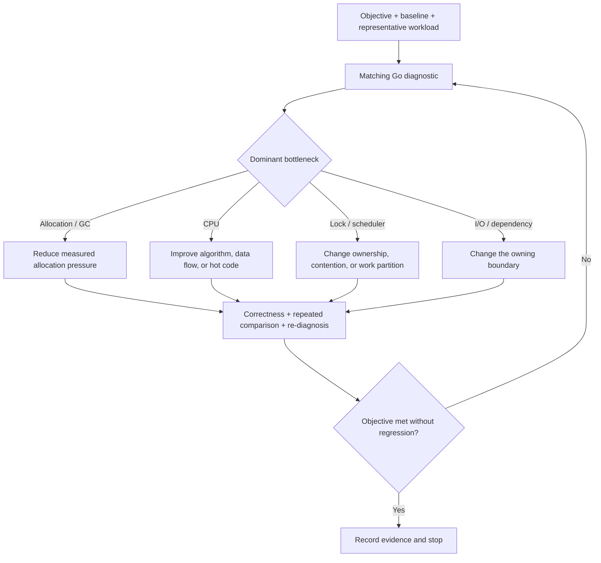

# Go Performance Engineering

> **Status:** Development
>
> **Catalog ID:** `languages/go/performance`
>
> **Selection:** Explicit
>
> **Routing:** Selection installs this Specification. Load it only for tasks
> that diagnose, change, claim, or review Go performance behavior.
>
> **Catalog metadata:** `catalog.json` is the source of truth for version,
> dependencies, file scopes, activation summary, and content digest.

## Purpose

Go performance changes earn implementation complexity through representative
evidence. This Specification keeps optimization work tied to an explicit
target, a measured bottleneck, a bounded hypothesis, a reproducible comparison,
and a stopping condition.

It does not define product-specific thresholds, capacity plans, service-level
objectives, or a universal order for CPU, allocation, lock, I/O, scheduler, and
assembly work. A consuming project owns those choices.

## Applicability

### Load this specification when

- defining or reviewing a Go performance objective, baseline, benchmark, or
  regression claim;
- capturing or interpreting Go profiles, traces, compiler diagnostics, or
  production-representative performance evidence;
- changing Go code to affect latency, throughput, CPU, allocation, heap, GC,
  contention, scheduling, or resource efficiency;
- adding pooling, `unsafe`, Go assembly, build-tagged fast paths, or other
  architecture-specific performance implementations.

### Do not apply this specification when

- changing Go code without a performance claim or performance-sensitive
  contract;
- estimating fleet capacity or infrastructure cost without diagnosing or
  changing a Go implementation;
- editing generated, vendored, cgo, or upstream-owned optimized code as its
  authoritative source; repository-owned adapters and compatibility tests may
  still activate this contract;
- applying a stricter project performance contract that remains compatible
  with these requirements.

`applies_to` creates conservative Go and assembly candidates. Task intent and
this Applicability contract decide activation.

## Agent workflow

When this Specification is activated, the implementing or reviewing agent:

1. records the performance objective, baseline, constraints, workload,
   environment, and stopping condition;
2. selects diagnostic evidence that matches the suspected resource or latency
   bottleneck;
3. identifies the hotspot, verifies its causal role, and states one bounded
   hypothesis for each claimed gain;
4. implements the smallest change that can test that hypothesis;
5. runs correctness checks, repeated baseline-versus-experiment measurement,
   repeated diagnosis, and applicable end-to-end verification;
6. applies the additional admission and compatibility checks before accepting
   `unsafe`, assembly, or architecture-specific code;
7. reports the activated Requirement IDs and durable evidence references.

## Terminology

- A **performance objective** is a metric and target bound together with its
  workload, environment, correctness constraints, and stopping condition.
- A **baseline** is the immutable source revision and measured result against
  which an experiment is compared.
- An **experiment** is the immutable source revision containing the bounded
  performance change under evaluation.
- A **representative workload** preserves the request mix, input distribution,
  data scale, concurrency, cache state, runtime duration, and dependencies that
  materially affect the objective.
- A **hotspot** is a measured code path or runtime interaction that accounts
  for a decision-relevant share of the constrained resource or latency.
- A **low-level optimization** uses `unsafe`, assembly, architecture-specific
  instructions, or another implementation whose portability and maintenance
  risks exceed ordinary idiomatic Go.

## Requirements

### GO-PERF-TARGET-001 — Performance work has an objective and stopping condition

**Activation:** Load when starting, scoping, or reviewing a Go performance change or claim.

**Context dependencies:** None

**Automated enforcement:** Advisory

Before a performance change is approved, its evidence record **MUST** identify
the target metric, baseline revision and value, representative workload,
measurement environment, correctness and reliability constraints, and the
condition that ends optimization work.

If the objective or workload changes after an experiment begins, the change
**MUST** be recorded and the baseline **MUST** be re-established. A local
metric such as `ns/op`, `B/op`, or `allocs/op` **MUST NOT** replace an
end-to-end objective when the claimed outcome concerns a service or complete
program.

**Rationale (non-normative):** A target without workload and environment is not
reproducible, while a target without a stopping condition rewards unnecessary
complexity.

**Enforcement (review):** Review the performance record before implementation
approval and before accepting the final claim.

**Evidence:** A revision-bound issue, change record, or benchmark manifest that
contains the objective, baseline, workload, environment, constraints, and
stopping condition.

### GO-PERF-DIAGNOSE-001 — Representative evidence selects the bottleneck

**Activation:** Load when collecting or interpreting Go profiles, traces, runtime metrics, or compiler diagnostics.

**Context dependencies:** `GO-PERF-TARGET-001`

**Automated enforcement:** Advisory

Diagnostic evidence **MUST** exercise a workload representative of the stated
objective and **MUST** record the source revision, Go toolchain, build and
runtime configuration, environment, collection duration, and material
collection overhead or interference.

The diagnostic mechanism **MUST** match the suspected bottleneck. The analysis
**MUST** distinguish CPU execution, cumulative allocation, live heap, lock or
blocking delay, scheduling, I/O, and downstream latency when those alternatives
could change the selected optimization. A hotspot **MUST** be reviewed in its
calling and runtime context before it is treated as the root cause.

**Rationale (non-normative):** CPU, allocation, heap, mutex, block, trace, and
service evidence answer different questions. A non-representative or
mismatched Profile can optimize a symptom or an irrelevant path.

**Enforcement (hybrid):** Mechanically retain collection metadata and review
whether the workload and diagnostic type can establish the claimed causal
path.

**Evidence:** Revision-bound diagnostic artifacts or access-controlled
references, collection commands and metadata, the selected hotspot, and a
reviewed root-cause statement.

### GO-PERF-CHANGE-001 — Each optimization tests a bounded hotspot hypothesis

**Activation:** Load when changing a measured Go hotspot or introducing performance-motivated complexity.

**Context dependencies:** `GO-PERF-TARGET-001`, `GO-PERF-DIAGNOSE-001`

**Automated enforcement:** Advisory

Each claimed gain **MUST** identify the measured hotspot, the primary causal
hypothesis, and the smallest implementation boundary needed to test it.
Unrelated optimizations **MUST** be measured as separate evidence units so that
their benefits and regressions remain attributable.

Implementations **SHOULD** evaluate algorithm, data flow, allocation,
batching, caching, and concurrency changes supported by the diagnosis before
adding low-level code. An allocation or CPU reduction **MUST NOT** weaken
correctness, ownership, memory safety, capacity bounds, observability, or
failure recovery. Added complexity **SHOULD** be isolated and documented with
the performance constraint, data invariants, and evidence reference that
justify it.

**Rationale (non-normative):** Small attributable changes let reviewers explain
the measured result, detect cost transfer, and remove an optimization when its
assumptions stop holding.

**Enforcement (hybrid):** Review the diff-to-hypothesis mapping and use focused
benchmarks or diagnostics to isolate every claimed gain.

**Evidence:** A change record connecting each optimized boundary to its
hotspot, hypothesis, focused measurement, maintained invariants, and rollback
surface.

### GO-PERF-VERIFY-001 — Improvement claims survive comparison and re-diagnosis

**Activation:** Load when claiming, approving, or regression-testing a Go performance improvement.

**Context dependencies:** `GO-PERF-TARGET-001`, `GO-PERF-DIAGNOSE-001`, `GO-TEST-001`

**Automated enforcement:** Advisory

The baseline and experiment **MUST** use the same workload and materially
equivalent toolchain, build configuration, runtime configuration, hardware,
and environment. Every unavoidable difference **MUST** be disclosed. The
comparison **MUST** contain enough repeated samples and a noise-aware analysis
appropriate to the measured metric; a single run or an isolated percentage
**MUST NOT** establish an improvement.

Applicable correctness, race, compatibility, and failure-path tests **MUST**
pass. The diagnostic evidence that selected the hotspot **MUST** be collected
or re-evaluated against the experiment. A service or complete-program claim
**MUST** verify the stated end-to-end objective and no-regression constraints;
a microbenchmark alone **MUST NOT** establish that claim.

The evidence record **MUST** identify both revisions, commands, inputs,
environment, raw results or durable access-controlled references, comparison
method, and observed regressions. A stable benchmark **SHOULD** remain as a
regression signal when its noise and maintenance cost are acceptable.

**Rationale (non-normative):** Comparative, repeated evidence distinguishes a
real gain from benchmark noise, workload drift, and cost moved to another
resource or path.

**Enforcement (hybrid):** Run focused tests and repeated comparative
measurements, re-run the selecting diagnostic, and review end-to-end and
no-regression metrics.

**Evidence:** Correctness and risk-test results, baseline and experiment
outputs, comparison report, repeated diagnostic, end-to-end result when
applicable, and immutable revision identifiers.

### GO-PERF-LOWLEVEL-001 — Low-level code has a stricter admission gate

**Activation:** Load when adding or changing `unsafe`, Go assembly, architecture-specific instructions, or build-tagged fast paths.

**Context dependencies:** `GO-PERF-CHANGE-001`, `GO-PERF-VERIFY-001`, `GO-COMPAT-001`, `GO-TEST-001`

**Automated enforcement:** Advisory

A low-level optimization **MUST** have evidence that the approved objective
remains unmet, the same hotspot persists across repeated diagnosis, applicable
higher-level alternatives were evaluated, and the expected end-to-end benefit
justifies the portability and maintenance cost.

The optimized boundary **MUST** define its behavioral and data-layout contract.
It **MUST** provide a portable reference or fallback implementation, or
explicitly declare unsupported architectures and their compatibility effect.
Assembly functions **MUST** have the Go declarations and toolchain metadata
required to validate their argument, result, pointer, and ABI contracts.

Reference and optimized implementations **MUST** pass equivalence tests over
normal, boundary, invalid, and architecture-relevant inputs. Every affected
supported architecture and build-tag path **MUST** be built and tested, and its
performance claim **MUST** be measured on applicable hardware. The change
**MUST** identify a rollback path if the gain disappears or toolchain behavior
changes.

**Rationale (non-normative):** Low-level code narrows portability and depends
on compiler, ABI, architecture, and runtime details that ordinary Go code lets
the toolchain manage.

**Enforcement (hybrid):** Review the admission record; run equivalence, vet,
build-tag, architecture, and comparative performance checks over the supported
matrix.

**Evidence:** Repeated hotspot evidence, evaluated alternatives, Go reference
or fallback, contract and equivalence tests, supported architecture matrix,
hardware measurements, and rollback plan.

## Approved patterns

The following flow is non-normative:



The diagram starts with an objective, chooses a diagnostic branch from the
evidence, and compares the changed implementation before stopping. No branch
is a mandatory optimization order.

A compact evidence record can use this non-normative shape. Its target and
revision placeholders are illustrative, not measurements or project defaults:

```yaml
objective: "p99 <= 40 ms at 10k requests/s without higher error rate"
baseline: "commit:<sha>"
experiment: "commit:<sha>"
workload: "replay:v3"
environment: "go version, GOOS/GOARCH, build flags, hardware, config"
diagnosis: "profile reference and hotspot"
comparison: "commands, repeated raw results, statistical summary"
verification: "tests, repeated profile, end-to-end metrics"
stopping_condition: "objective met and no-regression constraints pass"
```

CPU and allocation profiles often form a useful first pass for compute-heavy
services. Mutex, block, trace, runtime metrics, and dependency latency are
equally valid branches when the evidence points elsewhere. Compiler-assisted
optimization such as PGO can be evaluated before hand-written assembly when it
addresses the measured hotspot.

## Rejected patterns

- Rewriting a suspected hotspot without a baseline or representative
  diagnostic violates `GO-PERF-TARGET-001` and `GO-PERF-DIAGNOSE-001`.
- Treating allocation removal as mandatory when allocation is not the measured
  bottleneck violates `GO-PERF-CHANGE-001`.
- Reporting one benchmark run or only a percentage without raw baseline and
  experiment results violates `GO-PERF-VERIFY-001`.
- Extrapolating a microbenchmark gain to service throughput or tail latency
  without end-to-end evidence violates `GO-PERF-VERIFY-001`.
- Adding an object pool that introduces unbounded retained capacity, ambiguous
  ownership, or new contention violates `GO-PERF-CHANGE-001`.
- Adding assembly without a reference or declared portability boundary,
  equivalence tests, and affected-architecture measurements violates
  `GO-PERF-LOWLEVEL-001`.
- Continuing to add complexity after the approved objective and constraints
  pass violates the stopping contract in `GO-PERF-TARGET-001`.

## Exceptions

Production traffic need not be copied into a benchmark. A synthetic, replayed,
or sampled workload may stand in when safety, privacy, availability, or cost
prevents direct production measurement. The evidence record must identify the
material differences and why they do not invalidate the objective.

Baseline and experiment environments may differ only when the difference is
unavoidable, disclosed, and either controlled by the comparison design or
shown not to affect the conclusion.

A portable low-level fallback may be omitted only when the product explicitly
does not support other architectures. The compatibility contract, build
constraints, validation matrix, and migration effect must make that boundary
observable. No exception permits a performance claim to bypass correctness or
the minimum evidence contract.

## Verification

| Requirement | Minimum verification |
| --- | --- |
| `GO-PERF-TARGET-001` | Review the objective, baseline, workload, constraints, and stopping condition |
| `GO-PERF-DIAGNOSE-001` | Reproduce or audit the representative diagnostic and root-cause record |
| `GO-PERF-CHANGE-001` | Map each optimized boundary to one measured hotspot hypothesis and focused result |
| `GO-PERF-VERIFY-001` | Run correctness checks, repeated baseline comparison, re-diagnosis, and applicable end-to-end verification |
| `GO-PERF-LOWLEVEL-001` | Run admission review, reference equivalence, vet/build, architecture matrix, hardware comparison, and rollback review |

## Agent handoff

An agent that applies this Specification reports:

```text
Activated requirements: <GO-PERF-* IDs and applicable GO-* dependencies>
Objective and baseline: <metric, target, revisions, workload, environment, stopping condition>
Diagnosis: <profile, trace, metric, hotspot, and root-cause evidence>
Comparison: <commands, repeated samples, analysis, re-diagnosis, end-to-end result>
Low-level admission: not applicable | <alternatives, fallback, matrix, measurements, rollback>
Exceptions: none | <workload, environment, or portability exception and owner>
Compatibility or migration: none | <supported surface and adoption plan>
```

## Compatibility and migration

Version `0.1.1` clarifies prose, example boundaries, and reference authority.
It preserves Requirement IDs, obligations, activation metadata, context
dependencies, automated enforcement levels, and Verification mappings.
No consumer behavior migration is introduced by this editorial patch.

Version `0.1.0` introduces `GO-PERF-TARGET-001`,
`GO-PERF-DIAGNOSE-001`, `GO-PERF-CHANGE-001`,
`GO-PERF-VERIFY-001`, and `GO-PERF-LOWLEVEL-001`. Every Requirement begins
at Advisory automated enforcement.

The Specification is explicitly selected and does not change the behavior of
`languages/go` or automatically enter existing Go projects. Adopting projects
should first inventory current performance objectives, benchmark commands,
diagnostic access, evidence storage, and low-level implementations. Existing
optimized code need not be rewritten solely for adoption; changing or
reviewing that code activates the applicable Requirements.

No cross-language `testing/performance` contract exists in this version. A
future extraction requires materially different language/runtime evidence and
an approved Proposal before it changes this dependency boundary.

## References

References provide provenance and explanation. They do not add undeclared
normative obligations or require adoption of an external style guide.

- [Go Implementation](../go.md)
- [R-001 / RT-005: Go performance optimization workflow and specification boundary](../../../docs/research/active/r-001_reusable-go-project-practices/notes/go-performance-optimization.md)
- [Go Diagnostics](https://go.dev/doc/diagnostics)
- [Profiling Go Programs](https://go.dev/blog/pprof)
- [Profile-guided optimization](https://go.dev/doc/pgo)
- [`runtime/pprof`](https://pkg.go.dev/runtime/pprof)
- [`testing`](https://pkg.go.dev/testing)
- [Go Performance Monitoring](https://go.dev/wiki/PerformanceMonitoring)
- [A Quick Guide to Go's Assembler](https://go.dev/doc/asm)
